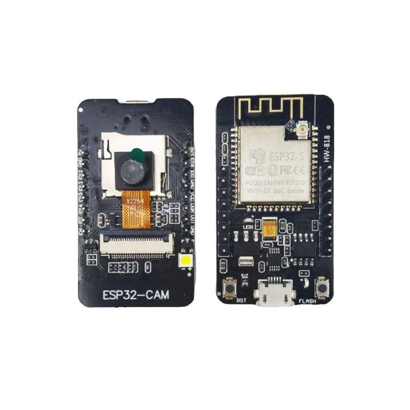
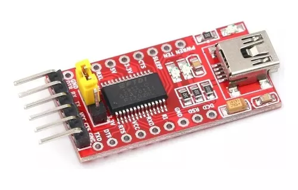
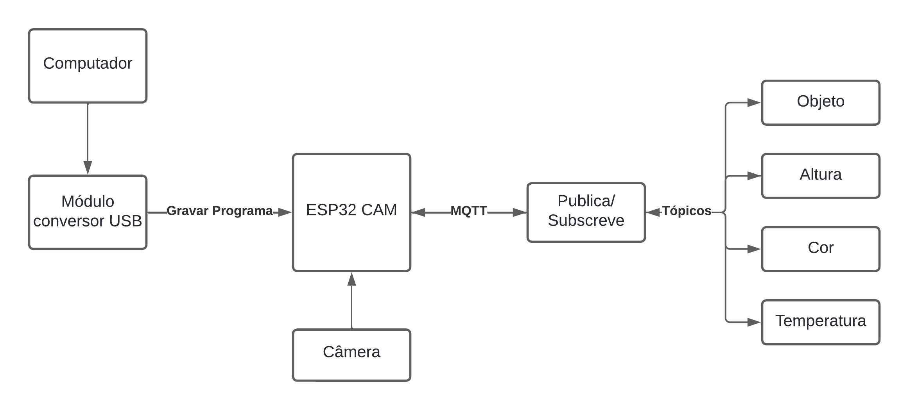
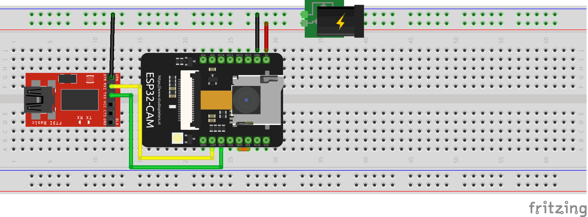
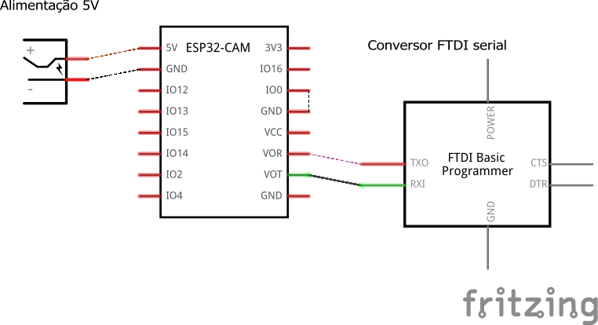

### Considerações Iniciais

Como uma etapa intermediária ao _Conceive_ e ao _Implement,_ no _Design_ deve-se buscar soluções para que o que fora prometido na concepção do projeto possa ser implementado fisicamente, reconhecendo a disponibilidade de materiais e tecnologias.

Será elaborado durante o tópico:

*   Lista de componentes.
*   Diagrama de blocos, como uma visão simplificada do sistema elétrico/eletrônico.
*   Maquete eletrônica.

Para tal usar-se-á as ferramenta:

*   Lucidchart para a elaboração do diagrama de blocos.
*   Fritzing para a elaboração da maquete eletrônica.

### Lista de Componentes

*   **ESP32-CAM.**

O ESP32-CAM é uma placa de desenvolvimento que combina um microcontrolador ESP32 com uma câmera OV2640 de 2MP. Se apresenta ideal para aplicação em questão, visto as opções de conectividade, velocidade de processamento suficiente e câmera integrada. Além disso, seu tamanho e consumo são diminutos.

Consumo: 6mA em _deep-sleep_ e corrente máxima de 310mA com _Flash_ ligado.

Câmera: Câmera OV2640 possui 2 megapixels de resolução(1920×1080).

Dimensões: 40.5mm x 27mm x 4.5mm.

Conectividade: Bluetooth BLE 4.2, suporte para cartão SD, antena embutida, wireless padrão 802.11 b/g/n e conexão Wifi 2.4 GHz.

*   **Placa FTDI FT232RL Conversor USB Serial.**

Este módulo permite a comunicação entre dispositivos TTL (ESP32) e computadores por meio da porta USB.

*   **Fonte de alimentação 5v.**
*   **Cabo Usb.**

### Design em Diagrama de Blocos

Concebe-se primeiramente o projeto do leitor de QR em forma de diagrama de blocos na figura 1:

O diagrama de blocos torna mais simples a elaboração do projeto, visto que separa o processo em subetapas.

Entendemos a sequência de subetapas da figura 1 da seguinte forma:.

1.  Utilizamos um conversor Usb serial para gravar o programa do computador para o ESP32.
2.  O ESP utiliza-se de sua câmera para capturar uma imagem contendo um código QR.
3.  O ESP identifica o código e publica o texto contido, separando-o em seus respectivos tópicos( objeto, altura, cor e temperatura).

Os textos devem inicialmente ser codificados em código &quot;QR&quot; com o auxílio de um gerador do código em questão, originando uma imagem como a da figura 2. Após feita a captura da imagem, o código é decodificado, dando origem a um texto para ser compartilhado via protocolo _MQTT_ como ao exemplo abaixo:

Objeto: Pirâmide  
Altura: 20 cm  
Cor: Verde  
Temperatura: 18°C

### Tópicos _MQTT_

qr\_code/objeto

qr\_code/altura

qr\_code/cor

qr\_code/temperatura

Todos o tópicos do protocolo _MQTT_ para o ESP32 CAM publicarão uma _string_ que é parte do texto decodificado.

### Maquete Eletrônica

A figura 3 abaixo apresenta a maquete eletrônica do projeto.

Nota-se que o ESP32-CAM não possui uma entrada Usb, logo, se faz necessário a implementação de um conversor Usb como o conversor FTDI serial representado acima para a gravação do programa no microcontrolador.

Há um curto entre o pino IO0 e GND no microcontrolador que deve ser mantido somente durante a gravação do código.

Considerando que o ESP32 possui um consumo baixíssimo, torna-se inviável uma fonte de alimentação individual para cada sistema composto por seus respectivos microcontroladores, sensores e atuadores da esteira. Por isso, foi posicionado um _power plug_ que representa a alimentação 5V  que deve ser compartilhada com os demais sistemas.

Na figura 4 abaixo é apresentado o esquemático:

### Referências:

HENRIQUE, Eduardo. Introdução ao ESP32-CAM. **Eletrogate**, 2023. Disponível em: &lt;[https://blog.eletrogate.com/introducao-ao-esp32-cam/](https://blog.eletrogate.com/introducao-ao-esp32-cam/)&gt;. Acesso em: 10 de abr. 2024.

SANTOS, Felipe. Utilize o ESP32-CAM como leitor de QR Code. **Maker Hero**, 2020. Disponível em: &lt;[https://www.makerhero.com/blog/utilize-esp32-cam-como-leitor-de-qr-code/](https://www.makerhero.com/blog/utilize-esp32-cam-como-leitor-de-qr-code/)&gt;. Acesso em: 9 de abr. 2024.

SANTOS, Sara. ESP32-CAM AI-Thinker Pinout Guide: GPIOs Usage Explained. **Random Nerd Tutorials**, 2020. Disponível em: &lt;[https://randomnerdtutorials.com/esp32-cam-ai-thinker-pinout/](https://randomnerdtutorials.com/esp32-cam-ai-thinker-pinout/)&gt;. Acesso em: 9 de abr. 2024.