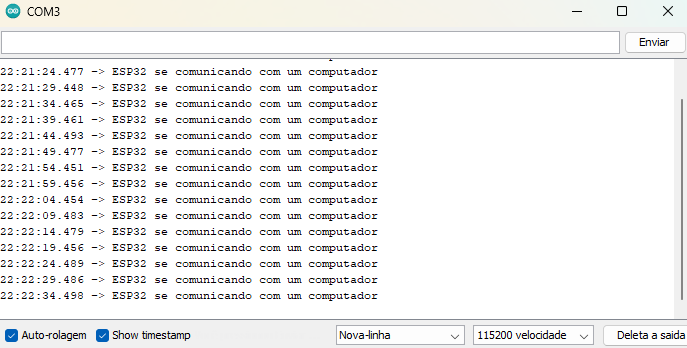
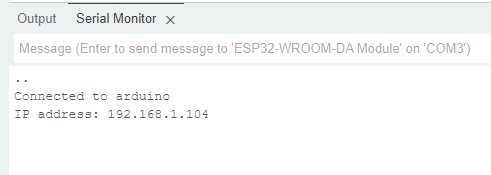
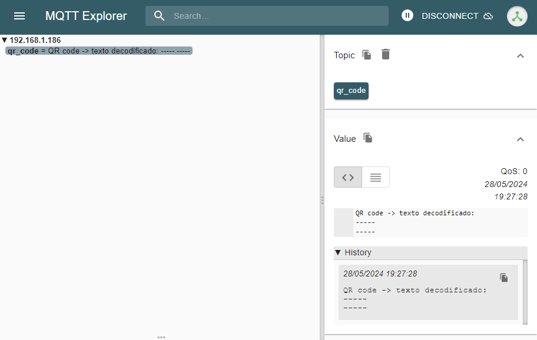
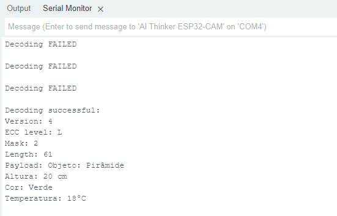
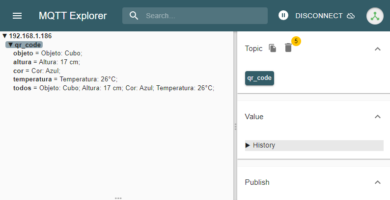

### Considerações Iniciais

Tendo-se fundamentado o escopo do projeto em _Conceive_ e buscado uma solução para tal na etapa _Design,_ deve-se agora aplicar a teoria estudada e formulada até então para concretizar o projeto por meio do primeiro protótipo. Para tanto foram sugeridos pelos professores ministrantes da unidade curricular de Projeto Integrador II uma série de experimentos práticos que mostram de forma segmentada o funcionamento dos processos que ocorrem em um ESP32.  A plataforma &quot;Arduino&quot; será utilizada para desenvolver e gravar cada código no microcontrolador.

Os experimentos listados serão abordados mais detalhadamente no discorrer do tópico, são eles:

*   Executar o &quot;Blink&quot; no ESP32 -&gt; Fazer o led soldado na placa ligar e desligar em um tempo determinado pelo usuário.
*   Imprimir um texto se utilizando das portas serial de dados do microcontrolador.
*   Conectar um ESP32 a uma rede _wifi._
*   Publicar um texto via protocolo MQTT.
*   Utilizar o microcontrolador para o fim de interpretar um sensor ou controlar um atuador.

Como uma ultima etapa, ao final do _implement,_ será apresentado o programa que permite o microcontrolador capturar, ler, decodificar o código QR e então enviar via MQTT as devidas mensagens.

### Blink

Para o propósito de se observar o processo de gravação de um código no ESP32 foi-se sugerido o &quot;blink&quot;, que permite observar um led ligando e desligando intermitentemente. O código carregado no microcontrolador é o seguinte:

```c
void setup() {
  pinMode(2, OUTPUT);
}
void loop() {
  digitalWrite(2, HIGH);   // liga o led e o deixa ligado por 3 segundos.
  delay(3000);             
  digitalWrite(2, LOW);    // Deixa o led desligado por 1 segundo.
  delay(1000);                       
}
```

### Serial Print

O objetivo deste teste prático é imprimir um texto se utilizando das portas serial e ler o texto pelo monitor serial do _Arduino IDE._ O código utilizado é o seguinte:

```c
void setup() {
  // Inicia a comunicação serial a um taxa de 115200 bits por segundo.
  Serial.begin(115200);
}
void loop() {
  // Imprime o texto e uma nova linha.
  Serial.println("ESP32 se comunicando com um computador");
  delay(5000);       //delay de 5 segundos.
}
```

Quando carregado no microcontrolador exibe-se o seguinte no monitor serial:



Nota-se que tanto na interface de desenvolvimento de código como no monitor serial encontra-se o número 115200. Tal numero estabelece a taxa em bits por segundo que o microcontrolador se comunicará com o computador.

### Conexão em uma rede _wifi_

Para conectar o ESP 32 a uma rede _wifi_, utilizando-se de seu modulo _wifi_ integrado, aplicaremos o seguinte código:

```c
#include <WiFi.h>
// ssid e senha do wifi
const char* ssid = "arduino";
const char* password = "esp-8266";
void setup() {
  Serial.begin(115200);
  // Coneta-se a rede wifi
  WiFi.mode(WIFI_STA);
  WiFi.begin(ssid, password);
  Serial.println("");
  // Loop para espera de conexão
  while (WiFi.status() != WL_CONNECTED) {
    delay(500);
    Serial.print(".");
  }
  Serial.println("");
  Serial.print("Connected to ");
  Serial.println(ssid);
  Serial.print("IP address: ");
  Serial.println(WiFi.localIP());
}
void loop() {}
```

O código apresentado conecta o ESP32 a um _acces point_ específico, no caso, o disponibilizado no LPAE do IFSC Florianópolis. É necessário a troca dos valores de constante &quot;ssid&quot; e &quot;password&quot; conforme cada rede. A figura 2 apresenta a saída serial com informações sobre o endereço IP assumido pelo microcontrolador.



###   

### Utilizando o protocolo MQTT

O primeiro passo para estabelecer a comunicação via MQTT é a criação de um servidor que será a entidade central da rede. O servidor é denominado _Broker_ e é o caminho comum para todo pacote de dados. O código a seguir permite que um ESP32 assuma a função de um broker:

```c
#include"sMQTTBroker.h"
sMQTTBroker broker;
IPAddress local_IP(192, 168, 1, 186); // Definir um IP fixo
IPAddress gateway(192, 168, 1, 1);
IPAddress subnet(255, 255, 255, 0);
void setup(){
 Serial.begin(115200);
 if (!WiFi.config(local_IP, gateway, subnet)) {
   Serial.println("STA Failed to configure");
 }
// Parâmetros do WIfi
const char* ssid = "arduino";      
const char* password = "esp-8266"; 
WiFi.begin(ssid, password);
 while (WiFi.status() != WL_CONNECTED) { // Wait for the Wi-Fi to connect
   delay(1000);
 }
 Serial.println("Connection established!");
 Serial.print("IP address:\t");
 Serial.println(WiFi.localIP());
 const unsigned short mqttPort = 1883; // Definir porta MQTT
 broker.init(mqttPort);
}
void loop(){
 broker.update();
}
```

Tendo-se estabelecido o _Broker,_ pode-se agora conectar clientes no servidor utilizando-se de outros microcontroladores que possuam modulo _wifi_. O código a seguir conecta o ESP32 na função de cliente no _Broker_ e envia uma mensagem no tópico publicado &quot;qr\_code&quot;:

```c
#include <WiFi.h>
#include <PubSubClient.h>
// WiFi (nome e senha)
const char *ssid = "arduino"; 
const char *password = "esp-8266";
// MQTT Broker
const char *mqtt_broker = "192.168.1.186";
const char *topic = "qr_code";
const char *mqtt_username = "";
const char *mqtt_password = "";
const int mqtt_port = 1883;
WiFiClient espClient;
PubSubClient client(espClient);
void setup() {
    // Taxa de tranferencia a 115200 bits/s
    Serial.begin(115200);
    // Conecta-se ao wifi
    WiFi.begin(ssid, password);
    while (WiFi.status() != WL_CONNECTED) {
        delay(500);
        Serial.println("Connecting to WiFi..");
    }
    Serial.println("Connected to the Wi-Fi network");
    // Conecta-se ao broker MQTT
    client.setServer(mqtt_broker, mqtt_port);
    client.setCallback(callback);
    while (!client.connected()) {
        String client_id = "esp32-client-";
        client_id += String(WiFi.macAddress());
        Serial.printf("The client %s connects to the public MQTT broker\n", client_id.c_str());
        if (client.connect(client_id.c_str(), mqtt_username, mqtt_password)) {
            Serial.println("Public EMQX MQTT broker connected");
        } else {
            Serial.print("failed with state ");
            Serial.print(client.state());
            delay(2000);
        }
    }
    // Publica e Subscreve no tópico "qr_code"
    client.publish(topic, "QR code -> texto decodificado:\n-----\n-----");
    client.subscribe(topic);
}
// Imprime mensagem do tópico subscrito
void callback(char *topic, byte *payload, unsigned int length) {
    Serial.print("Message arrived in topic: ");
    Serial.println(topic);
    Serial.print("Message:");
    for (int i = 0; i < length; i++) {
        Serial.print((char) payload[i]);
    }
    Serial.println();
}
void loop() {
    client.loop();
}
```

Através do programa &quot;MQTT-explorer&quot; podemos visualizar o que é publicado no servidor. A figura 3 apresenta a publicação do texto feito pelo segundo ESP32 no servidor.



### Leitor de Qr Code

O seguinte código, utiliza-se da biblioteca &quot;quirc.h&quot; para indentificar, capturar e decodificar um código QR.

```c
// Bibliotecas utilizadas
#include "esp_camera.h"
#include "soc/soc.h"
#include "soc/rtc_cntl_reg.h"
#include "quirc.h"

// "task handle"
TaskHandle_t QRCodeReader_Task; 

// Definir pinos GPIO
  #define PWDN_GPIO_NUM     32
  #define RESET_GPIO_NUM    -1
  #define XCLK_GPIO_NUM      0
  #define SIOD_GPIO_NUM     26
  #define SIOC_GPIO_NUM     27
  #define Y9_GPIO_NUM       35
  #define Y8_GPIO_NUM       34
  #define Y7_GPIO_NUM       39
  #define Y6_GPIO_NUM       36
  #define Y5_GPIO_NUM       21
  #define Y4_GPIO_NUM       19
  #define Y3_GPIO_NUM       18
  #define Y2_GPIO_NUM        5
  #define VSYNC_GPIO_NUM    25
  #define HREF_GPIO_NUM     23
  #define PCLK_GPIO_NUM     22
  
// Declaração de variáveis
struct QRCodeData{
  bool valid;
  int dataType;
  uint8_t payload[1024];
  int payloadLen;
};
struct quirc *q = NULL;
uint8_t *image = NULL;  
camera_fb_t * fb = NULL;
struct quirc_code code;
struct quirc_data data;
quirc_decode_error_t err;
struct QRCodeData qrCodeData;  
String QRCodeResult = "";

// ####### Setup() ####### 
void setup() {

  // Desabilita "brownout detector"
  WRITE_PERI_REG(RTC_CNTL_BROWN_OUT_REG, 0);
  Serial.begin(115200);			// "baud rate"
  Serial.setDebugOutput(true);
  Serial.println();
  
  // Configuração da câmera
  Serial.println("Start configuring and initializing the camera...");
  camera_config_t config;
  config.ledc_channel = LEDC_CHANNEL_0;
  config.ledc_timer = LEDC_TIMER_0;
  config.pin_d0 = Y2_GPIO_NUM;
  config.pin_d1 = Y3_GPIO_NUM;
  config.pin_d2 = Y4_GPIO_NUM;
  config.pin_d3 = Y5_GPIO_NUM;
  config.pin_d4 = Y6_GPIO_NUM;
  config.pin_d5 = Y7_GPIO_NUM;
  config.pin_d6 = Y8_GPIO_NUM;
  config.pin_d7 = Y9_GPIO_NUM;
  config.pin_xclk = XCLK_GPIO_NUM;
  config.pin_pclk = PCLK_GPIO_NUM;
  config.pin_vsync = VSYNC_GPIO_NUM;
  config.pin_href = HREF_GPIO_NUM;
  config.pin_sscb_sda = SIOD_GPIO_NUM;
  config.pin_sscb_scl = SIOC_GPIO_NUM;
  config.pin_pwdn = PWDN_GPIO_NUM;
  config.pin_reset = RESET_GPIO_NUM;
  config.xclk_freq_hz = 10000000;
  config.pixel_format = PIXFORMAT_GRAYSCALE;
  config.frame_size = FRAMESIZE_QVGA;
  config.jpeg_quality = 15;
  config.fb_count = 1;
  esp_err_t err = esp_camera_init(&config);
  if (err != ESP_OK) {
    Serial.printf("Camera init failed with error 0x%x", err);
    ESP.restart();
  }
  sensor_t * s = esp_camera_sensor_get();
  s->set_framesize(s, FRAMESIZE_QVGA);
  Serial.println("Configure and initialize the camera successfully.");
  Serial.println();
  
  // Cria "QRCodeReader_Task" usando a função xTaskCreatePinnedToCore()
  xTaskCreatePinnedToCore(
             QRCodeReader,          /* Task function. */
             "QRCodeReader_Task",   /* name of task. */
             10000,                 /* Stack size of task */
             NULL,                  /* parameter of the task */
             1,                     /* priority of the task */
             &QRCodeReader_Task,    /* Task handle to keep track of created task */
             0);                    /* pin task to core 0 */
}

// ####### Loop() #######
void loop() {
  delay(1);
}

// Função para instruir a captura do QR code e o decodificar em um texto.
void QRCodeReader( void * pvParameters ){
  Serial.println("QRCodeReader is ready.");
  Serial.print("QRCodeReader running on core ");
  Serial.println(xPortGetCoreID());
  Serial.println();

  // Loop para ler o QR code
  while(1){
      q = quirc_new();
      if (q == NULL){
        Serial.print("can't create quirc object\r\n");  
        continue;
      }
      fb = esp_camera_fb_get();
      if (!fb)
      {
        Serial.println("Camera capture failed");
        continue;
      }   
      quirc_resize(q, fb->width, fb->height);
      image = quirc_begin(q, NULL, NULL);
      memcpy(image, fb->buf, fb->len);
      quirc_end(q);
      int count = quirc_count(q);
      if (count > 0) {
        quirc_extract(q, 0, &code);
        err = quirc_decode(&code, &data);
        if (err){
          Serial.println("Decoding FAILED");
          QRCodeResult = "Decoding FAILED";
        } else {
          Serial.printf("Decoding successful:\n");
          dumpData(&data);
        } 
        Serial.println();
      } 
      esp_camera_fb_return(fb);
      fb = NULL;
      image = NULL;  
      quirc_destroy(q);
  }
}

// Função para apresentar os resultados da decodificação do código QR.
void dumpData(const struct quirc_data *data)
{
  Serial.printf("Version: %d\n", data->version);
  Serial.printf("ECC level: %c\n", "MLHQ"[data->ecc_level]);
  Serial.printf("Mask: %d\n", data->mask);
  Serial.printf("Length: %d\n", data->payload_len);
  Serial.printf("Payload: %s\n", data->payload);  
  QRCodeResult = (const char *)data->payload;
  delay(1500);					// Atraso para evitar o código ser lido diversas vezes consecultivas.
}
```

Ao ter-se carregado o código acima em um ESP32 Cam podemos experimentar o recurso criado. Como exemplo temos o código QR da figura 4 para ser lido.


Após o sucesso da leitura temos o resultado da decodificação no monitor serial, apresentado na figura 5.



Nota-se que algumas falhas ocorrem antes que o código possa ser lido corretamente, por isso, deve ser estudado as melhores condições de iluminação, foco( distância ideal do objeto) e velocidade da esteira.

### Aplicação Completa

O código a seguir é uma aglutinação dos programas anteriormente apresentados, porém, adaptado para enviar o texto derivado do &quot;QR code&quot; nos subtópicos do protocolo MQTT pré-estabelecidos. São os tópicos:

*   qr\_code/objeto
*   qr\_code/altura
*   qr\_code/cor
*   qr\_code/temperatura

O código com a aplicação completa é o seguinte:

```c
/* ======================================== Bibliotecas utilizadas */
#include "esp_camera.h"
#include "soc/soc.h"
#include "soc/rtc_cntl_reg.h"
#include "quirc.h"
#include <WiFi.h>
#include <PubSubClient.h>
/* ======================================== */
// WiFi (nome e senha)
const char *ssid = "arduino"; 
const char *password = "esp8266";
// MQTT Broker
const char *mqtt_broker = "192.168.1.186";
const char *topic = "qr_code/todos";        //tópicos e subtópicos
char *topic_objeto = "qr_code/objeto";
char *topic_altura = "qr_code/altura";
char *topic_cor = "qr_code/cor";
char *topic_temperatura = "qr_code/temperatura";
const char *mqtt_username = "";
const char *mqtt_password = "";
const int mqtt_port = 1883;

WiFiClient espClient;
PubSubClient client(espClient);

TaskHandle_t QRCodeReader_Task; 
/* ======================================== Seleção dos pinos GPIO para o ESP32-cam */
  #define PWDN_GPIO_NUM     32
  #define RESET_GPIO_NUM    -1
  #define XCLK_GPIO_NUM      0
  #define SIOD_GPIO_NUM     26
  #define SIOC_GPIO_NUM     27
  #define Y9_GPIO_NUM       35
  #define Y8_GPIO_NUM       34
  #define Y7_GPIO_NUM       39
  #define Y6_GPIO_NUM       36
  #define Y5_GPIO_NUM       21
  #define Y4_GPIO_NUM       19
  #define Y3_GPIO_NUM       18
  #define Y2_GPIO_NUM        5
  #define VSYNC_GPIO_NUM    25
  #define HREF_GPIO_NUM     23
  #define PCLK_GPIO_NUM     22
/* ======================================== */
/* ======================================== Declaração de variáveis */
char objeto_s[30] = "";
char altura_s[20] = "";
char cor_s[30] = "";
char temperatura_s[30] = "";
char QRCodeResult_2[100] = "";
struct QRCodeData{
  bool valid;
  int dataType;
  uint8_t payload[1024];
  int payloadLen;
};
struct quirc *q = NULL;
uint8_t *image = NULL;  
camera_fb_t * fb = NULL;
struct quirc_code code;
struct quirc_data data;
quirc_decode_error_t err;
struct QRCodeData qrCodeData;  
String QRCodeResult = "";
/* ======================================== */
/* ________________________________________________________________________________ VOID SETTUP() */
void setup() {
      // Taxa de tranferencia a 115200 bits/s
    Serial.begin(115200);
  /* ========================================Wifi e MQTT setup */ 
    // Conecta-se ao wifi
    WiFi.begin(ssid, password);
    while (WiFi.status() != WL_CONNECTED) {
        delay(500);
        Serial.println("Connecting to WiFi..");
    }
    Serial.println("Connected to the Wi-Fi network");
    // Conecta-se ao broker MQTT
    client.setServer(mqtt_broker, mqtt_port);
    client.setCallback(callback);
    while (!client.connected()) {
        String client_id = "esp32-client-";
        client_id += String(WiFi.macAddress());
        Serial.printf("The client %s connects to the public MQTT broker\n", client_id.c_str());
        if (client.connect(client_id.c_str(), mqtt_username, mqtt_password)) {
            Serial.println("Public EMQX MQTT broker connected");
        } else {
            Serial.print("failed with state ");
            Serial.print(client.state());
            delay(2000);
        }
    }
/* ======================================== */
/* ========================================Camara setup */
  // Desabilita brownout detector.
  WRITE_PERI_REG(RTC_CNTL_BROWN_OUT_REG, 0);
  /* ---------------------------------------- */
  Serial.setDebugOutput(true);
  Serial.println();
  /* ---------------------------------------- Configuração da câmera */
  Serial.println("Start configuring and initializing the camera...");
  camera_config_t config;
  config.ledc_channel = LEDC_CHANNEL_0;
  config.ledc_timer = LEDC_TIMER_0;
  config.pin_d0 = Y2_GPIO_NUM;
  config.pin_d1 = Y3_GPIO_NUM;
  config.pin_d2 = Y4_GPIO_NUM;
  config.pin_d3 = Y5_GPIO_NUM;
  config.pin_d4 = Y6_GPIO_NUM;
  config.pin_d5 = Y7_GPIO_NUM;
  config.pin_d6 = Y8_GPIO_NUM;
  config.pin_d7 = Y9_GPIO_NUM;
  config.pin_xclk = XCLK_GPIO_NUM;
  config.pin_pclk = PCLK_GPIO_NUM;
  config.pin_vsync = VSYNC_GPIO_NUM;
  config.pin_href = HREF_GPIO_NUM;
  config.pin_sscb_sda = SIOD_GPIO_NUM;
  config.pin_sscb_scl = SIOC_GPIO_NUM;
  config.pin_pwdn = PWDN_GPIO_NUM;
  config.pin_reset = RESET_GPIO_NUM;
  config.xclk_freq_hz = 10000000;
  config.pixel_format = PIXFORMAT_GRAYSCALE;
  config.frame_size = FRAMESIZE_QVGA;
  config.jpeg_quality = 15;
  config.fb_count = 1;
  
  #if defined(CAMERA_MODEL_ESP_EYE)
    pinMode(13, INPUT_PULLUP);
    pinMode(14, INPUT_PULLUP);
  #endif

  esp_err_t err = esp_camera_init(&config);
  if (err != ESP_OK) {
    Serial.printf("Camera init failed with error 0x%x", err);
    ESP.restart();
  }
  
  sensor_t * s = esp_camera_sensor_get();
  s->set_framesize(s, FRAMESIZE_QVGA);
  
  Serial.println("Configure and initialize the camera successfully.");
  Serial.println();
  /* ---------------------------------------- */
  /* ---------------------------------------- Cria "QRCodeReader_Task" usando a função xTaskCreatePinnedToCore()*/
  xTaskCreatePinnedToCore(
             QRCodeReader,          /* Task function. */
             "QRCodeReader_Task",   /* name of task. */
             10000,                 /* Stack size of task */
             NULL,                  /* parameter of the task */
             1,                     /* priority of the task */
             &QRCodeReader_Task,    /* Task handle to keep track of created task */
             0);                    /* pin task to core 0 */
  /* ---------------------------------------- */
}
/* ________________________________________________________________________________ */
void loop() {
  client.loop();
  delay(1);
}
/* ________________________________________________________________________________ */
// Esta função instruirá a câmera a capturar o QR code para então ser decodificado em texto.
void QRCodeReader( void * pvParameters ){
  /* ---------------------------------------- */
  Serial.println("QRCodeReader is ready.");
  Serial.print("QRCodeReader running on core ");
  Serial.println(xPortGetCoreID());
  Serial.println();
  /* ---------------------------------------- Loop para ler o código QR em tempo real */
  while(1){
      q = quirc_new();
      if (q == NULL){
        Serial.print("can't create quirc object\r\n");  
        continue;
      }
      fb = esp_camera_fb_get();
      if (!fb){
        Serial.println("Camera capture failed");
        continue;
      }   
      quirc_resize(q, fb->width, fb->height);
      image = quirc_begin(q, NULL, NULL);
      memcpy(image, fb->buf, fb->len);
      quirc_end(q);
      
      int count = quirc_count(q);
      if (count > 0) {
        quirc_extract(q, 0, &code);
        err = quirc_decode(&code, &data);
    
        if (err){
          Serial.println("Decoding FAILED");
          QRCodeResult = "Decoding FAILED";
        } else {
          Serial.printf("Decoding successful:\n");
          dumpData(&data);
          /* ---------------------------------------- Publica as strings no tópico e respctivos subtópicos MQTT */
          client.publish(topic_objeto, objeto_s);
          client.publish(topic_altura, altura_s);
          client.publish(topic_cor, cor_s);
          client.publish(topic_temperatura, temperatura_s);
          client.publish(topic, QRCodeResult_2);
          delay(1500);    // Evita do código ser lido mais de uma vez desnecessáriamente # Deve ser alterado conforme condições de captura
        } 
        Serial.println();
      } 
      esp_camera_fb_return(fb);
      fb = NULL;
      image = NULL;  
      quirc_destroy(q);
  }
  /* ---------------------------------------- */
}
/* ________________________________________________________________________________ */
/* ________________________________________________________________________________ Função para mostrar o resultado da decodifição no monitor serial */
void dumpData(const struct quirc_data *data){
  Serial.printf("Version: %d\n", data->version);
  Serial.printf("ECC level: %c\n", "MLHQ"[data->ecc_level]);
  Serial.printf("Mask: %d\n", data->mask);
  Serial.printf("Length: %d\n", data->payload_len);
  Serial.printf("Payload: %s\n", data->payload);
  
  QRCodeResult = (const char *)data->payload;
  int enter_counter = 0;
  int j = 0;
  for(int i = 0; i <= int (data->payload_len) ; i++){
    QRCodeResult_2[i] = data->payload[i];
    /*--------------------------------------- Filtra o texto nos respectivos subtópicos */
      if (data->payload[i-1] == 59){
      enter_counter++;
      j = 0;
      }
      switch (enter_counter){
        case 0:
          objeto_s[j] = data->payload[i];
          if (data->payload[i] == 59){
            objeto_s[j+1] = 0;
          }
          break;
        case 1:
            altura_s[j] = data->payload[i];
            if (data->payload[i] == 59){
              altura_s[j+1] = 0;
            }
          break;
        case 2:
            cor_s[j] = data->payload[i];
            if (data->payload[i] == 59){
              cor_s[j+1] = 0;
            }
          break;
        case 3:
            temperatura_s[j] = data->payload[i];
            if (data->payload[i] == 59){
              temperatura_s[j+1] = 0;
            }
          break;
        default:
          break;
      }
      j++;
  }
}
void callback(char *topic, byte *payload_2, unsigned int length) {
    Serial.print("Message arrived in topic: ");
    Serial.println(topic);
    Serial.print("Message:");
    for (int i = 0; i < length; i++) {
        Serial.print((char) payload_2[i]);
    }
    Serial.println();
}
```

Após testes, verificou-se a necessidade de adicionar um caractere especial no texto para facilitar a separação do mesmo em subtópicos, o caractere escolhido foi o &quot;;&quot;. A figura 6 apresenta um modelo exemplar do código QR que deve ser utilizado:


Carregando-se o código no ESP32-cam e utilizando-se do _QR code_ da figura 6 obtemos um exemplo do funcionamento desejado da aplicação.  A sequência de execução do programa é a seguinte:

1.  Inicia-se a comunicação serial.
2.  Conecta-se ao _wifi._
3.  Conecta-se a um broker MQTT
4.  Configura a câmera.
5.  Espera até que identifique-se um _QR code_ na frente do sensor.
6.  _QR code_ é decodificado em texto.
7.  Texto é separado em subtópicos do tópico &quot;qr-code&quot;.
8.  Texto separado é enviado através do protocolo MQTT para o broker em seus respectivos subtópicos.

Depois do passo 4, o programa é executado em ciclo a partir do passo 5.

Na figura 7 vê-se os resultados da decodificação de um _QR code_ por meio do &quot;MQTT-explorer&quot;.



### Referências:

A Beginner&#39;s Guide to MQTT Brokers. **HiveMQ**, 2023. Disponível em: &lt;[https://www.hivemq.com/blog/mqtt-brokers-beginners-guide/](https://www.hivemq.com/blog/mqtt-brokers-beginners-guide/)&gt;. Acesso em: 6 de jun. 2024.

FERREIRA, Thales. MQTT com ESP32. **Crescer Industria de Automação**, 2023. Disponível em: &lt;[https://www.crescerengenharia.com/post/mqtt-esp32](https://www.crescerengenharia.com/post/mqtt-esp32)&gt;. Acesso em: 6 de jun. 2024.

Language Reference. **Arduino**, 2024. Disponível em: &lt;[https://www.arduino.cc/reference/en/](https://www.arduino.cc/reference/en/)&gt;. Acesso em: 6 de jun. 2024.