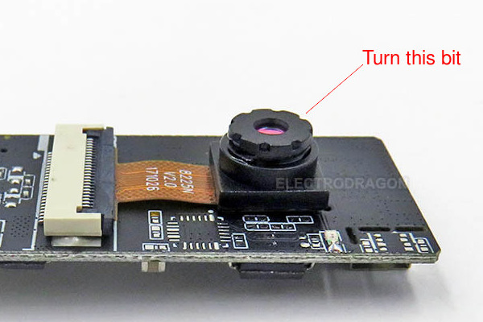
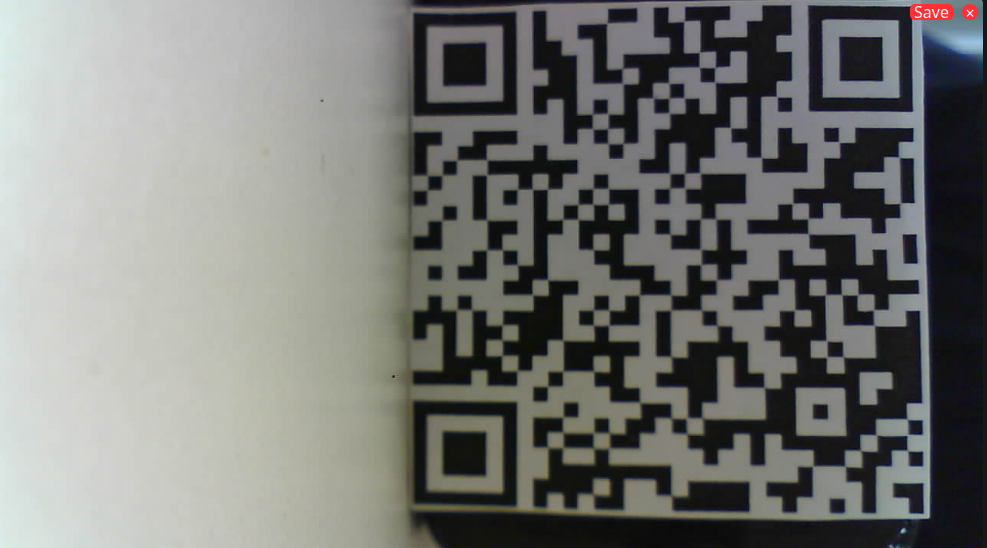
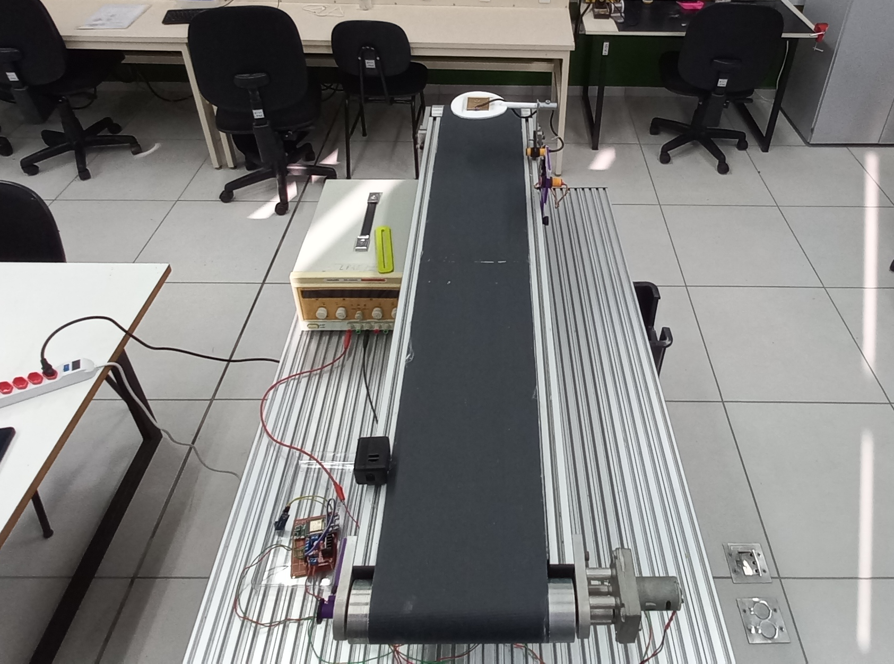
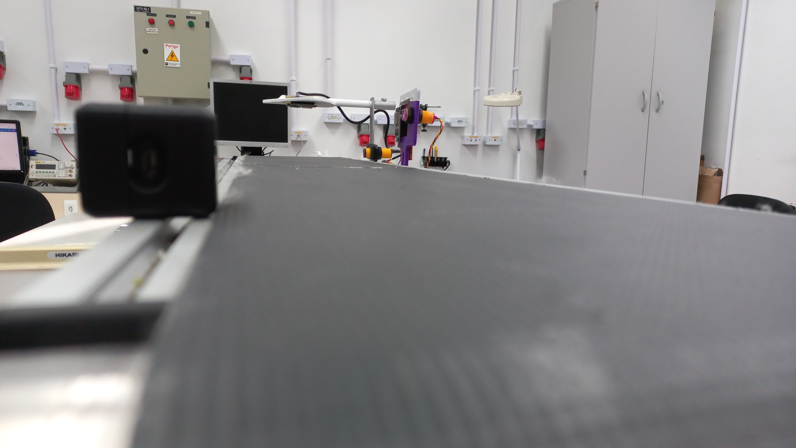

### Considerações Iniciais

Como uma ultima etapa do ciclo CDIO, no _operate,_ revisar-se-á o que fora feito como um projeto até agora e buscar-se-á aprimoramentos para o protótipo construído em _Implement_. Além disso, estudar-se-á a implementação do leitor de _QR code_ com os outros sensores e atuadores da esteira, bem como a disposição de cada elemento ao longo do caminho que percorrerá o &quot;produto&quot;.  O objetivo é garantir que cada sensor e atuador atue na sua melhor condição, buscando também através de uma alocação estratégica evitar interferências que um sensor pode provocar em outro.

### Revisão do Projeto

Na unidade curricular de Projeto Integrador II, foi-se proposto para o grupo discente a construção de uma esteira com diferentes atuadores e sensores implementados a ela. Inspirado no modelo de indústria 4.0, cada membro foi responsável pela incorporação de um sensor ou atuador gerenciado por um ESP 32 que deve se comunicar via protocolo MQTT alterando o funcionamento da esteira ou a exibição no display, sem a necessidade de fios de dados.

O projeto se segue em 4 etapas denominadas, _conceive_, _design_, _implement_ e a atual _operate_:

Estabeleceu-se em _Conceive_ o escopo do projeto, a ideia de ler um código QR e transmitir o texto derivado via MQTT. Para isso devia-se ser estabelecido os tópicos que cada ESP 32 deveria publicar e subscrever.

Em _Design_ foi-se projetado a materialização do objetivo, decodificar um _QR code_. Para isso, foi-se elaborado uma lista de componentes, um diagrama de blocos e uma maquete eletrônica.

Em _Implement_ foi-se discutido o funcionamento do microcontrolador de acordo com cada código carregado via Arduino IDE e montado o código que funcionaria para os primeiros testes à implementação do conjunto ESP32Cam-Esteira.

Por fim, segue-se a etapa atual e fim do ciclo CDIO, _Operate_.

### Condições de Captura de Imagem

O primeiro passo foi encontrar o foco ideal para a distância desejada, compreendida dentro da largura de banda da esteira, alterando-se a distância sensor-lente, como exemplificado na figura 1. Juntamente a isso,  um tamanho de código QR deve ser arbitrado.



Para delimitar estes fatores, foi-se aplicado um teste prático utilizando-se do código denominado como _CameraWebServer_ disponibilizado em arquivos. O código instalado em um ESP-32 CAM permite a transmissão de um vídeo em tempo real.

Em um navegador em um computador conectado a mesma rede local de internet, temos o apresentado na figura 2.



Por meio deste método foi possível verificar as melhores condições de captura. E, então definiu-se os seguintes parâmetros ideiais:

*   Tamanho QR _code_: 4cm x 4cm.
*   Distância Sensor-Objeto: 6cm (mínimo) -12cm (máximo).
*   Flash: desligado.

### Alterações Necessárias

Após alocar os sensores e testar suas funções com a esteira em movimento, constatou-se que alguns sensores tem a necessidade de fazer uma medida ou captura de imagem com a esteira parada, ou de ter a posição do objeto que a percorre reconhecida.

Logo, uma solução foi posicionar ao lado de cada sensor, um sensor de proximidade, que permite identificar a chegada de um objeto e se necessário enviar uma mensagem via MQTT no tópico &quot;motor/velocidade&quot;  para alterar sua velocidade.

Porém a mesma abordagem para a solução do problema de captura de _Qr code_ é inviável, visto que, objetos de tamanhos diferentes, pesos diferentes e a velocidade variável da esteira não proporcionam a parada da esteira com um _Qr code_ imediatamente na frente da câmera. Tal método resultaria, no exemplo de uma linha de montagem ,em &quot;quebra da linha de produção&quot;, onde o produto pararia, e não se moveria até que a etapa de identificação por meio do código não fosse concluída.

Portanto, a solução encontrada para esse problema foi implementar uma câmera móvel, que possa ser manuseada, e, assim que o _Qr code_ for lido corretamente, o microcontrolador envia por MQTT a ordem de partida da esteira.

Assim, o código com as modificações que permitem a partida da esteira após a leitura do QR é o seguinte:

```c
/* ======================================== Bibliotecas utilizadas */
#include "esp_camera.h"
#include "soc/soc.h"
#include "soc/rtc_cntl_reg.h"
#include "quirc.h"
#include <WiFi.h>
#include <PubSubClient.h>
/* ======================================== */
// WiFi (nome e senha)
const char *ssid = "lpae_wifi"; 
const char *password = "esp-8266";
// MQTT Broker
const char *mqtt_broker = "192.168.1.2";
const char *topic = "qr_code/todos";        //tópicos e subtópicos
char *topic_objeto = "qr_code/objeto";
char *topic_altura = "qr_code/altura";
char *topic_cor = "qr_code/cor";
char *topic_temperatura = "qr_code/temperatura";
char *topic_velocidade = "motor/velocidade";
const char *mqtt_username = "lpae";
const char *mqtt_password = "esp-32";
const int mqtt_port = 1883;

WiFiClient espClient;
PubSubClient client(espClient);

TaskHandle_t QRCodeReader_Task; 
/* ======================================== Seleção dos pinos GPIO para o ESP32-cam */
  #define PWDN_GPIO_NUM     32
  #define RESET_GPIO_NUM    -1
  #define XCLK_GPIO_NUM      0
  #define SIOD_GPIO_NUM     26
  #define SIOC_GPIO_NUM     27
  #define Y9_GPIO_NUM       35
  #define Y8_GPIO_NUM       34
  #define Y7_GPIO_NUM       39
  #define Y6_GPIO_NUM       36
  #define Y5_GPIO_NUM       21
  #define Y4_GPIO_NUM       19
  #define Y3_GPIO_NUM       18
  #define Y2_GPIO_NUM        5
  #define VSYNC_GPIO_NUM    25
  #define HREF_GPIO_NUM     23
  #define PCLK_GPIO_NUM     22
/* ======================================== */
/* ======================================== Declaração de variáveis */
char objeto_s[30] = "";
char altura_s[20] = "";
char cor_s[30] = "";
char temperatura_s[30] = "";
char QRCodeResult_2[100] = "";
struct QRCodeData{
  bool valid;
  int dataType;
  uint8_t payload[1024];
  int payloadLen;
};
struct quirc *q = NULL;
uint8_t *image = NULL;  
camera_fb_t * fb = NULL;
struct quirc_code code;
struct quirc_data data;
quirc_decode_error_t err;
struct QRCodeData qrCodeData;  
String QRCodeResult = "";
/* ======================================== */
/* ________________________________________________________________________________ VOID SETTUP() */
void setup() {
      // Taxa de tranferencia a 115200 bits/s
    Serial.begin(115200);
  /* ========================================Wifi e MQTT setup */ 
    // Conecta-se ao wifi
    WiFi.begin(ssid, password);
    while (WiFi.status() != WL_CONNECTED) {
        delay(500);
        Serial.println("Connecting to WiFi..");
    }
    Serial.println("Connected to the Wi-Fi network");
    // Conecta-se ao broker MQTT
    client.setServer(mqtt_broker, mqtt_port);
    //client.setCallback(callback);
    while (!client.connected()) {
        String client_id = "esp32-client-";
        client_id += String(WiFi.macAddress());
        Serial.printf("The client %s connects to the public MQTT broker\n", client_id.c_str());
        if (client.connect(client_id.c_str(), mqtt_username, mqtt_password)) {
            Serial.println("Public EMQX MQTT broker connected");
        } else {
            Serial.print("failed with state ");
            Serial.print(client.state());
            delay(2000);
        }
    }
/* ======================================== */
/* ========================================Camara setup */
  // Desabilita brownout detector.
  WRITE_PERI_REG(RTC_CNTL_BROWN_OUT_REG, 0);
  /* ---------------------------------------- */
  Serial.setDebugOutput(true);
  Serial.println();
  /* ---------------------------------------- Configuração da câmera */
  Serial.println("Start configuring and initializing the camera...");
  camera_config_t config;
  config.ledc_channel = LEDC_CHANNEL_0;
  config.ledc_timer = LEDC_TIMER_0;
  config.pin_d0 = Y2_GPIO_NUM;
  config.pin_d1 = Y3_GPIO_NUM;
  config.pin_d2 = Y4_GPIO_NUM;
  config.pin_d3 = Y5_GPIO_NUM;
  config.pin_d4 = Y6_GPIO_NUM;
  config.pin_d5 = Y7_GPIO_NUM;
  config.pin_d6 = Y8_GPIO_NUM;
  config.pin_d7 = Y9_GPIO_NUM;
  config.pin_xclk = XCLK_GPIO_NUM;
  config.pin_pclk = PCLK_GPIO_NUM;
  config.pin_vsync = VSYNC_GPIO_NUM;
  config.pin_href = HREF_GPIO_NUM;
  config.pin_sscb_sda = SIOD_GPIO_NUM;
  config.pin_sscb_scl = SIOC_GPIO_NUM;
  config.pin_pwdn = PWDN_GPIO_NUM;
  config.pin_reset = RESET_GPIO_NUM;
  config.xclk_freq_hz = 10000000;
  config.pixel_format = PIXFORMAT_GRAYSCALE;
  config.frame_size = FRAMESIZE_QVGA;
  config.jpeg_quality = 15;
  config.fb_count = 1;
  
  #if defined(CAMERA_MODEL_ESP_EYE)
    pinMode(13, INPUT_PULLUP);
    pinMode(14, INPUT_PULLUP);
  #endif

  esp_err_t err = esp_camera_init(&config);
  if (err != ESP_OK) {
    Serial.printf("Camera init failed with error 0x%x", err);
    ESP.restart();
  }
  
  sensor_t * s = esp_camera_sensor_get();
  s->set_framesize(s, FRAMESIZE_QVGA);
  
  Serial.println("Configure and initialize the camera successfully.");
  Serial.println();
  /* ---------------------------------------- */
  /* ---------------------------------------- Cria "QRCodeReader_Task" usando a função xTaskCreatePinnedToCore()*/
  xTaskCreatePinnedToCore(
             QRCodeReader,          /* Task function. */
             "QRCodeReader_Task",   /* name of task. */
             10000,                 /* Stack size of task */
             NULL,                  /* parameter of the task */
             1,                     /* priority of the task */
             &QRCodeReader_Task,    /* Task handle to keep track of created task */
             0);                    /* pin task to core 0 */
  /* ---------------------------------------- */
}
/* ________________________________________________________________________________ */
void loop() {
  client.loop();
  delay(1);
}
/* ________________________________________________________________________________ */
// Esta função instruirá a câmera a capturar o QR code para então ser decodificado em texto.
void QRCodeReader( void * pvParameters ){
  /* ---------------------------------------- */
  Serial.println("QRCodeReader is ready.");
  Serial.print("QRCodeReader running on core ");
  Serial.println(xPortGetCoreID());
  Serial.println();
  /* ---------------------------------------- Loop para ler o código QR em tempo real */
  while(1){
      q = quirc_new();
      if (q == NULL){
        Serial.print("can't create quirc object\r\n");  
        continue;
      }
      fb = esp_camera_fb_get();
      if (!fb){
        Serial.println("Camera capture failed");
        continue;
      }   
      quirc_resize(q, fb->width, fb->height);
      image = quirc_begin(q, NULL, NULL);
      memcpy(image, fb->buf, fb->len);
      quirc_end(q);
      
      int count = quirc_count(q);
      if (count > 0) {
        quirc_extract(q, 0, &code);
        err = quirc_decode(&code, &data);
    
        if (err){
          Serial.println("Decoding FAILED");
          QRCodeResult = "Decoding FAILED";
        } else {
          Serial.printf("Decoding successful:\n");
          dumpData(&data);
          /* ---------------------------------------- Publica as strings no tópico e respctivos subtópicos MQTT */
          client.publish(topic_objeto, objeto_s);
          client.publish(topic_altura, altura_s);
          client.publish(topic_cor, cor_s);
          client.publish(topic_temperatura, temperatura_s);
          delay(3000);    // Evita do código ser lido mais de uma vez desnecessáriamente # Deve ser alterado conforme condições de captura
          client.publish(topic_velocidade, "100");        // Velocidada da esteira em 100%
          client.publish("motor/rampa", "5000");          // velocidade 0% a 100% em 5000ms
          client.publish("motor/liga", "1");              // Liga o motor
        } 
        Serial.println();
      } 
      esp_camera_fb_return(fb);
      fb = NULL;
      image = NULL;  
      quirc_destroy(q);
  }
  /* ---------------------------------------- */
}
/* ________________________________________________________________________________ */
/* ________________________________________________________________________________ Função para mostrar o resultado da decodifição no monitor serial */
void dumpData(const struct quirc_data *data){
  Serial.printf("Version: %d\n", data->version);
  Serial.printf("ECC level: %c\n", "MLHQ"[data->ecc_level]);
  Serial.printf("Mask: %d\n", data->mask);
  Serial.printf("Length: %d\n", data->payload_len);
  Serial.printf("Payload: %s\n", data->payload);
  
  QRCodeResult = (const char *)data->payload;
  int enter_counter = 0;
  int j = 0;
  for(int i = 0; i <= int (data->payload_len) ; i++){
    QRCodeResult_2[i] = data->payload[i];
    /*--------------------------------------- Filtra o texto nos respectivos subtópicos */
      if (data->payload[i-1] == 59){
      enter_counter++;
      j = 0;
      }
      switch (enter_counter){
        case 0:
          if( j == 0){
            i = i+9;
          }
          objeto_s[j] = data->payload[i-1];
          if (data->payload[i] == 59){
            objeto_s[j+1] = 0;
          }
          break;
        case 1:
          if( j == 0){
            i = i+10;
          }
            altura_s[j] = data->payload[i-1];
            if (data->payload[i] == 59){
              altura_s[j+1] = 0;
            }
          break;
        case 2:
          if( j == 0){
            i = i+7;
          }
            cor_s[j] = data->payload[i-1];
            if (data->payload[i] == 59){
              cor_s[j+1] = 0;
            }
          break;
        case 3:
          if( j == 0){
            i = i+15;
          }
            temperatura_s[j] = data->payload[i-1];
            if (data->payload[i] == 59){
              temperatura_s[j+1] = 0;
            }
          break;
        default:
        break;
      }
      j++;
  }
}
```

Em comparação ao código apresentado em _implement,_ este possui também a função de publicar o valor &quot;100&quot; em &quot;motor/velocidade&quot;, o valor &quot;5000&quot; em &quot;motor/rampa&quot;(recomendado pelo projetista do atuador do motor) e o valor &quot;1&quot; em &quot;motor/liga&quot;.  O programa agora executa os seguintes passos:

1.  Inicia-se a comunicação serial.
2.  Conecta-se ao _wifi._
3.  Conecta-se a um broker MQTT
4.  Configura a câmera.
5.  Espera até que identifique-se um _QR code_ na frente do sensor.
6.  _QR code_ é decodificado em texto.
7.  Texto é separado em subtópicos do tópico &quot;qr-code&quot;.
8.  Texto separado é enviado através do protocolo MQTT para o broker em seus respectivos subtópicos.
9.  Esteira é posta em movimento novamente.

Depois do passo 4, o programa é executado em ciclo a partir do passo 5.

### Esteira na Forma final

Nas figuras 3 e 4 é apresentado a esteira montada com o atuador do motor, sensores de cor, temperatura e de leitura de _Qr code,_ além de um display para apresentar os dados advindos dos sensores.





Observa-se na parte de baixo da figura 3 um case em preto, alí está posicionado o ESP-32 Cam que pode ser manuseado em ordem de ler um _Qr code_ para dar início a esteira.

A sequência de eventos é a seguinte:

1.  Objeto é posicionado manualmente sobre a esteira.
2.  _QR code_ aderido a superfície do objeto é lido e decodificado.
3.  Display mostra texto derivado do _QR code._
4.  Esteira inicia o movimento.
5.  Conjunto do sensor de temperatura identifica objeto e lê temperatura.
6.  Display exibe temperatura.
7.  Conjunto do sensor de cor identifica objeto e lê cor.
8.  Display exibe Cor.
9.  Esteira é parada.

### Considerações finais

Aos moldes da ideia de indústria 4.0, o projeto de um sensor capaz de decodificar um código QR atingiu as expectativas estabelecidas em _conceive._ O produto final pôde capturar um _QR code_ e transmitir o texto derivado, com a adição da função de ligar a esteira. A integração dos elementos atuadores e sensores por protocolo MQTT funcionou de forma eficiente, garantindo rapidez na troca de dados e permitindo redução no uso de fios ou cabos.

O projeto realizado na unidade curricular Projeto Integrador II demonstra a possibilidade de se utilizar de sensores e atuadores de forma simples, eficaz e pouco custosa. Tais ideias podem ser aplicadas em diferentes ambientes, permitindo desde o monitoramento de temperatura de um motor em uma indústria até o monitoramento de animais em seu habitat natural.

Porquê os microcontroladores utilizados são regraváveis e os sensores são modulares, podem ser reutilizados para diferentes propósitos até o fim de sua vida útil. Porém, em necessidade de descarte, uma reciclagem selecionada deve ser feita, visto que os componentes possuem uma pequena quantidade de metais pesados incorporados.