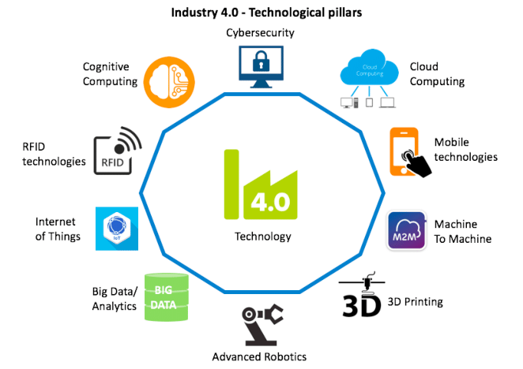
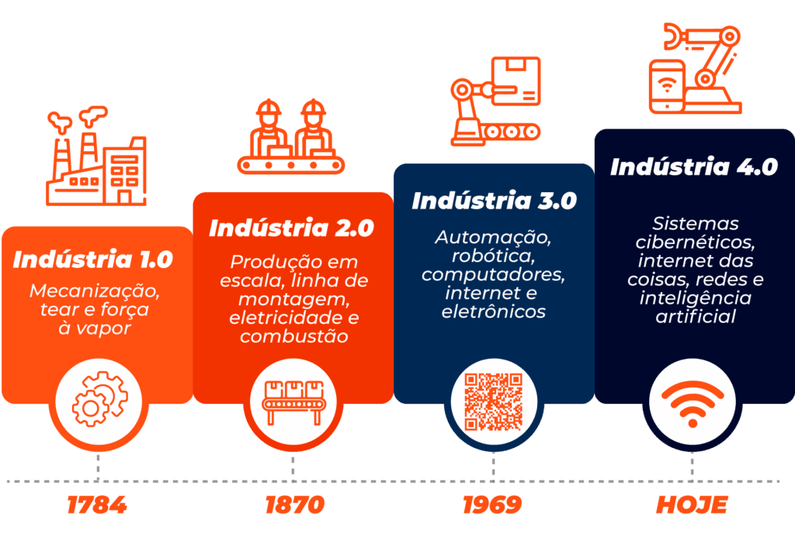

># Introdução

 A quarta revolução industrial ou mais conhecida como indústria 4.0 tem por objetivo integrar as pessoas e a tecnologia por sistemas interconectados. O sistemas são integrados com uma rede para compartilhamento de dados muitas vezes em tempo real. Esses dados são utilizados pelos mais diversos dispositivos na atualidade, dentre eles: _smartphones_, _tablets_, sistemas embarcados e etc. Ferramentas como o IOT, _machine learning_ facilitaram o desenvolvimento dos sistemas gerando novas gamas de aplicação. A indústria 4.0 pode ser caracterizada por um corpo composto por sensores inteligentes que contribuem e muitas vezes até substituem as mais variadas tarefas humanas. A indústria 4.0, por exemplo, possibilita que um usuário possa gerenciar a sua casa a partir da palma de sua mão, verificando a temperatura do ar, umidade, pressão e etc. A geração de energia sustentável é um dos pilares da indústria 4.0 prevendo a diminuição de gases de efeito estufa, emissão de gás carbono, danos ambientais gerados por energias não renováveis, e etc. Outro pilar é a proteção dos dados das pessoas e uso consciente - com tantos sistemas conectados simultaneamente a privacidade se torna um luxo e é ai que a lei geral de proteção de dados entra (LGPD). Na quarta revolução industrial tecnologias como _ChatGPT_ se tornaram protagonistas, porém, não são unanimidade entre governos e nem entre pessoas, muitas vezes criando uma relação de medo caso a tecnologia não seja utilizada corretamente ou para fins negativos.  Aplicativos fazem parte da maioria das aplicações e cada um deles envolve a informação de um usuário que irá ser compartilhada com outro para que haja uma interação. Redes sociais também são parte da indústria 4.0 e são a nova economia do mundo. Nunca antes foi possível integrar tantas pessoas e sistemas, que muitas vezes estão distantes, de forma fácil e objetiva - muitas vezes com apenas um clique ou toque no celular. Por fim, apesar da indústria 4.0 ser revolucionária é necessário que se tenha muita responsabilidade e maturidade para que as informações dos usuários não estejam em risco. Tanto os componentes quanto as etapas da indústria 4.0 podem ser verificadas respectivamente nas figuras 1 e 2.

