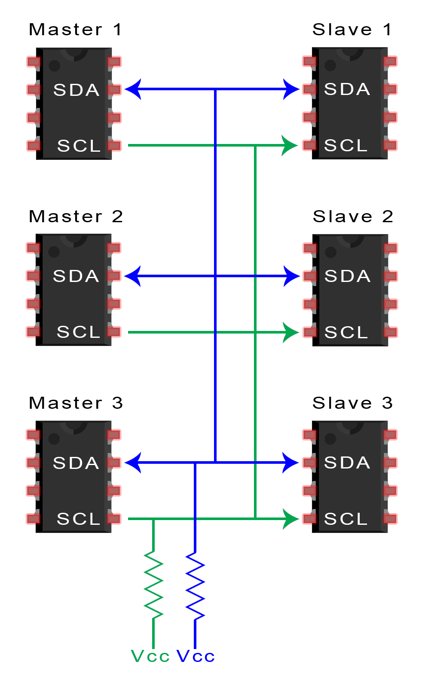
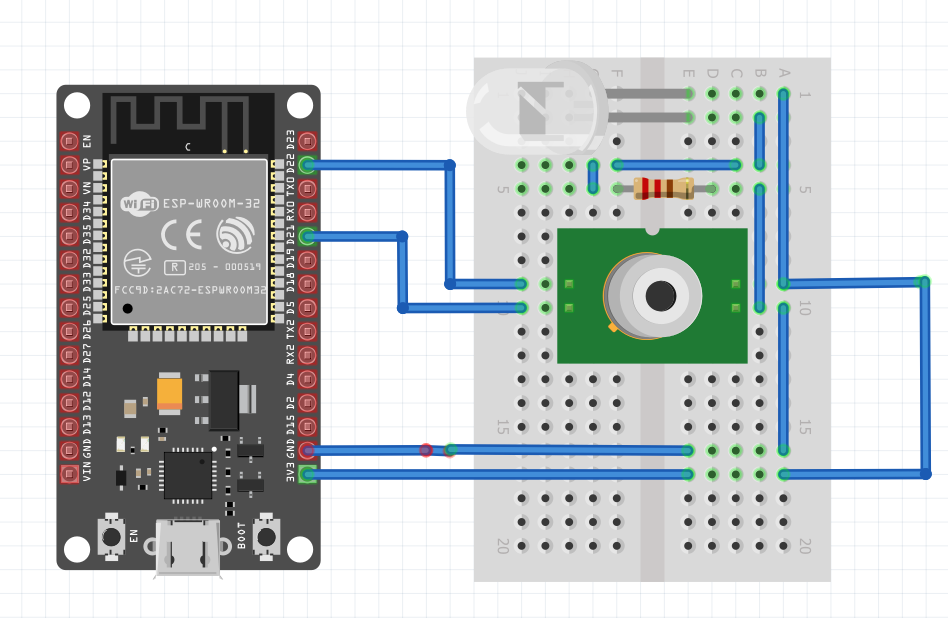
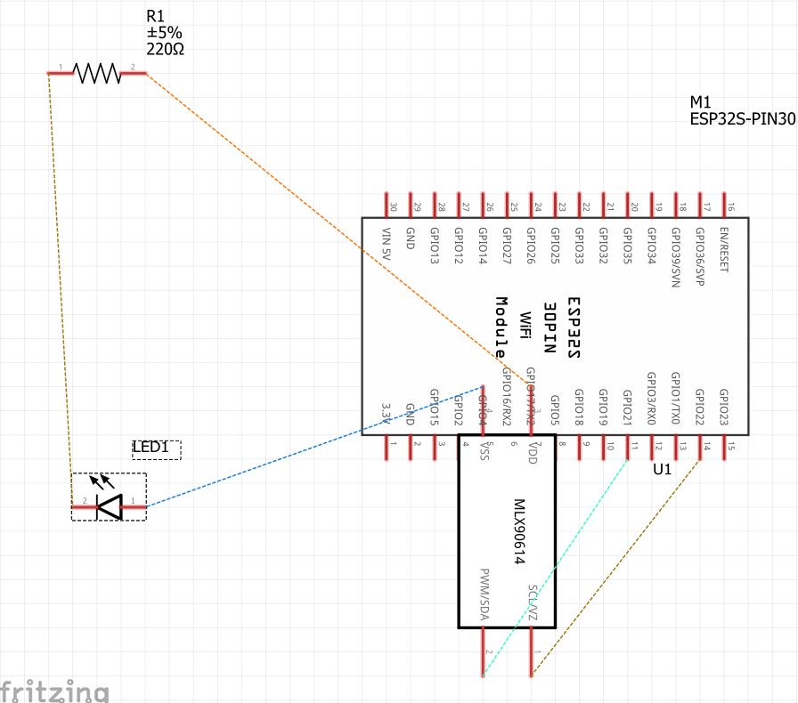
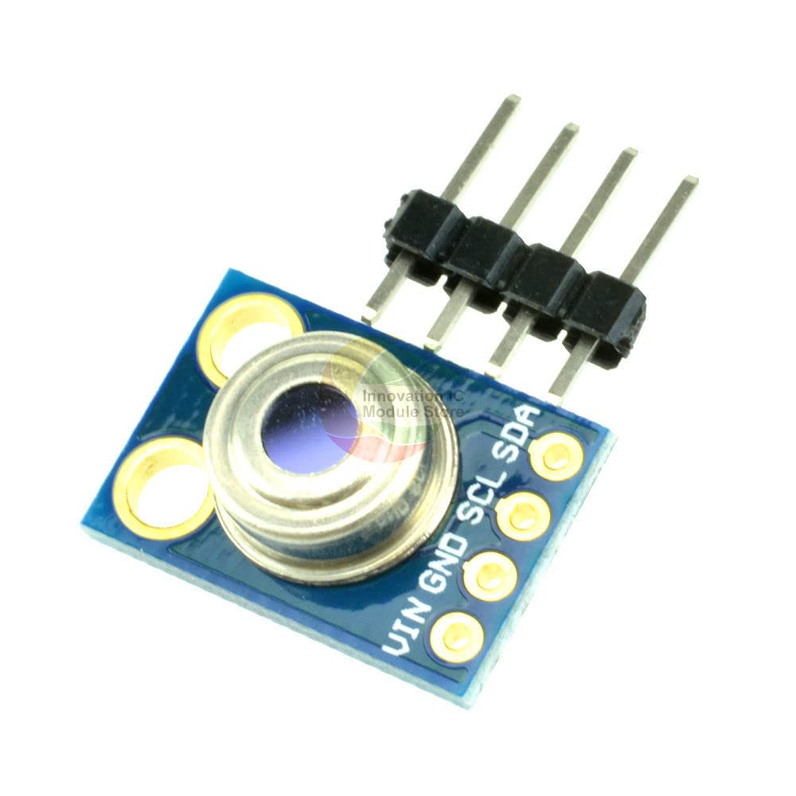

https://www.electronicshub.org/esp32-pinout/

I2C

PWM

A imagem 1

https://protosupplies.com/product/gy-906-mlx90614-non-contact-precision-thermometer-module/

A imagem 2 trata da foto panorâmica do sensor a ser utilizado. Essa foto possui indicação escrita da identificação de cada um dos pinos para conexão com o microcontrolador. O pino Vin trata da tensão de alimentação de 3,3v a ser fornecida pelo microcontrolador. O pino GND trata da referência também a ser fornecida pelo microcontrolador. O protocolo de comunicação I2C utilizará os pinos 39 e 42 do microcontrolador para conexão do SCL e SDA respectivamente, a fim de estabelecer a comunicação bilateral. O sensor possui ângulo de leitura de 90° em cone e temperaturas máxima e mínima de 380°C e -70°C. O sensor custa na faixa de R$80 e está amplamente disponível no mercado através dos principais fabricantes. O sensor pesa não mais que 1g e possui dimensões de 17(comprimento)x 11,5(largura)x5,6(altura)mm. O sensor possui um filtro que filtra a luz visível para não interferir na leitura.

