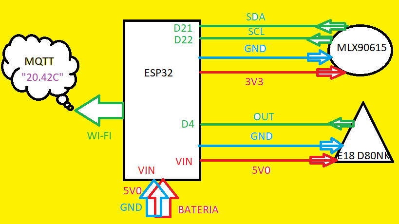
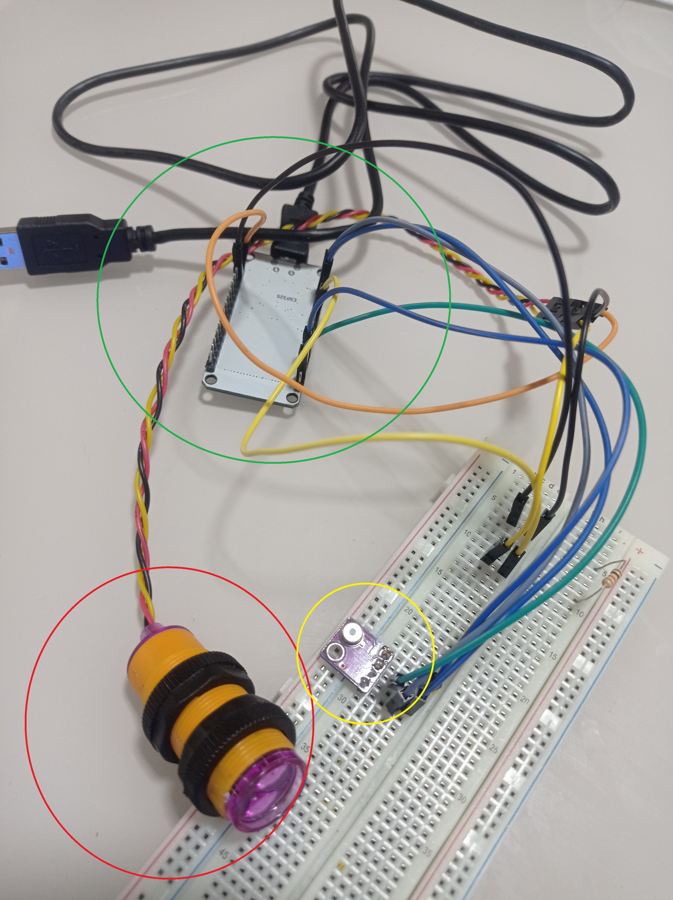
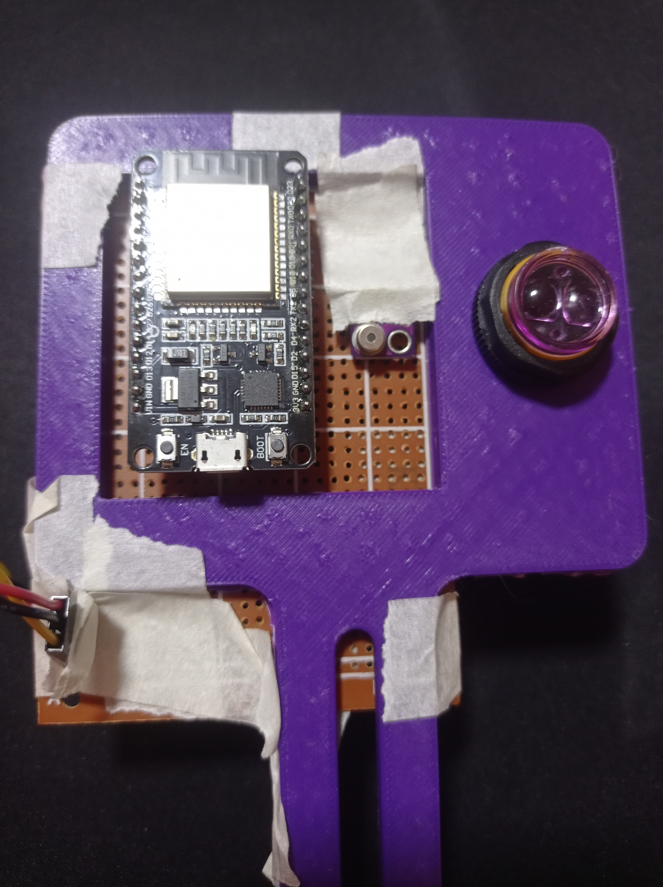
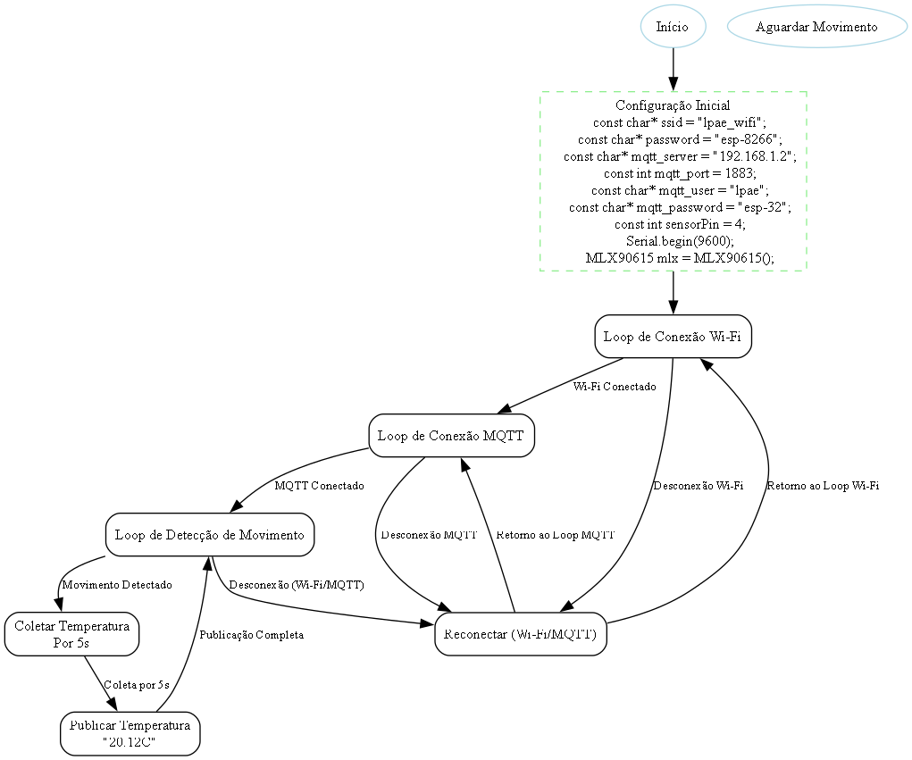
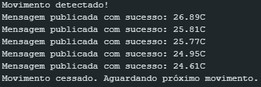

*   Na etapa de implementação serão mostradas as etapas passo a passo para que seja possível implementar o sistema escolhido do zero. A etapa de implementação contemplará tanto hardware quanto software e utilizará dos seguintes componentes: IDE Arduino, matriz de contatos, fios de baixa corrente e baixa temperatura, microcontrolador ESP32, sensor de temperatura MLX90615, sensor de presença E18-D80NK. Como discutido em etapas anteriores será implementado um sistema capaz de enviar mensagens a respeito da temperatura medida sob a condição de presença de movimento. Essas mensagens serão enviadas de uma localidade até outra bastando se conectar em um servidor, neste caso o Broker localizado no laboratório LPAE no IFSC campus Florianópolis.

**ETAPA 1: ARDUINO**

*   O Arduino que se enquadra entre as camadas de aplicação e IDF é um versátil e poderoso ambiente de desenvolvimento capaz de contemplar os mais diversos hardwares. A interface amigável somada à infinidade de exemplos disponíveis faz com que seja uma das plataformas mais utilizadas. O download seguro pode ser feito no link presente nas referências. Para a utilização do ambiente (IDE Arduino) com enfoque no projeto final a ser desenvolvido deve-se efetuar o download também da biblioteca específica do sensor de temperatura e dos drivers do microcontrolador ESP32 para o SO desejado. Ambos os links estão disponíveis nas referências. Após as configurações necessárias de porta COM e a seleção correta do hardware (ESP32) o código pode ser compilado e programado. Os códigos serão desenvolvidos conforme a base que organiza-os em duas partes abaixo: 1 - definições, inicializações, declarações e utilização de bibliotecas; 2 - função principal do código em laço infinito.

```text
1.  #include < >
2.  
3.  void setup() {
4.  }
5.  
6.  void loop() {
7.  }
```

*   O primeiro e mais simples código que pode ser criado para entendimento suscinto da IDE Arduino e verificação do hardware é o pisca led como visto abaixo.

**ETAPA 2: PISCA LED**

```text
1.  #define LED 2
2.  
3.  void setup() {
4.    pinMode(LED, OUTPUT);
5.  }
6.  
7.  void loop() {
8.    digitalWrite(LED, HIGH);
9.    delay(1000);
10.   digitalWrite(LED, LOW);
11.   delay(1000);
12. }
```

*   Foi definido que o pino 2 chamado de &quot;LED&quot; será configurado como saída e terá nível lógico alto e depois nível lógico baixo após 1 segundo, ou seja, irá acender e apagar na frequência de 1Hz. O laço infinito faz com que o led pisque de forma indefinida. O resultado visto no hardware após a programação é um led da cor azul que pisca em 1Hz. Um led piscando ou aceso pode ser um ótimo sinalizador de funcionamento do hardware, colocando-se sob determinadas condições o led irá piscar ou acender quando essas determinadas condições forem atendidas, dessa forma é possível monitorar e/ou controlar o código de maneira mais eficiente.
*   Outra ferramenta extremamente útil é o monitor serial.

**ETAPA 3: MONITOR SERIAL**

```text
1.  #include <Arduino.h>
2.  #define TX_PIN 1
3.  
4.  void setup() {
5.    Serial.begin(9600);
6.    pinMode(TX_PIN, OUTPUT);
7.  }
8.  
9.  void loop() {
10.   Serial.println("Teste");
11.   digitalWrite(TX_PIN, HIGH);
12.   delay(250);
13.   digitalWrite(TX_PIN, LOW);
14.   delay(250);
15. }
```

*   É importante perceber que foi adicionada uma nova biblioteca para que fosse possível executar as necessidades do código, neste caso essa biblioteca já é nativa do Arduino necessitando apenas referenciá-la. O pino 1 é definido para transmissão de informações. Nota importante: os pinos devem ser definidos conforme o esquema de pinos do hardware utilizado e suas funções. No caso do ESP32 o pino de transmissão é o pino 1. Após configurar a taxa de Baud para a velocidade de 9600 deve-se também alterar o monitor serial no Arduino para visualização na velocidade de 9600, do contrário não será possível ler a mensagem. A função deste código é imprimir a mensagem &quot;Teste&quot; a cada aproximadamente 0,5 segundos de forma indefinida a ser verificada no próprio monitor serial do Arduino.
*   O projeto também requer a conexão em rede local. Para testar a conexão em rede local pode-se escrever as linhas de código a seguir.

**ETAPA 4: WI-FI**

```text
1.  #include <WiFi.h>
2.  
3.  const char* ssid = "NOME_DA_REDE_WIFI";
4.  const char* password = "SENHA_DA_REDE_WIFI";
5.  
6.  void setup() {
7.    Serial.begin(115200);
8.    Serial.println();
9.    Serial.print("Conectando-se a ");
10.   Serial.println(ssid);
11.   WiFi.begin(ssid, password);
12.   while (WiFi.status() != WL_CONNECTED) {
13.     delay(500);
14.     Serial.print(".");
15.   }
16.   Serial.println("");
17.   Serial.println("Conexão Wi-Fi estabelecida");
18.   Serial.print("Endereço IP: ");
19.   Serial.println(WiFi.localIP());
20. }
21. 
22. void loop() {}
```

*   O código acima testa a conexão do hardware com o wi-fi em rede local a partir da biblioteca &quot;WiFi.h&quot; que muitas vezes está disponível para versões mais recentes do Arduino. Não estando disponível deve-se adicioná-la da mesma forma que as demais. Deve-se configurar &quot;ssid&quot; com o nome da rede que se está utilizando e &quot;password&quot; com a senha da rede. Se o nome da rede e senha estiverem corretos aparecerá no monitor serial a mensagem de &quot;Conexão Wi-Fi estabelecida&quot; e será mostrado o endereço de IP da rede. Nada mais ocorre no código após a conexão bem sucedida.
*   Por fim antes de adicionar qualquer hardware deve-se configurar o IOT via MQTT e broker apropriado. Código para configuração e verificação do funcionamento do MQTT representado como segue.

**ETAPA 5: MQTT**

```text
1.  #include <WiFi.h>
2.  #include <PubSubClient.h>
3.  
4.  const char* ssid = "seuSSID";
5.  const char* password = "suaSenha";
6.  const char* mqtt_server = "endereco_do_broker_mqtt";
7.  const int mqtt_port = 1883;
8.  const char* mqtt_user = "seuUsuarioMQTT";
9.  const char* mqtt_password = "suaSenhaMQTT";
10. const char* publish_topic = "seu/topico/publicacao";
11. 
12. WiFiClient espClient;
13. PubSubClient client(espClient);
14. 
15. void setup() {
16.   Serial.begin(115200);
17.   WiFi.begin(ssid, password);
18.   while (WiFi.status() != WL_CONNECTED) {
19.     delay(500);
20.     Serial.print(".");
21.   }
22.   Serial.println("\nWiFi conectado");
23.   client.setServer(mqtt_server, mqtt_port);
24.   while (!client.connected()) {
25.     Serial.print("Conectando ao broker MQTT...");
26.     if (client.connect("ESP32Client", mqtt_user, mqtt_password)) {
27.       Serial.println("Conectado");
28.     } else {
29.       Serial.print("Falha, rc=");
30.       Serial.print(client.state());
31.       Serial.println(" Tentando novamente em 5 segundos");
32.       delay(5000);
33.     }
34.   }
35. }
36. 
37. void loop() {
38.   if (!client.connected()) {
39.     while (!client.connected()) {
40.       Serial.print("Reconectando ao broker MQTT...");
41.       if (client.connect("ESP32Client", mqtt_user, mqtt_password)) {
42.         Serial.println("Reconectado");
43.       } else {
44.         Serial.print("Falha, rc=");
45.         Serial.print(client.state());
46.         Serial.println(" Tentando novamente em 5 segundos");
47.         delay(5000);
48.       }
49.     }
50.   }
51.   client.loop();
52.   static unsigned long lastPublish = 0;
53.   unsigned long now = millis();
54.   if (now - lastPublish > 5000) {
55.     lastPublish = now;
56.     client.publish(publish_topic, "teste");
57.     Serial.println("Mensagem 'teste' publicada");
58.   }
59. }
```

*   A partir do código anterior de conexão wi-fi e utilizando uma nova biblioteca chamada de &quot;PubSubClient.h&quot; é possível enviar mensagens de uma rede local para outra rede através de um servidor MQTT.  Basicamente o servidor MQTT (Broker) requer 4 informações importantes que devem ser colocadas: 1 - Endereço do Broker. 2 - Porta do Broker. 3 - Usuário do Broker. 4 - Senha do Broker. Caso a conexão com o Broker seja bem sucedida será possível verificar em &quot;dashboard&quot;, no aplicativo web ou para instalação, o conteúdo das mensagens enviadas em tempo real, neste caso será possível verificar o conteúdo &quot;teste&quot; a cada 5 segundos. Caso a conexão não seja bem sucedida será tentada a reconexão e assim o código ficara nesse laço de conexão e reconexão, se necessário. &quot;RC&quot; indica o erro que ocorreu ao tentar se conectar ao Broker, por exemplo, &quot;RC=2&quot; inidica que a conexão foi negada possivelmente por alguma credencial incorreta.
*   A primeira adição de hardware será para o sensor de temperatura modelo GY906 ou MLX90615/14. O código contendo a lógica de funcionamento do sensor de temperatura encontra-se abaixo.

**ETAPA 6: MLX90615**

```text
1.  #include <Wire.h>
2.  #include <mlx90615.h>
3.  
4.  MLX90615 mlx = MLX90615();
5.  
6.  void setup() {
7.    Serial.begin(9600);
8.    Serial.println("Melexis MLX90615 infra-red temperature sensor test");
9.    mlx.begin();
10.   Serial.print("Sensor ID number = ");
11.   Serial.println(mlx.get_id(), HEX);
12. }
13. 
14. void loop() {
15.   Serial.print("Ambient = ");
16.   Serial.print(mlx.get_ambient_temp());
17.   Serial.print(" *C\tObject = ");
18.   Serial.print(mlx.get_object_temp());
19.   Serial.println(" *C");
20.   Serial.println();
21.   delay(500);
22. }
```

*   Após a adição da biblioteca correta deve-se configurar os pinos corretos de SDA (pino 21) e SCL (pino 22) do ESP32 para coincidir com os mesmos pinos do sensor de temperatura de forma que a comunicação I2C funcione. Após uma simples configuração tanto em software quanto em hardware será mostrada no monitor serial a temperatura do ambiente (temperatura do encapsulamento do sensor) e a temperatura do objeto (temperatura medida em frente ao sensor). A temperatura será mostrada a cada 500ms.

**ETAPA 7: D18-80NK**

```text
1.  const int sensorPin = 4;
2.  const int ledPin = 2;
3.  
4.  void setup() {
5.    Serial.begin(9600);
6.    pinMode(sensorPin, INPUT);
7.    pinMode(ledPin, OUTPUT);
8.    Serial.println("Sensor de Movimento E18-D80NK testando...");
9.  }
10. 
11. void loop() {
12.   int sensorValue = digitalRead(sensorPin);
13.   if (sensorValue == HIGH) {
14.     Serial.println("Movimento detectado!");
15.     digitalWrite(ledPin, HIGH);
16.   } else {
17.     Serial.println("Nenhum movimento.");
18.     digitalWrite(ledPin, LOW);
19.   }
20.   delay(100);
21. }
```

*   O sensor de movimento é o último hardware a ser adicionado e funciona de forma simplificada enviando um nível lógico baixo ou alto no pino de saída. Esse nível lógico pode ser interpretado para condicionar a atuação do microcontrolador. No caso do código acima são definidos dois pinos, um para o led integrado (pino 2) e um para a saída do sensor de presença (pino 4). O led irá acompanhar o funcionamento do sensor de presença acendendo caso o pino 4 vá para nível lógico alto. No monitor serial é enviada a mensagem de &quot;movimento detectado&quot; ou &quot;nenhum movimento&quot; a depender do estado do pino 4.
*   Por fim, integrando todas as etapas anteriores chega-se ao projeto final. O diagrama de blocos do projeto final pode ser visto na figura 1. O mesmo diagrama foi montado em placa de prototipagem assim como na figura 2, que destaca em vermelho, verde e amarelo, respectivamente: sensor de movimento, ESP32 e sensor de temperatura. Para a entrega os conectores dos componentes foram soldados na placa universal e inseridos em um suporte feito por uma impressora 3D a fim de fixá-lo posteriormente na esteira. Uma bateria foi inserida para alimentar e embarcar o ESP32. A figura 3 mostra o projeto final em seu estágio físico final.






*   O código final engloba todos os códigos anteriores em seu escopo, dessa forma a complexidade torna-se diminuída por entender cada módulo separadamente. O monitor serial terá a função de enviar várias mensagens para controle na própria IDE Arduino possibilitando a verificação das inicializações de hardware, a conectividade da rede e o conteúdo enviado. O módulo de wi-fi se junta ao módulo mqtt para enviar uma mensagem de rede local para outra rede, ambos têm função elementar no laço que só avança se ocorrer a conexão. Caso haja falha na conexão o laço retorna para tentar a reconexão. Após a conexão certa o envio da mensagem fica condicionado à indicação de movimento (outro laço). Por fim se todos os módulos estiverem de acordo a mensagem com o valor da temperatura é enviada 5 vezes e aparecerá da seguinda forma no Broker: &quot;20.21C&quot;. Onde &quot;C&quot; representa a temperatura em graus Celsius. O fluxograma completo do código final pode ser visto na figura 4.

**ETAPA 8: CÓDIGO FINAL**

```text
1.  #include <Wire.h>
2.  #include <mlx90615.h>
3.  #include <WiFi.h>
4.  #include <PubSubClient.h>
5.  
6.  MLX90615 mlx = MLX90615();
7.  const char* ssid = "lpae_wifi";
8.  const char* password = "esp-8266";
9.  const char* mqtt_server = "192.168.1.2";
10. const int mqtt_port = 1883;
11. const char* mqtt_user = "lpae";
12. const char* mqtt_password = "esp-32";
13. const int sensorPin = 4;
14. 
15. WiFiClient espClient;
16. PubSubClient client(espClient);
17. 
18. void setup() {
19.   Serial.begin(9600);
20.   Serial.println("Melexis MLX90615 infra-red temperature sensor test");
21.   mlx.begin();
22.   Serial.print("Sensor ID number = ");
23.   Serial.println(mlx.get_id(), HEX);
24.   setup_wifi();
25.   client.setServer(mqtt_server, mqtt_port);
26.   pinMode(sensorPin, INPUT);
27. }
28. 
29. void loop() {
30.   if (!client.connected()) {
31.     reconnect();
32.   }
33.   client.loop();
34.   int sensorValue = digitalRead(sensorPin);
35.   if (sensorValue == HIGH) {
36.     Serial.println("Movimento detectado!");
37.     for (int i = 0; i < 5; i++) {
38.       float objectTemp = mlx.get_object_temp();
39.       String payload = String(objectTemp, 2) + "C";
40.       if (client.publish("sensor/temperatura", payload.c_str())) {
41.         Serial.println("Mensagem publicada com sucesso: " + payload);
42.       } else {
43.         Serial.println("Falha ao publicar mensagem.");
44.       }
45.       delay(1000);
46.     }
47.     while (digitalRead(sensorPin) == HIGH) {
48.       delay(100);
49.     }
50.     Serial.println("Movimento cessado. Aguardando próximo movimento.");
51.   }
52.   delay(500);
53. }
54. 
55. void setup_wifi() {
56.   delay(10);
57.   Serial.println();
58.   Serial.print("Conectando-se à rede ");
59.   Serial.println(ssid);
60.   WiFi.begin(ssid, password);
61.   while (WiFi.status() != WL_CONNECTED) {
62.     delay(500);
63.     Serial.print(".");
64.   }
65.   Serial.println("");
66.   Serial.println("WiFi conectado");
67.   Serial.println("Endereço IP: ");
68.   Serial.println(WiFi.localIP());
69.   delay(3000);
70. }
71. 
72. void reconnect() {
73.   while (!client.connected()) {
74.     Serial.print("Tentando conexão MQTT...");
75.     if (client.connect("temp_client", mqtt_user, mqtt_password)) {
76.       Serial.println("conectado");
77.     } else {
78.       Serial.print("falhou, rc=");
79.       Serial.print(client.state());
80.       Serial.println(" tentando novamente em 5 segundos");
81.       delay(5000);
82.     }
83.   }
84. }
```



*   O resultado colhido pode ser verificado nas figuras 5 e 6, mostrando respectivamente o monitor serial do Arduino e o Broker 192.168.1.2 com o tópico da temperatura aberto e atualizado conforme o envio.




**REFERÊNCIAS**

*   KISELEV, S. _MLX90615_. Disponível em: [https://github.com/skiselev/MLX90615](https://github.com/skiselev/MLX90615). Acesso em: 21 ago. 2024.
*   ARDUINO. _Arduino software_. Disponível em: [https://www.arduino.cc/en/software](https://www.arduino.cc/en/software). Acesso em: 21 ago. 2024.
*   _USB to UART Bridge VCP Drivers_. SILICON LABS. Disponível em: https://www.silabs.com/developers/usb-to-uart-bridge-vcp-drivers?tab=downloads. Acesso em: 21 ago. 2024.