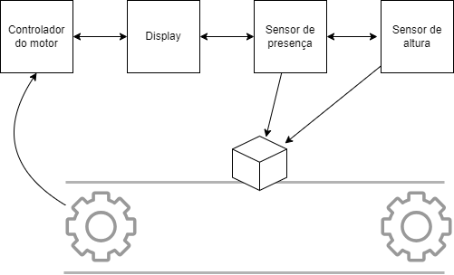
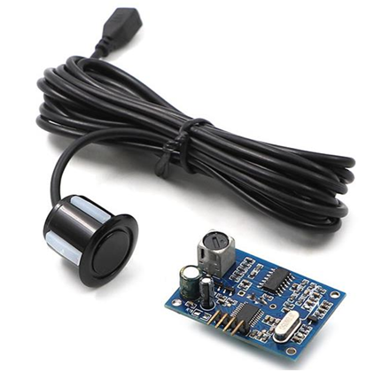
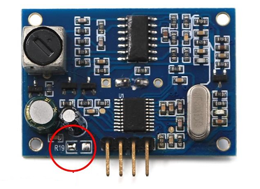
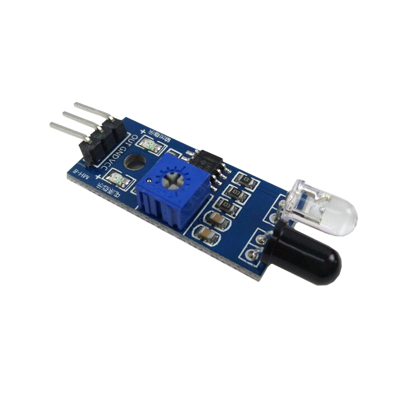
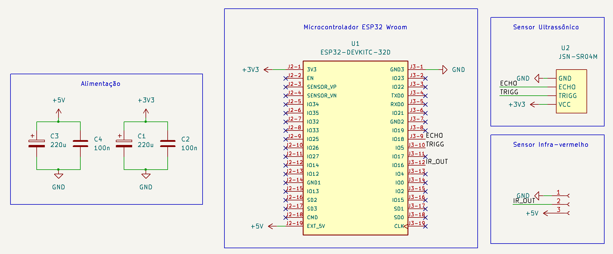
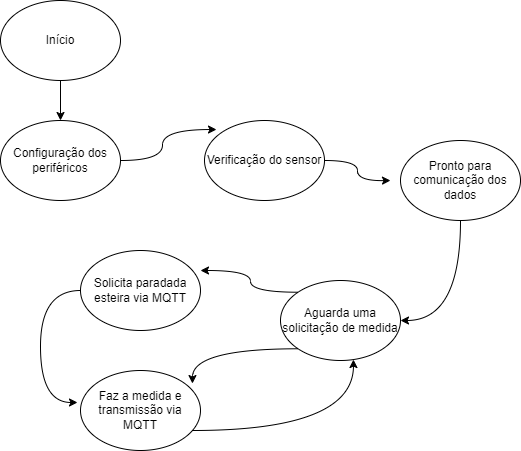
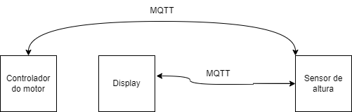

**O sistema de medição de altura**

O sistema de medida de altura tem como objetivo principal fornecer informações precisas sobre a posição vertical dos objetos que passam pela esteira. Isso é fundamental para monitorar o fluxo de produção, garantir a qualidade dos produtos e otimizar o processo de fabricação.

Além disso, o sistema deve ser capaz de operar de forma confiável em diferentes condições, incluindo a esteira em movimento e parada. Isso requer a seleção cuidadosa de sensores e realizar as implementações de software necessárias para isso.

O sistema de medição de altura desenvolvido estabelecerá uma comunicação com outros componentes da esteira transportadora, incluindo o controle do motor, o sensor de presença e o display. Esta comunicação bidirecional permitirá uma coordenação eficiente das operações da esteira, garantindo um funcionamento suave e preciso do sistema como um todo.

Quando uma medida de altura for solicitada, o sistema de medição de altura será capaz de responder de maneira adequada, realizando uma medição rápida quando a esteira estiver em movimento e uma medição lenta quando a esteira estiver parada. Para isso, ele solicitará a parada da esteira ao controle do motor, garantindo condições ideais para uma medição precisa.

Além disso, o sistema de medição de altura estará integrado ao sensor de presença, de modo que, quando o sensor detectar a presença de um objeto na esteira, o sistema realizará uma leitura rápida da altura do objeto e a armazenará para uso futuro. Essa funcionalidade permite uma resposta rápida e eficiente às mudanças no ambiente da esteira, garantindo a coleta e o armazenamento de dados relevantes.

Por fim, o sistema de medição de altura estará pronto para enviar as medidas ao display quando solicitado, fornecendo informações em tempo real sobre a altura dos objetos na esteira. Essa interface com o display permite aos operadores monitorar o processo de produção e tomar decisões informadas com base nos dados fornecidos.

**Sensor Ultrassônico**

O sensor ultrassônico será responsável por medir a altura dos objetos na esteira. Ele enviará os dados de altura para o microcontrolador, que estará configurado como um cliente para a comunicação MQTT. Quando um sistema solicitar a altura medida, o sistema responderá enviando os dados para exibição em um display, após receber esta solicitação.

Além disso, o sensor secundário de infravermelho será utilizado para detectar a presença de objetos na esteira. Quando um objeto for detectado, o sensor enviará um sinal para o microcontrolador, que então enviará um comando via MQTT para parar a esteira suavemente. Após a parada da esteira, o sensor ultrassônico fará a leitura da altura do objeto e enviará os dados via para o sistema de controle.

O módulo JSN-SR04M foi escolhido e fornecido para a realização do sistema. Este módulo possui as seguintes características:

*   Distância de medição: O JSN-SR04M é capaz de medir distâncias com precisão em um intervalo que geralmente varia de 20cm a 8m, dependendo das condições de operação e das características do ambiente;
*   Alta precisão: o JSN-SR04M oferece uma precisão de medição geralmente na faixa de milímetros;
*   Ângulo de detecção: O módulo JSN-SR04M normalmente possui um ângulo de detecção amplo, o que significa que pode detectar objetos em uma ampla área frontal.
*   Tensão de operação: O JSN-SR04M é alimentado com uma tensão de 3 a 5.5V (consumo aproximado 30mA);
*   Interface de comunicação: JSN-SR04M possui uma interface simples de comunicação consistindo em um sinal de disparo (trigger) e um sinal de eco (echo), ou ainda serial;
*   Impermeável: no módulo JSN-SR04M seu sensor é a prova de água.

O módulo do sensor ultrassônico é constituido de 2 componentes: sensor ultrassônico e placa de controle:

O módulo pode ser configurado para diferentes tipos de comunicação, bastando para isso alterar o valor do resistor 19:  
1\. Sem ressitor: Modo de acionamento compatível com o módulo modelo HR-04;  
2\. 300kOhm: Modo de Baixa Potência;  
3\. 120kOhm: Modo Serial Automático;  
4\. 47kOhm: Modo Serial de Baixa Potência;  
5\. Jumper: Modo de Impressão de Computador.

Assim, a pinagem de comunicação para o microcontrolador, dependerá do método de comunicação utilizado.

Para este projeto, o método de comunicação entre microcontrolador e placa de controle do sensor será sem resistor, assim poderá utilizar bibliotecas semelhantes ao modelo HR-04. Dessa forma, os pinos serão:

1.  GND: Negativo da fonte de alimentação
2.  ECHO: Resposta da leitura realizada;
3.  TRIG: Dispara o sensor para fazer uma leitura;
4.  Alimentação 3 a 5.5V;

**Sensor de presença**

O sensor de presença será interligado apenas localmente no sistema de medida de altura, este tem por função garantir que o objeto se encontra no local correto para realizar a medida de altura. Assim, quando este sensor identificar presença do objeto, fará a medida. No caso da medida lenta (que será abordada adiante) este sensor será utilizado para verificar a localização correta do objeto, caso esteja de acordo realizará a medida, caso contrário resultará em erro de medida ou poderá realizar tentativa nova de leitura após pequena movimentação da esteira.

Abaixo, a imagem representa o sensor infra-vermelho:

1.  GND: Negativo da fonte de alimentação;
2.  OUT: Resposta da leitura realizada;
3.  VCC: Alimentação positiva 5V.

**Microcontrolador ESP32**

Para possibilitar a implementação do protocolo MQTT semelhante ao utilizado na indústria, será utilizado junto aos sensores (infra-vermelho e ultrasônico) um microcontrolador ESP32 (fabricação Espressif) conforme sugestão e adequação das características de comunicação (Wi-Fi).

A escolha do ESP32 como controlador principal e do sensor ultrassônico com capacidade de medir a distância entre o transdutor e o objeto em frente parece ser uma decisão sólida e bem fundamentada. O ESP32 é uma plataforma versátil e amplamente utilizada para projetos de IoT e automação, oferecendo conectividade Wi-Fi e Bluetooth integradas, além de uma ampla variedade de recursos de processamento e E/S.

Portanto, a combinação do ESP32 como controlador e do sensor ultrassônico com essa capacidade específica parece ser uma escolha adequada para o projeto proposto. Isso permitirá que o sistema atenda aos requisitos de medição de altura na esteira automatizada de forma eficiente e confiável, conforme sugerido pelo professor e considerando a disponibilidade dos componentes.

Este microconrolador é utilizado em uma placa de desenvolvimento que possui alimentação, cristais, proteções, pinos disponpiveis para a utilização e depuração:

*   ESP32-WROOM-32 contém dois microprocessadores Xtensa® de baixa potência de 32 bits LX6
*   448 KBytes de ROM para inicialização e funções principais
*   520 KBytes de SRAM embutido
*   8 KBytes de SRAM em RTC LENTO
*   8 KBytes de SRAM em RTC RÁPIDO
*   1 Kbit de EFUSE, 256 bits MAC
*   WiFi: 802.11 b/g/n/d/e/i/k/r (802.11n até 150 Mbps)
*   Bluetooth v4.2 especificação BR/EDR e BLE
*   IPv4, IPv6, SSL, TCP/UDP/HTTP/FTP/MQTT
*   Interfaces: cartão SD, UART, SPI, SDIO, I2C, PWM de LED, PWM de motor, I2S, IR, GPIO, sensor de toque capacitivo, ADC, DAC, sensor Hall, sensor de temperatura
*   Temperatura de operação -40 + 85°C
*   Tensão de operação: 2,2-3,6V
*   Consumo: 80 mA típico
*   Dimensões: 18 mm x 20 mm x 3 mm

A pinagem encontrada na placa de desenvolvimento pode ser vista na imagem a seguir:

**Esquemático de interconexão Microcontrolador - módulo do sensor**

Básicamente precisamos garantir tensão estável na alimentação dos sensores: será utilizada a porta de saída com tensão 5V vinda do cabo USB que alimentará o sensor de presença e a placa ESP32.

Internamente à placa, há um regulador de tensão com saída 3V3 que alimenta o microcontrolador presente na placa de desenvolvimento e o sensor infra-vermelho.

Uma observação é que a princípio a alimentação do sistema será feita via porta USB presente na placa ESP32.

A comunicação dos sensores para a placa de desenvolvimento ESP32, será baseada em:

*   IR\_OUT: sinal digital que apresenta nível lógico baixo na presença de um objeto e nível alto na ausência de objetos abaixo do sensor;
*   ECHO e TRIGG: sinais de comunicação do sensor ultrassônico.

**Firmware de controle**

**O hardware será capaz de forncer as seguintes informações locais:**

*   Presença de um objeto: nível lógico alto ou baixo;
*   Distância lida pelo sensor ultrassônico: será necessário converter essa distância para altura, descontando o valor da distância da esteira.

Para o controle e transmissão, o firmware deverá configurar os periféricos Wi-fi, entrada e saída e realizar um teste do sensor.

Após isso, ficará aguardando uma solicitação de medida vindo dos outros clientes na rede MQTT.

Assim, poderá ter a medida rápida ou a lenta. Onde a rápida apenas mede com a esteira em movimento e manda esta informação para o solicitante. Caso seja medida lenta, antes de medir, o controlador enviará solicitação de parada ao controlador do motor, fará a medida lenta e retornará para o solicitante.

**A Comunicação MQTT**

Cada componente do sistema (sensores, display, controlador do motor, leitor de QRCode) será um cliente MQTT. Assim, os sistemas isolados serão subscritos conforme necessidade de troca de informações.

No caso do sensor de altura, o display será subscrito no sistema de medida de altura e poderá solicitar medida lenta ou rápida.

E para solicitar as paradas, o sensor de altura será subscrito no controlador do motor e poderá solicitar parada da esteira e após enviará comando para retomar o movimento da esteira.

Ou seja teremos a seguinte estrutura (ilustração apenas dos componentes interconectados e relacionados a medida de altura):

Os tópicos MQTT disponibilizados pelo sensor de altura serão:

*   \\altura\\rapida: Medida rápida (realiza a medida sem parar a esteira);
*   \\altura\\lenta: Medida lenta (para a esteira e retorna medida mais precisa).