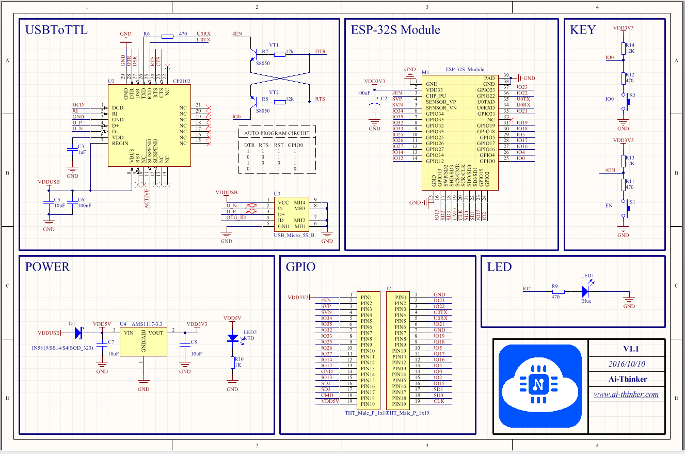
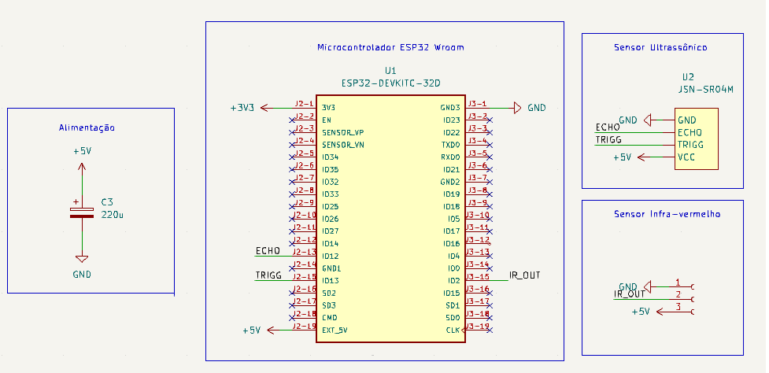
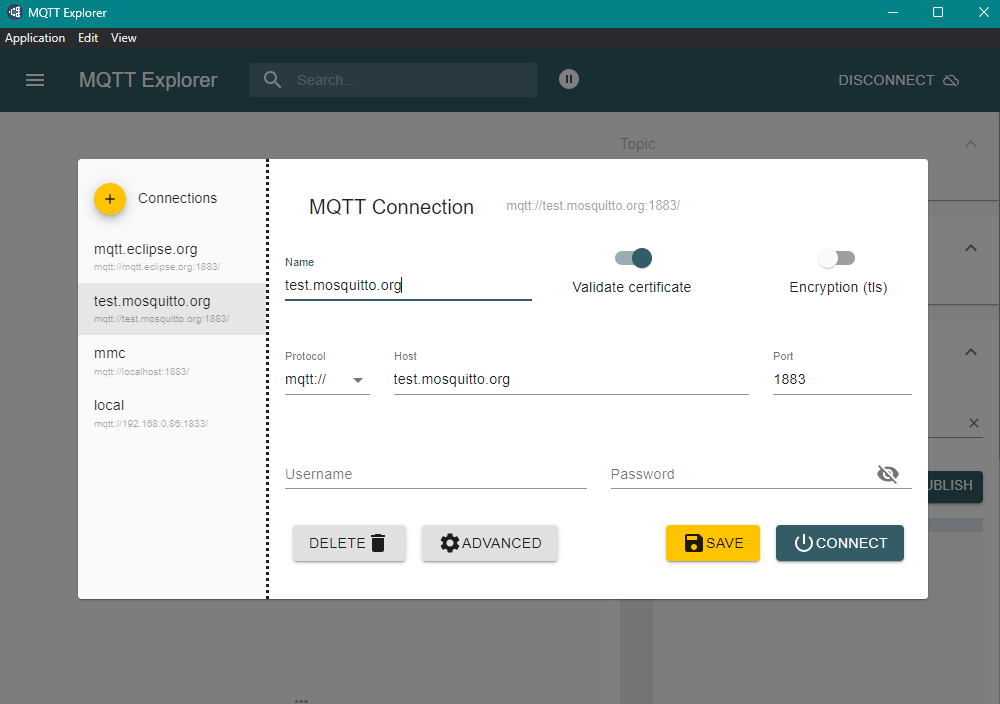
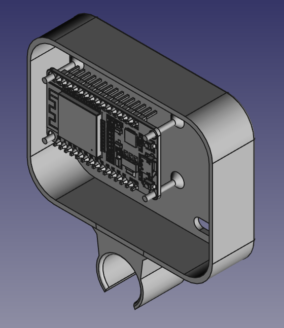
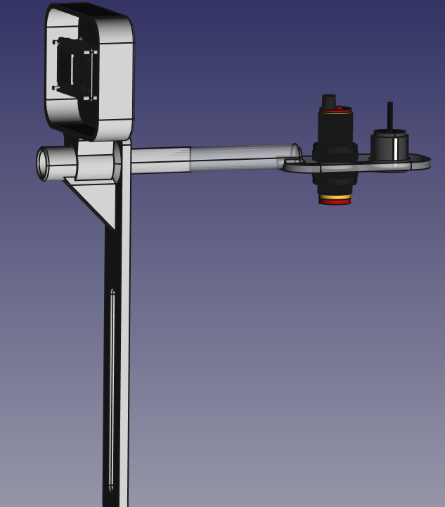
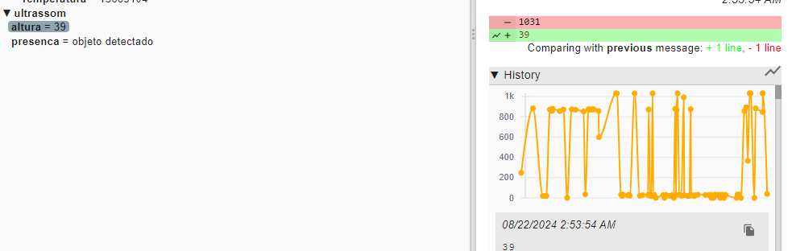
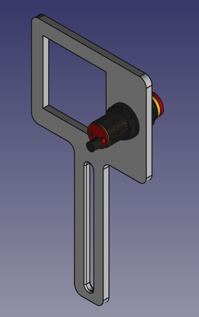
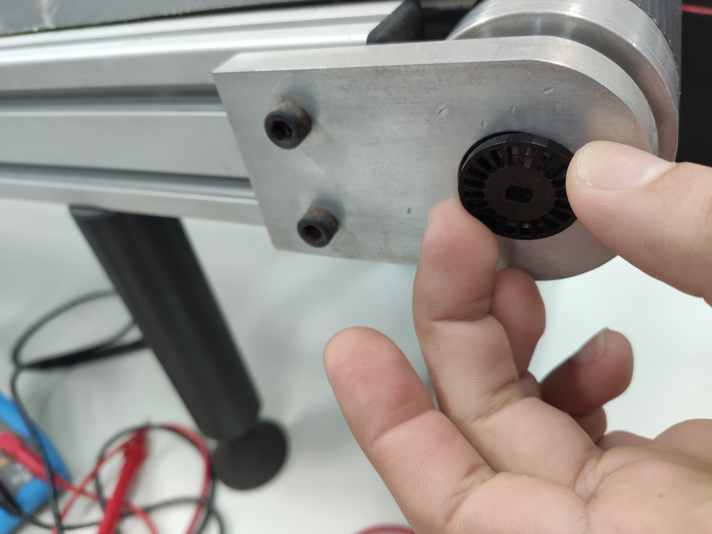
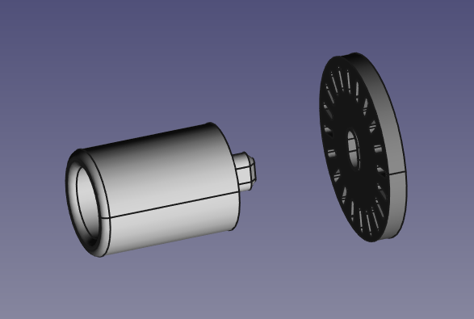

#   

# Implementação do Sistema de Medição de Altura

## Introdução

Na fase de implementação do projeto, o foco estará em integrar e programar todos os componentes para garantir o funcionamento eficaz do sistema de medição de altura. Esse processo envolverá a configuração do microcontrolador ESP32, a integração do sensor ultrassônico JSN-SR04M e do sensor de presença, além da implementação da comunicação via MQTT entre esses dispositivos.

O sistema será configurado para operar em dois modos principais: medição rápida e medição lenta. A medição rápida ocorrerá com a esteira em movimento, enquanto a medição lenta será realizada com a esteira parada, garantindo maior precisão. Para isso, o sistema será programado para solicitar a parada da esteira quando necessário, garantindo que as medições sejam feitas em condições ideais.

A comunicação entre o sensor de altura, o controle do motor, o sensor de presença e o display será essencial para o funcionamento do sistema. O microcontrolador ESP32 será programado para receber os sinais dos sensores, processar os dados de altura e transmitir as informações conforme solicitado. Quando o sensor de presença detectar um objeto, o sistema realizará uma leitura rápida da altura e armazenará esses dados, permitindo que sejam acessados posteriormente, caso necessário.

Finalmente, o firmware do microcontrolador será desenvolvido para configurar e controlar todos os periféricos, incluindo a comunicação Wi-Fi para o protocolo MQTT, as entradas e saídas digitais para os sensores, e a lógica de controle necessária para a operação coordenada de todo o sistema.

## Testes de firmware - elementos utilizados no projeto

Pinout e esquemático da placa de desenvolvimento podem ser consultados abaixo:

#### Pinout - ESP32 Wroom


###   

### Esquemático ESP32 Wroom



### GPIO - Output

Inicialmente, os testes de firmware serão conduzidos no ESP32 WROOM, começando pelo controle básico de GPIO, onde o objetivo é piscar o LED onboard da placa. Esse teste inicial validará a configuração de saída do GPIO.

Segundo esquemático da placa ESP32 Wroom, o led onboard é ligado no modo Current source no pino GPIO2. Portanto, nível lógico alto corresponde ao led ligado.

O software a seguir foi utilizado para o teste:

```blink
void setup() {
  pinMode(2, OUTPUT);
}

void loop() {
  digitalWrite(2, HIGH);
  delay(1000);
  digitalWrite(2, LOW);
  delay(1000);
}
```

## Serial e leitura de entrada digital

Para este teste, foi utilizado novamente o pino 2, assim sendo, ao energizar este pino com nível lógico alto, o led acende e a leitura do pino deverá ser nível lógico alto. Além disso, a função digitalRead(2) retorna o valor booleano com a leituras do GPIO2 e a envia via Serial:

```text
void setup() {
 pinMode(2,INPUT);
 Serial.begin(115200);
}

void loop() {
  Serial.println(!digitalRead(2));
  delay(200);
}
```

### Leitura pino digital - Sensor IR

O mesmo software foi utilizado, e o jumper utilizado no teste anterior foi substituido pelo sinal de saída do módulo de sensor IR. O módulo foi alimentado pelo pino de alimentação da placa ESP32 que possui tensão de 5V fornecida pela USB. Foi ajustado o trimpot presente no módulo IR para calibração da distância de detecção inferior a 20cm, utilizando como feedback o led presente no mesmo módulo e o led onboard neste mesmo pino. A sapida deste módulo possui nível lógico alto normalmente, e passa a ser nível alto quando detectada uma distância inferior ao ajustado, cerca de 20cm.

### Leitura pino digital - Sensor IR via interrupção externa

Ao longo do projeto, pode ser necessária uma otimização do firmware para detecção do objeto na esteira e sua parada mais rápida possível para efetuar medida de altura. Assim, foi testado também a leitrua do pino digital via interrupção externa com o seguinte firmware:

```text
#define GPIO_BOTAO 2
#define TEMPO_DEBOUNCE 10 //ms
 
int contador_acionamentos = 0;
unsigned long timestamp_ultimo_acionamento = 0;
 
/* Função ISR (chamada quando há geração da
interrupção) */
void IRAM_ATTR funcao_ISR()
{
/* Conta acionamentos do sensor considerando debounce */
if ( (millis() - timestamp_ultimo_acionamento) >= TEMPO_DEBOUNCE )
{
contador_acionamentos++;
timestamp_ultimo_acionamento = millis();
}
}
 
 
void setup()
{
Serial.begin(115200);
 
/* Configura o GPIO do sensor como entrada
e configura interrupção externa no modo
RISING para ele.
*/
pinMode(GPIO_BOTAO, INPUT);
attachInterrupt(GPIO_BOTAO, funcao_ISR, RISING);
}
 
void loop()
{
Serial.print("Acionamentos do sensor: ");
Serial.println(contador_acionamentos);
delay(1000);

}
```

Exemplo retirado da seguinte fonte: [https://www.makerhero.com/blog/uso-de-interrupcoes-externas-com-esp32/](https://www.makerhero.com/blog/uso-de-interrupcoes-externas-com-esp32/)

### Teste do sensor ultrassonico

Para o teste do sensor ultrassonico que será usado para medida de altura, será montado o hardware a seguir:



O firmware foi então ajustado para os novos pinos. Essa mudança foi realizada apenas por conta de ajustes da placa e na sua ligação elétrica que pode ser feita já que havia disponibilidade. A alimentação do sensor ultrassonico também foi corrigida para 5V conforme indicação no módulo.

```text
// Define Trig and Echo pin:
#define trigPin 12
#define echoPin 14
// Define variables:
long duration;
int distance;

void setup() {
  // Define inputs and outputs
  pinMode(trigPin, OUTPUT);
  pinMode(echoPin, INPUT);
  // Begin Serial communication at a baudrate of 9600:
  Serial.begin(115200);
}

void loop() {
  // Clear the trigPin by setting it LOW:
  digitalWrite(trigPin, LOW);
  
  delayMicroseconds(5);

 // Trigger the sensor by setting the trigPin high for 10 microseconds:
  digitalWrite(trigPin, HIGH);
  delayMicroseconds(10);
  digitalWrite(trigPin, LOW);
  
  // Read the echoPin. pulseIn() returns the duration (length of the pulse) in microseconds:
  duration = pulseIn(echoPin, HIGH);
  
  // Calculate the distance:
//  distance = duration*0.034/2;
  
distance = (duration/2) / 29.1;
  // Print the distance on the Serial Monitor (Ctrl+Shift+M):
  Serial.print("Distance = ");
  Serial.print(distance);
  Serial.println(" cm");
  delay(200);
   
}
```

Ao realizar o upload, obtemos as medidas acima de 20cm com resolução de 1cm.

Assim, observou-se que haverá necessidade de um ajuste na acomodação do sensor para leitruras de altura na ordem de 20 a 30cm para adequar-se ao projeto. Essa limitação foi identificada e verificada, o sensor ultrassônico opera corretamente em distâncias acima de 20cm.

### Leitura simultânea dos sensores - Ultrassonico e IR

O hardware foi montado conforme o esquemático anterior e o software foi adaptado para leitura de ambos os sensores:

```text
// Define Trig and Echo pin:
#define trigPin 13
#define echoPin 12
#define IR 2
// Define variables:
long duration;
int distance;

void setup() {
  // Define inputs and outputs
  pinMode(trigPin, OUTPUT);
  pinMode(echoPin, INPUT);
  pinMode(IR, INPUT);
  // Begin Serial communication at a baudrate of 115200:
  Serial.begin(115200);
}

void loop() {
  // Clear the trigPin by setting it LOW:
  digitalWrite(trigPin, LOW);
  
  delayMicroseconds(10);

 // Trigger the sensor by setting the trigPin high for 10 microseconds:
  digitalWrite(trigPin, HIGH);
  delayMicroseconds(10);
  digitalWrite(trigPin, LOW);
  
  // Read the echoPin. pulseIn() returns the duration (length of the pulse) in microseconds:
  duration = pulseIn(echoPin, HIGH);
  
  // Calculate the distance:
//  distance = duration*0.034/2;
  
distance = (duration/2) / 29.1;
  // Print the distance on the Serial Monitor (Ctrl+Shift+M):
  Serial.print("Distance = ");
  Serial.print(distance);
  Serial.print(" cm  ");
  Serial.print("IR: ");
  Serial.println(!digitalRead(IR));
  delay(500);
   
}
```

### MQTT - Client

Para estes testes, foi utilizado o software MQTT explorar disponível em [https://mqtt-explorer.com/.](https://mqtt-explorer.com/) Realizou-se a conexão com o host disponibilizado pela Mosquitto para testes.



Inicialmente foi testado o envio de informações fictícias como cliente pars teste host. O formware utilizado é o seguinte:

```text
#include <WiFi.h>
#include <PubSubClient.h>

//meu topico: /sensor/altura
//MQTT Client Publisher
//funcionando
// Update these with values suitable for your network.

const char* ssid = "Cardoso2.4"; // Ajuste estes valores a sua aplicação
const char* password = "pessegopepino";
const char* mqtt_server = "test.mosquitto.org";

WiFiClient espClient;
PubSubClient client(espClient);
unsigned long lastMsg = 0;
#define MSG_BUFFER_SIZE           (50)
char msg[MSG_BUFFER_SIZE];
int value = 0;
bool flag = 0;
void setup_wifi() {

  delay(10);
  // We start by connecting to a WiFi network
  Serial.println();
 Serial.print("Connecting to ");
 Serial.println(ssid);

 WiFi.mode(WIFI_STA);
  WiFi.begin(ssid, password);

  while (WiFi.status() != WL_CONNECTED) {
    delay(500);
   Serial.print(".");
  }

 randomSeed(micros());

 Serial.println("");
 Serial.println("WiFi connected");
 Serial.println("IP address: ");
 Serial.println(WiFi.localIP());
}

void callback(char* topic, byte* payload, unsigned int length) {
 Serial.print("Message arrived [");
 Serial.print(topic);
 Serial.print("] ");
  for (int i = 0; i < length; i++) {
   Serial.print((char)payload[i]);
  }
  Serial.println();
}

void reconnect() {
  // Loop until we're reconnected
  while (!client.connected()) {
   Serial.print("Attempting MQTT connection...");
    // Create a random client ID
    String clientId = "ESP32";
    clientId += String(random(0xffff), HEX);
    // Attempt to connect
    if (client.connect(clientId.c_str())) {
    //if (client.connect(clientId.c_str(),"lpae","esp-32")) {
     Serial.println("connected");
      // Once connected, publish an announcement...
     //client.publish("outTopic", "hello world");
      // ... and resubscribe
     //client.subscribe("exemple");
    } else {
     Serial.print("failed, rc=");
     Serial.print(client.state());
     Serial.println(" try again in 5 seconds");
      // Wait 5 seconds before retrying
      delay(5000);
    }
  }
}

void setup() {

 Serial.begin(115200);
  setup_wifi();
 client.setServer(mqtt_server, 1883);
 client.setCallback(callback);
}

void loop() {

  if (!client.connected()) {
    reconnect();
  }
  client.loop();

  unsigned long now = millis();
  if (now - lastMsg > 2000) {
    lastMsg = now;
    if (flag == 0) {
     client.publish("ultrassom/altura", "10");
    }
    else {
     client.publish("ultrassom/altura", "20");
    }
    flag = !flag;
  }
}#include <WiFi.h>
#include <PubSubClient.h>

//meu topico: /sensor/altura
//MQTT Client Publisher
//funcionando
// Update these with values suitable for your network.

const char* ssid = "Cardoso2.4"; // Ajuste estes valores a sua aplicação
const char* password = "pessegopepino";
const char* mqtt_server = "test.mosquitto.org";

WiFiClient espClient;
PubSubClient client(espClient);
unsigned long lastMsg = 0;
#define MSG_BUFFER_SIZE           (50)
char msg[MSG_BUFFER_SIZE];
int value = 0;
bool flag = 0;
void setup_wifi() {

  delay(10);
  // We start by connecting to a WiFi network
  Serial.println();
 Serial.print("Connecting to ");
 Serial.println(ssid);

 WiFi.mode(WIFI_STA);
  WiFi.begin(ssid, password);

  while (WiFi.status() != WL_CONNECTED) {
    delay(500);
   Serial.print(".");
  }

 randomSeed(micros());

 Serial.println("");
 Serial.println("WiFi connected");
 Serial.println("IP address: ");
 Serial.println(WiFi.localIP());
}

void callback(char* topic, byte* payload, unsigned int length) {
 Serial.print("Message arrived [");
 Serial.print(topic);
 Serial.print("] ");
  for (int i = 0; i < length; i++) {
   Serial.print((char)payload[i]);
  }
  Serial.println();
}

void reconnect() {
  // Loop until we're reconnected
  while (!client.connected()) {
   Serial.print("Attempting MQTT connection...");
    // Create a random client ID
    String clientId = "ESP32";
    clientId += String(random(0xffff), HEX);
    // Attempt to connect
    if (client.connect(clientId.c_str())) {
    //if (client.connect(clientId.c_str(),"lpae","esp-32")) {
     Serial.println("connected");
      // Once connected, publish an announcement...
     //client.publish("outTopic", "hello world");
      // ... and resubscribe
     //client.subscribe("exemple");
    } else {
     Serial.print("failed, rc=");
     Serial.print(client.state());
     Serial.println(" try again in 5 seconds");
      // Wait 5 seconds before retrying
      delay(5000);
    }
  }
}

void setup() {

 Serial.begin(115200);
  setup_wifi();
 client.setServer(mqtt_server, 1883);
 client.setCallback(callback);
}

void loop() {

  if (!client.connected()) {
    reconnect();
  }
  client.loop();

  unsigned long now = millis();
  if (now - lastMsg > 2000) {
    lastMsg = now;
    if (flag == 0) {
     client.publish("ultrassom/altura", "10");
    }
    else {
     client.publish("ultrassom/altura", "20");
    }
    flag = !flag;
  }
}
```

Ao rodar o firmware obteve-se sucesso na recepção pelo host.

### MQTT subscriber

Utilizando o MQTT explorer para envio de mensagens, foi testado o formware a seguir e ocorreu corretamente a recepção do tópico:

```text
#include <WiFi.h>
#include <PubSubClient.h>

//MQTT Client Subscriber

// Update these with values suitable for your network.

const char* ssid = "Cardoso2.4"; // Ajuste estes valores a sua aplicação
const char* password = "pessegopepino";
const char* mqtt_server = "test.mosquitto.org";

WiFiClient espClient;
PubSubClient client(espClient);
unsigned long lastMsg = 0;
#define MSG_BUFFER_SIZE           (50)
char msg[MSG_BUFFER_SIZE];
int value = 0;

void setup_wifi() {

  delay(10);
  // We start by connecting to a WiFi network
  Serial.println();
 Serial.print("Connecting to ");
 Serial.println(ssid);

 WiFi.mode(WIFI_STA);
  WiFi.begin(ssid, password);

  while (WiFi.status() != WL_CONNECTED) {
    delay(500);
   Serial.print(".");
  }

 randomSeed(micros());

 Serial.println("");
 Serial.println("WiFi connected");
 Serial.println("IP address: ");
 Serial.println(WiFi.localIP());
}

void callback(char* topic, byte* payload, unsigned int length) {
 Serial.print("Message arrived [");
 Serial.print(topic);
 Serial.print("] ");
  for (int i = 0; i < length; i++) {
   Serial.print((char)payload[i]);
  }
  Serial.println();
  if ((char)payload[0] == '1') {
    digitalWrite(32, LOW);
  } else {
    digitalWrite(32, HIGH);
  }

  if ((char)payload[1] == '1') {
    digitalWrite(33, LOW);
  } else {
    digitalWrite(33, HIGH);
  }

  if ((char)payload[2] == '1') {
    digitalWrite(4, LOW);
  } else {
    digitalWrite(4, HIGH);
  }
}

void reconnect() {
  // Loop until we're reconnected
  while (!client.connected()) {
   Serial.print("Attempting MQTT connection...");
    // Create a random client ID
    String clientId = "ESP8266Client-";
    clientId += String(random(0xffff), HEX);
    // Attempt to connect
    if (client.connect(clientId.c_str())) {
     Serial.println("connected");
      // Once connected, publish an announcement...
     //client.publish("outTopic", "hello world");
      // ... and resubscribe
     client.subscribe("ultrassom/altura");
    } else {
     Serial.print("failed, rc=");
     Serial.print(client.state());
     Serial.println(" try again in 5 seconds");
      // Wait 5 seconds before retrying
      delay(5000);
    }
  }
}

void setup() {

 Serial.begin(115200);
  setup_wifi();
 client.setServer(mqtt_server, 1883);
 client.setCallback(callback);
}

void loop() {

  if (!client.connected()) {
    reconnect();
  }
  client.loop();
}
```

### Montagem do hardware

#### Eletrônica

Para as interligações entre os módulos e a placa ESP32, foi utilizada uma placa fenolite padrão, onde foram soldados soquetes e pin headers para conexão:


### Mecânica

Inicialmente foram tiradas as medidas das peças, obtidos os modelos dos módulos e a modelagem dos suportes:





Assim, foram fabricadas as peças com impressão 3d e verificou-se as dimesões e encaixes na esteira e dos componentes:


### Teste Integração dos dois sensores com MQTT

Com o hardware testado individualmente, basta integrar todos os sistemas no firmware. Inicialmente foi utilizada a interrupção externa vinda do sensor de presença, leitrua de altura e seu envio sem tratamento.

Posteriormente será melhor elaborada a lógica para o envio da informação altura, contornando as limitações do sensor.

```text
#include <WiFi.h>
#include <PubSubClient.h>

#define IR 4
#define TEMPO_DEBOUNCE 10 //ms
// Define Trig and Echo pin:
#define trigPin 13
#define echoPin 12


// Define variables:
long duration;
int distance;

int contador_acionamentos = 0;
unsigned long timestamp_ultimo_acionamento = 0;
 
void IRAM_ATTR funcao_ISR();


const char* ssid = "Cardoso2.4"; // Ajuste estes valores a sua aplicação
const char* password = "pessegopepino";
const char* mqtt_server = "test.mosquitto.org";

WiFiClient espClient;
PubSubClient client(espClient);
unsigned long lastMsg = 0;
#define MSG_BUFFER_SIZE           (50)
char msg[MSG_BUFFER_SIZE];
int value = 0;
bool flag = 0;
char buffer[50];
bool IR_flag = 0;

void setup_wifi() {
  delay(10);
  // We start by connecting to a WiFi network
  Serial.println();
 Serial.print("Connecting to ");
 Serial.println(ssid);

 WiFi.mode(WIFI_STA);
  WiFi.begin(ssid, password);

  while (WiFi.status() != WL_CONNECTED) {
    delay(500);
   Serial.print(".");
  }

 randomSeed(micros());

 Serial.println("");
 Serial.println("WiFi connected");
 Serial.println("IP address: ");
 Serial.println(WiFi.localIP());
}

void callback(char* topic, byte* payload, unsigned int length) {
 Serial.print("Message arrived [");
 Serial.print(topic);
 Serial.print("] ");
  for (int i = 0; i < length; i++) {
   Serial.print((char)payload[i]);
  }
  Serial.println();
  
}


void reconnect() {
  // Loop until we're reconnected
  while (!client.connected()) {
   Serial.print("Attempting MQTT connection...");
    // Create a random client ID
    String clientId = "ESP32";
    clientId += String(random(0xffff), HEX);
    // Attempt to connect
    //if (client.connect(clientId.c_str(),"lpae","esp-32")) {
    if (client.connect(clientId.c_str())) {
     Serial.println("connected");
      // Once connected, publish an announcement...
     client.publish("testeMMC", "123");
      // ... and resubscribe
     client.subscribe("testeMMCsub");
    } else {
     Serial.print("failed, rc=");
     Serial.print(client.state());
     Serial.println(" try again in 5 seconds");
      // Wait 5 seconds before retrying
      delay(5000);
    }
  }
}

void setup() {

pinMode(IR, INPUT);
attachInterrupt(IR, funcao_ISR, FALLING);

pinMode(trigPin, OUTPUT);
  pinMode(echoPin, INPUT);
  
  
 Serial.begin(115200);
  setup_wifi();
 client.setServer(mqtt_server, 1883);
 client.setCallback(callback);
}

void loop() {

  if (!client.connected()) {
    reconnect();
  }
  client.loop();

  unsigned long now = millis();
  if (now - lastMsg > 500) {
      if(IR_flag=1){
        client.publish("ultrassom/presenca", "objeto detectado");
        IR_flag = 0;
      }
      

    lastMsg = now;
      digitalWrite(trigPin, LOW);
  
      delayMicroseconds(5);

 // Trigger the sensor by setting the trigPin high for 10 microseconds:
  digitalWrite(trigPin, HIGH);
  delayMicroseconds(10);
  digitalWrite(trigPin, LOW);
  
  // Read the echoPin. pulseIn() returns the duration (length of the pulse) in microseconds:
  duration = pulseIn(echoPin, HIGH);
  
  // Calculate the distance:
//  distance = duration*0.034/2;
  
distance = (duration/2) / 29.1;
  // Print the distance on the Serial Monitor (Ctrl+Shift+M):
  Serial.print("Distance = ");
  Serial.print(distance);
  Serial.println(" cm");
  sprintf(buffer, "%i", distance);
  client.publish("ultrassom/altura", buffer);
  }
}


/* Função ISR (chamada quando há geração da interrupção) */
void IRAM_ATTR funcao_ISR()
{
/* Conta acionamentos do botão considerando debounce */
if ( (millis() - timestamp_ultimo_acionamento) >= TEMPO_DEBOUNCE )
{
  timestamp_ultimo_acionamento = millis();
  Serial.println("objeto detectado");
  IR_flag=1;

}
}
```


  

#### Outras modelagens e impressões feitas foram:







  

REFERÊNCIAS

1\. VIRTUAL Robotics. Utilizando ESP32 e Sensor Ultrassônico para Medição de Distância. YouTube, 17 de outubro de 2023. Disponível em: https://youtu.be/nSCJfK3BRCQ. Acesso em: 21 ago. 2024.

2\. HOME Automation Guide. Como Configurar o MQTT no ESP32 com Sensores. YouTube, 5 de junho de 2023. Disponível em: https://youtu.be/aqLq-22A5rU. Acesso em: 21 ago. 2024.

3\. TECH Projects. Medindo Distâncias com o ESP32 e Sensor Ultrassônico. YouTube, 3 de abril de 2023. Disponível em: https://www.youtube.com/watch?v=EHTpWQ5s-No. Acesso em: 21 ago. 2024.

4\. ELETRON Projects. Guia de Configuração de Sensores no ESP32. YouTube, 20 de dezembro de 2023. Disponível em: https://youtu.be/qPYe9YF5A80. Acesso em: 21 ago. 2024.

5\. INTEGRATED IoT. Tutorial: Programando o ESP32 para Sensores de Proximidade. YouTube, 15 de fevereiro de 2024. Disponível em: https://youtu.be/hyJhKWhxAxA. Acesso em: 21 ago. 2024.