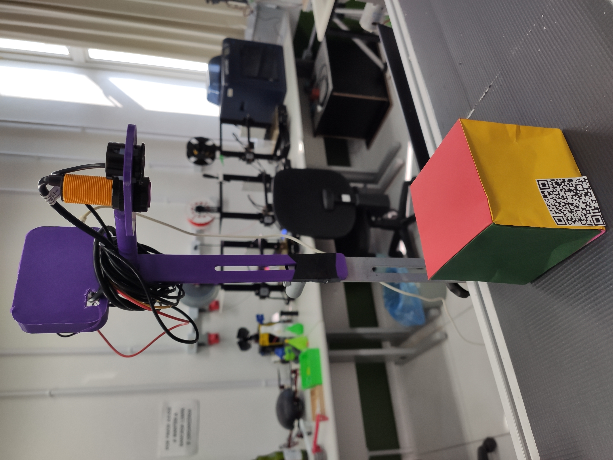

O sistema foi implementado com todos os sensores instalados, incluindo os de temperatura, altura, cor, leitor de QR code, além do display e o acionamento do motor. 

O sensor de altura está operando, enviando as informações para a rede MQTT e atualizando os dados no display. O sistema atingiu o objetivo inicial de realizar medições de altura dos objetos na esteira e comunicar essas informações com os demais componentes do sistema.

No entanto, alguns problemas foram identificados e podem ser corrigidos em futuras atualizações para melhorar a performance geral do sistema:

Precisão do sensor: A resolução do sensor de altura está atualmente em 1 cm, o que, embora adequado para algumas aplicações, apresenta um erro considerável em termos de exatidão. Para futuras versões, pode-se considerar a calibração ou a troca do sensor por um modelo com maior precisão, ou a aplicação de algoritmos de correção para reduzir o erro nas leituras.

Acomodação do sensor: O sensor precisa ser instalado com 20 cm extras em relação à altura máxima que poderá ser lida. Esse requisito físico implica em ajustes no layout da esteira, tanto no posicionamento dos sensores quanto na configuração geral do sistema. Uma melhoria futura pode incluir a integração de sensores menores ou soluções de montagem mais flexíveis, otimizando o espaço necessário.

Leitura de objetos pequenos e em movimento: O sensor ultrassônico, embora eficaz em várias condições, apresenta dificuldades em medir com precisão objetos pequenos ou em movimento. Isso gera leituras inconsistentes que podem comprometer a qualidade do processo. Para resolver esse problema, uma abordagem seria adicionar sensores complementares, como sensores ópticos ou lidar, que poderiam lidar melhor com objetos de dimensões reduzidas ou em deslocamento rápido.

Futuras Atualizações  
\- Aprimoramento da precisão: Implementação de algoritmos de filtragem de dados para aumentar a precisão das medições ou a substituição do sensor por uma versão de maior resolução.  
\- Integração de novos sensores: Utilizar sensores adicionais para melhorar a detecção de objetos pequenos e em movimento.  
\- Revisão do layout físico: Otimizar o espaço para instalação, ajustando a acomodação do sensor de altura para reduzir as margens de erro na instalação.  
\- Calibração avançada: Implementar um sistema de calibração automática, que ajusta dinamicamente o sensor com base no ambiente de operação e nos tipos de objetos monitorados.

Contudo, as atualizações propostas visam elevar ainda mais a confiabilidade e a precisão.

