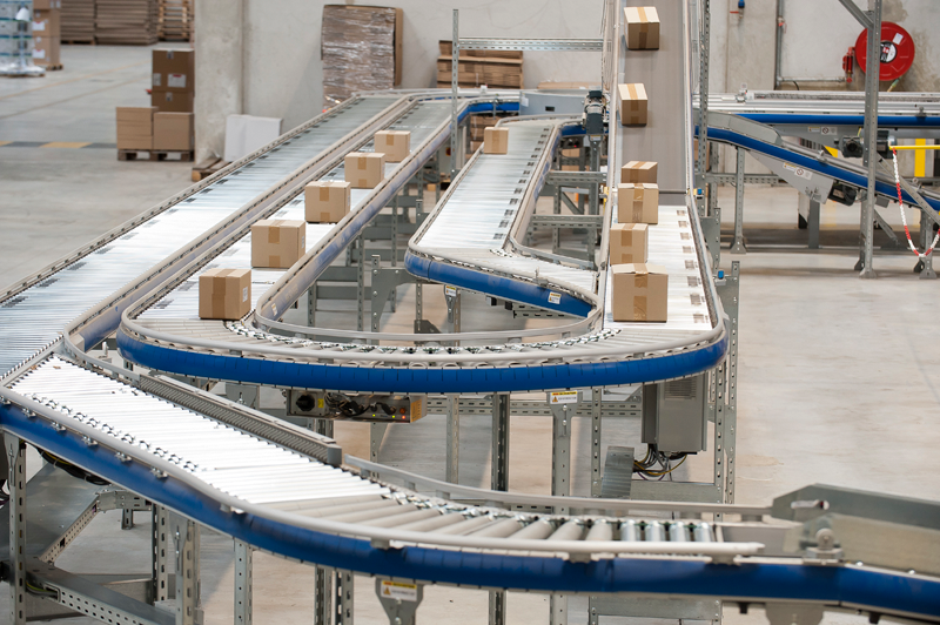
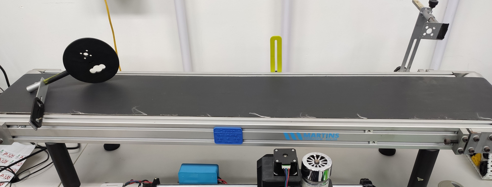
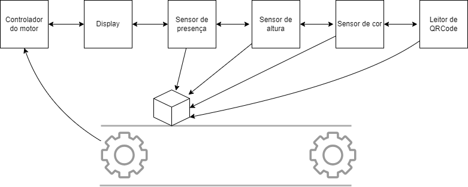

As esteiras desempenham um papel fundamental na indústria, sendo amplamente utilizadas em processos de produção, montagem, embalagem, transporte e logística. A automação de esteiras por meio do uso de sensores e atuadores oferece uma série de benefícios significativos para a eficiência operacional, qualidade do produto e segurança no ambiente de trabalho.  Ao automatizar o controle das esteiras com sensores e atuadores, é possível melhorar a eficiência operacional, garantir a qualidade do produto, integrar processos industriais e aumentar a segurança no ambiente de trabalho, contribuindo para uma produção mais ágil, precisa e segura. Para garantir um funcionamento automatizado, a esteira será equipada com uma variedade de sensores, interfaces homem-máquina (IHM), comunicação sem fio e controle do motor.

Para aperfeiçoar uma esteira, um conceito de esteira industrial será elaborado, com sensores e atuadores que se comunicam e interagem com o usuário para aperfeiçoar a obtenção de dados de objetos que farão uso da mesma.

Conceber um sistema de medição de altura em uma esteira automatizada, utilizando um sensor ultrassônico, controle e comunicação, para isso implementando o hardware e software necessários. O objetivo é criar um sistema que seja capaz de medir a altura de objetos na esteira enquanto garante a segurança e a integridade do processo de produção. Além da implementação do sensor de altura, outros dados serão obtidos pelos outros integrantes do projeto: sensor de cor, sensor de temperatura, leitor de QRCode. A apresentação dos dados para o usuário será feita via display. O motor da esteira será controlado via comunicação solicitada pelos outros sensores.

O sistema consistirá em vários componentes interconectados, incluindo o sensor de altura, o microcontrolador e a implementação de comunicação de dados. Além disso, será necessário integrar um sensor secundário de infravermelho para detectar a presença de objetos na esteira e coordenar o funcionamento da mesma.

No diagrama de blocos abaixo, ilustraremos a interconexão desses componentes na esteira transportadora, demonstrando como eles se complementam para garantir um funcionamento eficiente e automatizado do sistema.

Cada aluno pode ser responsável por desenvolver e integrar um componente específico do projeto, como a programação para controlar um sensor ou o desenvolvimento de algoritmos para o controle do motor. No final do projeto, a integração de todos os componentes pode ser realizada para criar um sistema completo e funcional de esteira automatizada, interconectada.

Além dos sensores, a esteira contará com uma interface homem-máquina (IHM) para permitir a interação dos operadores com o sistema. O IHM fornecerá informações em tempo real sobre o status da esteira e dos objetos transportados, bem como permitirá a configuração e o monitoramento dos parâmetros do sistema.

A comunicação sem fio será empregada para conectar os diferentes sistemas de sensoriamento, o display e o controle do motor. Isso permitirá uma integração perfeita entre os diversos componentes da esteira, facilitando a troca de dados e o controle remoto do sistema. 

**Medida de altura**

A medição da altura de objetos em uma esteira transportadora é importante por várias razões, principalmente nos processos industriais onde a precisão e o controle são essenciais. Os usos de um sistema de medida de altura em uma esteira podem incluir: Controle de Qualidade, Classificação e Seleção, Dimensionamento e Embalagem, Prevenção de Colisões, Otimização do Processo entre outros. Ao fornecer informações precisas sobre as dimensões dos objetos em movimento, é possível tomar decisões informadas e implementar sistemas de controle automatizados que melhoram o desempenho geral do sistema de transporte.

Dois métodos de medida de altura podem ser implementados:

*   Medida rápida: sem parar a esteira, mais rápida porém menos precisa e fornecerá a medida em centímetros;
*   Medida lenta: a esteira será pausada utilizando sensor de presença, e será feita várias medidas e uma média, a fim de obter uma maior precisão e fornecerá a medida em milímetros.

Assim, as duas solicitações de medidas podem ser feitas e comunicadas para o sistema completo da esteira automatizada. Ao final do projeto, o objetivo é implementar um sensor que seja capaz de se comunicar, transmitir dados e realizar medições de altura tanto com a esteira parada quanto em movimento. Isso representa um desafio interessante que requer uma abordagem cuidadosa para garantir a precisão e confiabilidade das medições em ambas as condições. Para isso será feito ao longo do projeto as seguintes etapas:

*   Seleção do Sensor: Escolher um sensor adequado para medir a altura dos objetos de forma precisa e confiável é fundamental. Sensores ultrassônicos são uma opção comum para essa aplicação devido à sua capacidade de medir distâncias com precisão. No entanto, é importante verificar se o sensor selecionado é capaz de operar corretamente tanto com a esteira parada quanto em movimento. A princípio um modelo sugerido pelo professor será utilizado.
*   Calibração do Sensor: É essencial calibrar o sensor adequadamente para garantir a precisão das medições em diferentes condições de operação. Isso pode envolver a realização de testes e ajustes para garantir que o sensor forneça resultados consistentes e confiáveis em todas as situações.
*   Comunicação e Transmissão de Dados: O sensor deve ser capaz de se comunicar com o sistema de controle, transmitindo os dados de altura medidos de forma eficiente e confiável.
*   Testes e Validação: Antes da implementação final, é crucial realizar testes extensivos para verificar o desempenho do sensor em diferentes cenários, incluindo a esteira parada e em movimento. Isso ajudará a identificar e resolver quaisquer problemas ou limitações que possam surgir durante o processo de medição.

Ao implementar um sensor que seja capaz de realizar medições de altura com a esteira tanto parada quanto em movimento, será possível ter um sistema robusto, capaz de fornecer informações precisas e em tempo real sobre os objetos em transporte. Isso é essencial para garantir a eficiência e a qualidade dos processos industriais que dependem da esteira transportadora.

**REFERÊNCIAS**

\[1\] HINOVAR. Esteiras transportadoras para negócio. Disponível em: &lt;https://hinovar.net.br/esteiras-transportadoras/esteiras-transportadoras-para-negocio\\&gt;. Acesso em: 26 de fevereiro de 2024.