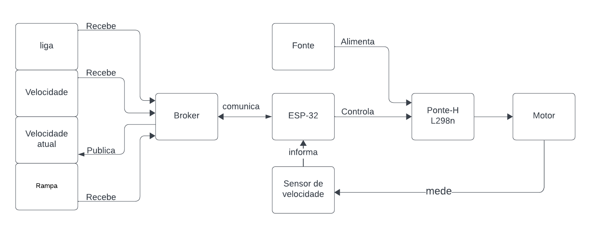
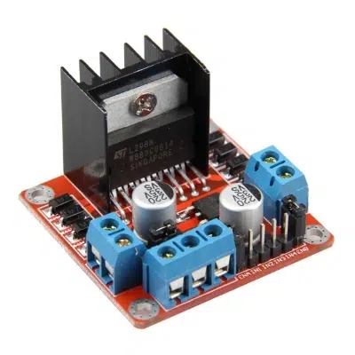
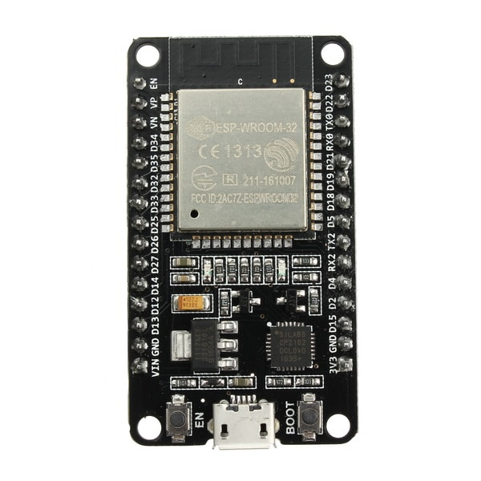
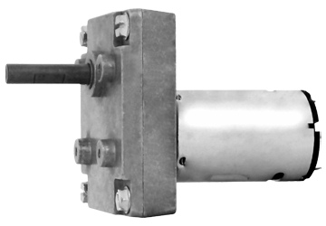
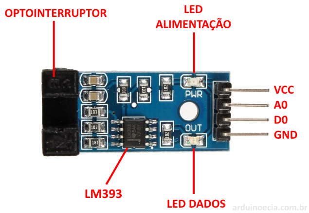
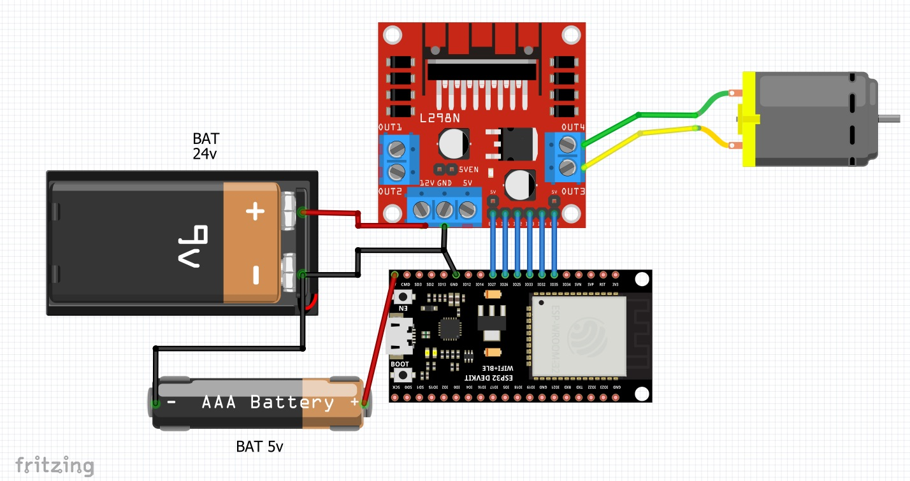
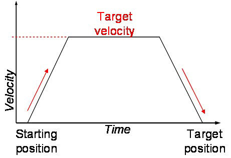

Para ilustrar o funcionamento do projeto foi criado um diagrama de blocos que mostra os processos inclusos no funcionamento do atuador.

O diagrama mostra os tópicos do MQTT e suas relações, destacando que a comunicação entre esses tópicos será intermediada pelo Broker. O controle do motor será realizado pelo ESP-32, responsável por determinar quando a Ponte-H permite que a fonte de alimentação forneça energia ao motor. Além disso, um sensor monitorará a velocidade do motor, fornecendo _feedback_ ao sistema de controle.

*   **L298N**: Um circuito integrado utilizado como controlador de motores DC bidirecionais, e que suporta uma corrente alta, o CI consiste em duas **pontes H**, permitindo o controle independente de dois motores. Ele possui entrada de controle por sinais digitais (geralmente _PWM_) que determinam a velocidade e a direção de rotação dos motores.

*   **ESP-32:** É o microcontrolador do projeto, sendo responsável pela leitura dos valores dos sensores, por controlar os atuadores e através do protocolo _MQTT_ receber o publicar os tópicos que sejam relacionados.

*   **Broker:** realiza a comunicação entre os microcontroladores através do protocolo _MQTT._
*   **Motor DC, MR 710-ISVBUN-12-24V:** motor que será usado na esteira, é fabricado pela Motron, sendo um Motoredutor de corrente contínua a Tensão de armadura de 24V e uma velocidade de 12RPM.

*   **Sensor de velocidade encoder LM393.** : Um sensor de velocidade ira &quot;medir&quot; a velocidade da rotação do motor e assim será possível calcular a velocidade da esteira.

O sensor possui de um lado um led infravermelho, e no outro lado um fototransistor. Quando o feixe de luz infravermelha é interrompido, a saída digital D0 envia o sinal 1, caso contrário, o saída permanece em nível 0, assim é possível contar quantas vez o feixe é interrompido e calcular a velocidade de rotação

Tópicos do _MQTT_:

*   /motor/liga: liga(1) e desliga(0) o motor.
*   /motor/velocidade: recebe a velocidade alvo que deve ser alcançada, em porcentagem.
*   /motor/velocidade\_atual:  publica a velocidade atual, em porcentagem.
*   /motor/rampa: recebe o tempo para atingir a velocidade máxima, em milissegundos.

Layout dos 3 principais componentes com as duas possíveis alimentações, uma de 24v que ira para o motor, e outra de 5v para alimentar os CIs

#### Controle do motor

O controle do motor será feito pelo ESP-32, e é realizado utilizando a técnica de modulação por largura de pulso (_PWM_), na qual o ESP-32 ajusta a largura dos pulsos de tensão aplicados ao motor, variando o tempo de energização, o que altera a média de potência entregue ao motor e, consequentemente, sua velocidade, sem a necessidade de alterar a tensão da alimentação.

O controle também se baseará na velocidade medida pelo sensor. Enquanto essa velocidade não for igual à velocidade alvo, será ajustada por meio da variação da largura de pulso. Essa variação será decidida com base na variável &quot;Rampa&quot;, na velocidade atual e na velocidade alvo, permitindo assim definir a aceleração do motor. Dessa forma, o motor suavemente alcança e mantém a velocidade alvo.

##### Grafico mostrando o funcionamento da aceleração do motor

Esse gráfico mostra o significado de rampa, que é o tempo que o motor deverá ir da velocidade inicial (atual?) até a velocidade alvo, e assim definindo qual é a aceleração do motor.

#### sequencia de funcionamento

Após o motor receber o sinal de ligar, junto com a velocidade alvo e o tempo para à alcançar, assim poderá chegar na velocidade alvo de forma adequada, com base nos outros sensores os tópicos podem mudar assim a velocidade se adequar ao quanto necessário.

MOTOREDUTOR MR 710-ISVBUN-15-24V. **Motron**. Disponível em: [http://www.motron.com.br/produtos/710/curvas/mr710-isvbun-15-24v.pdf](http://www.motron.com.br/produtos/710/curvas/mr710-isvbun-15-24v.pdf). Acesso em: 20 mar. 2024.

Datasheet do LM393. Disponível em: [https://www.makerhero.com/img/files/download/LM393-Datasheet.pdf](https://www.makerhero.com/img/files/download/LM393-Datasheet.pdf). Acesso em: 20 mar. 2024. 

Sensor de Velocidade LM393 com Arduino. **Arduino e cia** Disponível em: https://www.arduinoecia.com.br/sensor-de-velocidade-lm393-arduino/. Acesso em: 20 mar. 2024.