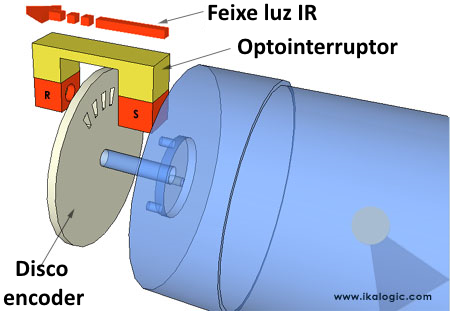

### _Sensor de velocidade_



A velocidade de rotação do motor será medida acoplando um disco _encoder_ com 20 aberturas, com o quando o feixe de luz infravermelha esta em uma em uma abertura a saída esta em nível lógico 0, e quando o feixe é interrompido a saída digital D0 envia o sinal alto, assim é possível contar quantas vez o feixe é interrompido e calcular a velocidade de rotação, para ter uma noção melhor do RPM é feita a media dos últimos valores de RPM e esse dado que é publicado

```cpp
const int sensorPin = 2;  // Pino do sensor
volatile int rpmCount = 0; // Contador de pulsos de RPM

unsigned long currentTime;
unsigned long lastTime;
unsigned long interval = 100; // Intervalo de 1 segundo - 1000 ms
unsigned long intervalMedia = 1000;

const int maxValues = 20; // Número máximo de valores a armazenar
float rpsValues[maxValues]; // Vetor para armazenar valores de RPS
int indice = 0; // Índice para o vetor circular
bool isFull = false; // Flag para indicar se o vetor está cheio

void setup() {
	Serial.begin(115200);
	Serial.print("Incio");
	pinMode(sensorPin, INPUT_PULLUP);
	attachInterrupt(digitalPinToInterrupt(sensorPin), countRPM, RISING); // Configuração da interrupção
	attachInterrupt(digitalPinToInterrupt(sensorPin), countRPM, RISING);
	currentTime	= millis();
	lastTimeRPM	= currentTime;
	intervalMrpm = currentTime;
}
void CalcRPM() {
	unsigned long currentTime = millis();
	
	if (currentTime - lastTimeRPM >= intervalRPM) {
		// Calcula RPM
		float rps = rpmCount*1000.0/(20*intervalRPM);
		rpmCount = 0; // Zera o contador

		// Armazena o valor no vetor
		rpsValues[indice] = rps;
		indice = (indice + 1) % maxValues; // Move para o próximo índice

		if (indice == 0) { // Se o índice voltar para 0, o vetor está cheio
			isFull = true;
		}

		if (currentTime - lastTimeMrpm >= intervalMrpm) {		// A cada "intervalMrpm" a media será feita e enviada pelo MQTT
			float averageRPS = calculateAverageRPS();
			printf("Average RPM: %f\n", averageRPS*60);
			SendCurrentRPM(averageRPS*60);
			lastTimeMrpm = currentTime;
		}
		lastTimeRPM = currentTime;
	}
}
void loop() {
	CalcRPM();

}

float calculateAverageRPS() {
	// Calcula a média dos valores armazenados
	float sum = 0;
	int count = isFull ? maxValues : indice;
	for (int i = 0; i < count; i++) {
		sum += rpsValues[i];
	}
	return sum / count;
}

void countRPM() {
	// Incrementa o contador de RPM a cada pulso
	rpmCount++;
}
```

### Ponte H e PWM

Ponte H é um circuito eletrônico que permite a inversão da polaridade da tensão aplicada a um motor, possibilitando o controle da direção de rotação. Ela é composta por quatro transistores dispostos em forma de &quot;H&quot;.

A CI da ponte H que será usado consegue controlar dois motores, o motor que será usado é o &quot;A&quot; que os pinos da ponte H ENA, IN1 e IN2 para controlar o motor, os outros pinos a serem usados são &quot;12V&quot; a tensão que ira ir para o motor, e que não necessariamente deve ser de 12V e o GND, e os pinos de saida para o motor é Out1 e Out2

O pino ENA será conectado ao 13 do ESP e é o pino usado para o PWM, já o pinos  IN1 e IN2 são usados para definir o sentido de rotação e serão conectados no pino 12 e 14 do esp;

A Modulação por Largura de Pulso (_PWM_) utiliza pulsos de largura variável para controlar a quantidade de energia fornecida a uma carga, no caso o motor. A frequência e a largura dos pulsos determinam a potência média entregue.

No código o _PWM_ possui uma frequência próxima de 1k Hz e uma resolução de 8 bits o que resulta em 256 valores possíveis de largura de pulso, com 0 sendo sem pulso e  255 o pulso continuo.

Código criado para o entendimento do _PWM_ e da ponte H, define uma função chamada &quot;acelera&quot; que controla o sentido e o _PWM_ do motor, variando o PWM de forma suave e produzindo uma rampa, no loop criado para o teste, essa função é chamada 4 vezes para que possa ser mostrado o motor acelerando até o máximo, desacelerando e depois fazendo o mesmo no outro sentido.

```text
//declaracao dos pinos utilizados para controlar a velocidade de rotacao
const int PINO_ENA = 13; //d13 motor A,sinal PWM 0 a 255, controla 0% a 100% em relação ao duty cycle
//const int PINO_ENB = 25; //d25 motor B

//declaracao dos pinos utilizados para controlar o sentido do motor
const int PINO_IN1 = 12; //d12
const int PINO_IN2 = 14; //d14

const int TEMPO_ESPERA = 1000; //declaracao do intervalo de 1 segundo entre os sentidos de rotacao do motor

const int TEMPO_RAMPA = 30; //declaracao do intervalo de 30 ms para as rampas de aceleracao e desaceleracao

int PWM_atual=0;

// Função para acelerar e desacelerar o motor
void acelera(int &PWM_atual, int PWM_alvo, int RAMPA = 50, bool sentido = true, unsigned int incremento = 1) {
  // Configura o sentido do motor
  if (sentido) {
    digitalWrite(PINO_IN1, LOW); 
    digitalWrite(PINO_IN2, HIGH);
  } else {
    digitalWrite(PINO_IN1, HIGH); 
    digitalWrite(PINO_IN2, LOW);
  }

  // Rampa de aceleração ou desaceleração
  if (PWM_atual < PWM_alvo) {
    // Aceleração
    for (; PWM_atual <= PWM_alvo; PWM_atual += incremento) {
      if (PWM_atual > 255) PWM_atual = 255;  // Limita o valor máximo
      analogWrite(PINO_ENA, PWM_atual);
      delay(RAMPA); // Intervalo para incrementar a variável
    }
  } else {
    // Desaceleração
    for (; PWM_atual >= PWM_alvo; PWM_atual -= incremento) {
      if (PWM_atual < 0) PWM_atual = 0;  // Limita o valor mínimo
      analogWrite(PINO_ENA, PWM_atual);
      delay(RAMPA); // Intervalo para diminuir a variável
    }
  }

}

void setup() {
  // Configuração dos pinos
  pinMode(PINO_ENA, OUTPUT);
  pinMode(PINO_IN1, OUTPUT);
  pinMode(PINO_IN2, OUTPUT);
}

void loop() {
  // Acelera até o máximo
  acelera(PWM_atual, 255, TEMPO_RAMPA, true);
  
  // Desacelera até zero
  acelera(PWM_atual, 0, TEMPO_RAMPA, true);

  // Acelera até o máximo no novo sentido
  acelera(PWM_atual, 255, TEMPO_RAMPA, false);
  
  // Desacelera até zero no novo sentido
  acelera(PWM_atual, 0, TEMPO_RAMPA, false);
  
  // Espera antes de repetir o ciclo
  delay(TEMPO_ESPERA);
}
```

#### _Wifi_ e _MQTT_

A comunicação entre os diferentes ESPs é feita através  do protocolo MQTT, o esp responsável  pelo controle do motor ira se subscrever em 4 tópicos do MQTT, &quot;motor/liga&quot;, &quot;motor/velocidade&quot;, &quot;motor/rampa&quot; &quot;motor/sentido&quot;  e ira publicar em um topico o &quot;motor/RPM&quot;

<figure class="table op-uc-figure_align-center op-uc-figure"><table class="op-uc-table"><tbody><tr class="op-uc-table--row"><td class="op-uc-table--cell">tópico</td><td class="op-uc-table--cell">tipo</td><td class="op-uc-table--cell">intervalo</td></tr><tr class="op-uc-table--row"><td class="op-uc-table--cell">motor/liga</td><td class="op-uc-table--cell">subscreve</td><td class="op-uc-table--cell">"1" ligado, qual quer outro é &nbsp;desligado</td></tr><tr class="op-uc-table--row"><td class="op-uc-table--cell">velocidade</td><td class="op-uc-table--cell">subscreve</td><td class="op-uc-table--cell">&nbsp;valor inteiro em porcentagem de 0 a 100 do PWM a ser enviado enviado para o motor</td></tr><tr class="op-uc-table--row"><td class="op-uc-table--cell">rampa</td><td class="op-uc-table--cell">subscreve</td><td class="op-uc-table--cell">valor inteiro maior que zero, é o tempo em ms para ir de 0 a velocidade maxima</td></tr><tr class="op-uc-table--row"><td class="op-uc-table--cell">sentido</td><td class="op-uc-table--cell">subscreve</td><td class="op-uc-table--cell">"1" sentido padrão, "0" sentido inverso, qualquer outro não há alteração</td></tr><tr class="op-uc-table--row"><td class="op-uc-table--cell">RPM</td><td class="op-uc-table--cell">publica</td><td class="op-uc-table--cell">velocidade RPM media medida pelo sensor enconder float com duas casas decimais</td></tr></tbody></table></figure>

Para usar o _MQTT_ foi criada a função &quot;MQTTsetup&quot; que conecta ao broker e subscreve nos topicos, e define qual será a função que sera chamada quando uma mensagem for recebida, a função _Callback._

```text
void MQTTsetup(){
	client.setServer(mqtt_broker, mqtt_port);
	while (!client.connected()) {

		String client_id = "esp32-client-"; // Cria uma string pro id do cliente MQTT
		client_id += String(WiFi.macAddress()); // Gera uma id específica com base no endereço MAC da esp32 específica
		Serial.printf("The client %s connects to the public MQTT broker\n", client_id.c_str()); // Imprime uma mensagem indicando que o cliente está tentando se conectar ao broker MQTT

		if (client.connect(client_id.c_str(), mqtt_user, mqtt_password)) { // Tenta conectar o cliente MQTT ao broker MQTT usando o ID do cliente, nome de usuário e senha especificados
			Serial.println("Public EMQX MQTT broker connected"); // Em caso de conexão bem sucedida, imprime uma mensagem indicando que o cliente está conectado ao broker

			client.subscribe("motro/liga");
			client.subscribe("motro/velocidade");
			client.subscribe("motro/rampa");
			client.subscribe("motro/sentido");
			
			client.setCallback(Callback);
		} else {

			Serial.print("failed with state "); // Caso haja falha na conexão, envia uma mensagem de falha

			Serial.print(client.state()); // Imprime o estado atual do cliente MQTT

			delay(2000);
		}
	}
}
```

A função _Callback é a função responsável por receber e manipulara a mensagem, identificando em qual tópico é a mensagem foi enviada e a convertendo para o tipo de dado que será processado pelo código._

```cpp
// Função de callback chamada quando uma mensagem é recebida
void Callback(char* topic, byte* message, unsigned int length) {

	Serial.print("Mensagem recebida no tópico: ");
	Serial.println(topic);
	// Converte a mensagem para uma string
	String msg;
	for (int i = 0; i < length; i++) {
		msg += (char)message[i];
	}
	Serial.print("a mensagem é: ");
	Serial.println(msg);
	// Verifica qual tópico foi recebido
	if (String(topic) == "motor/liga") {
		// Atualiza a variável liga
		liga = (msg == "1");
		Serial.print("Liga: ");
		Serial.println(liga ? "ligando" : "desligando");
	} else if (String(topic) == "motor/velocidade") {
		// Atualiza a variável RPM_alvo
		velocidade = msg.toInt();
		if(velocidade>100){
			velocidade=100;
		};
		if(velocidade<0){
			velocidade=velocidade*-1; //inutill
		};
		Serial.println("oi");
		printf("velocidade em %i %c /n",velocidade,'%');
	} else if (String(topic) == "motor/rampa") {

		rampa = msg.toInt();
		printf("Rampa de %i ms",rampa);
	} else if (String(topic) == "motor/sentido") {
		sentido = (msg == "1");
		Serial.print("Sentido atualizado para: ");
		Serial.println(liga ? "normal" : "inverso");
	}
}
```

a função &quot;SendCurrentRPM&quot; publica o RPM médio no topico &quot;motor/RPM&quot; e é chamada pela &quot;CalcRPM&quot; a cada intervalo de tempo para publicar a media dos RPM medidos.

```cpp
void SendCurrentRPM(float RPM) {
	// Envie o RPM_atual
	char msg[8]; //0.00 - 10000.00
	snprintf(msg, 8, "%.2f", RPM); // Formata o RPM atual em string
	client.publish("motor/RPM", msg); // Envia o RPM atual para o tópico
}
```

A função &quot;MotorControl&quot; é a função responsável por controlar o motor usando os dados vindos do MQTT, há 4 casos definido dentro da logica dessa função, o motor estar ligado e o PWM ser diferente do PWM alvo, isso é o caso do motor mudar seu PWM, acelerando ou desacelerando, o segundo caso é o PWM ser igual ao PWM alvo e o motor estar ligado, a função acelera não será chamada pois a velocidade apenas deve ser mantido, o 3 caso é se o motor for desligado mas o PWM for diferente de 0, isso ira fazer a função &quot;acelera&quot; seja chamada de modo a zerar o PWM e o ultimo caso é o motor estar desligado e sem velocidade, onde ele continua desligado, ainda falta uma terceira variável de estado que ainda não está sendo contada, o sentido da rotação, quando essa variável for manipulada terá que haver muitos novos casos para lidar corretamente com a mudança de sentido em diferentes casos. 

```cpp
void MotorControl(bool liga,unsigned int &PWM,unsigned int velocidade,unsigned int rampa=5000,bool sentido=true){

	unsigned int PWM_alvo=(velocidade*255)/100;
	Serial.print("O PWM alvo é  ");
	Serial.println(PWM_alvo);
	Serial.print("O PWM atual é ");
	Serial.println(PWM);
	if(liga&&(PWM_alvo!=PWM)){
		Serial.println("ligado");
		PWM = acelera(PWM,PWM_alvo,rampa);
	}
	else if(liga){
		Serial.println("mantendo a velocidade");
		delay(200);
	}
	else if(!liga&&(PWM!=0)){
		Serial.println("desligando");
		PWM = acelera(PWM,0,2000);
	}
	else {;
		Serial.println("desligado");
		delay(1000);
	}
}
```

  

#### Problemas e posiveis melhorias

A função &quot;acelera&quot; atualmente é feita usando &quot;delay&quot; e bloqueia o código durante a aceleração do motor durante o tempo que for necessário para acelerar, desta forma se  enviado para o motor ligar e atingir a velocidade maxima em 5 segundos, durante essa aceleração outra função importante como a medida do RPM não será feita, a função _Callback_ é uma exceção pois sera chamada assim que a  mensagem for recebida, mesmo que o código esteja preso na função &quot;acelera&quot; mas o motor não ira responder a mudanças nas variáveis de controle vindas do MQTT, como mandar ele desligar por exemplo. Uma das formas de resolver esse problema seria reimplementar a função &quot;acelera&quot; para que ela seja feita de forma semelhante a &quot;CalcRPM&quot; que em vez de &quot;delay&quot; realiza medidas de tempo e assim checa se o tempo necessário já foi passado para dai então fazer o que precisa ser feito, em vez de travar o código em quanto espera.

[https://www.arduino.cc/en/Guide/Introduction](https://www.arduino.cc/en/Guide/Introduction)

[https://en.wikipedia.org/wiki/Arduino](https://en.wikipedia.org/wiki/Arduino) ?

[https://www.arduino.cc/reference/en/](https://www.arduino.cc/reference/en/)

[https://www.makerhero.com/blog/controle-motor-dc-pwm-arduino-uno/](https://www.makerhero.com/blog/controle-motor-dc-pwm-arduino-uno/)