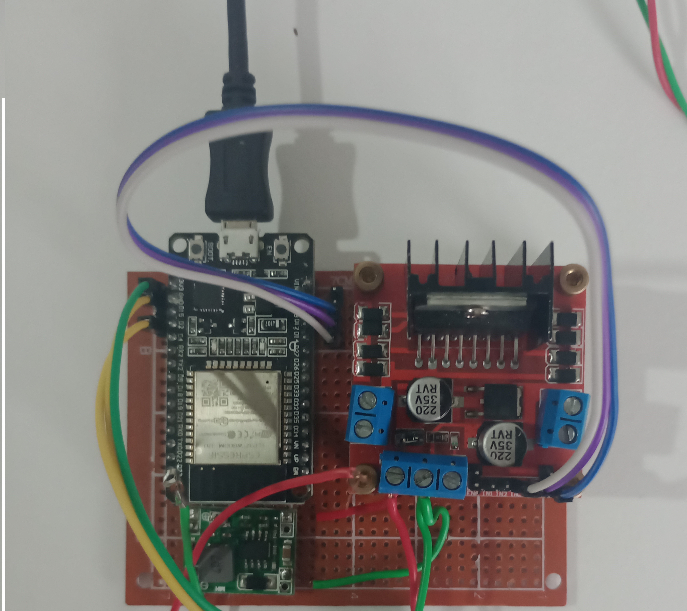

### Instalação

A montagem foi feita usando uma placa padrão para uma maior facilidade e menor risco de problemas durante o uso, foi também adicionado um novo componente para não precisar de uma fonte para alimentar o esp, esse componente usa a mesma tensão de 24V que é usado pelo motor para fornecer os 5v para o ESP.

### Uso:

#### Os 3 tópicos do MQTT que estabelecem a comunicação são:

*   motor/velocidade: é a porcentagem da largura do PWM que sera dada para o motor, sendo um valor entre &quot;0&quot; e &quot;100&quot;, é uma informação de controle e não a velocidade real do motor,testes mostraram que a relação entre a largura do PWM e a velocidade da esteira não são nem um pouco lineares e variam com a &quot;carga&quot; que for colocada na esteira, para um PWM de 20% (motor/velocidade=&quot;20&quot;) a velocidade da esteira é praticamente 0, com 40% já é usável para alguns sensores que precisem da esteira estar lenta para realizarem a medida.
*   motor/sentido: Não foi implementado no código a logica para lidar com a troca de sentido.
*   motor/rampa: é o tempo para atingir a velocidade máxima a partir da velocidade 0, assim definindo a aceleração, que sera constante independente de qual é a velocidade alvo, é usado em quase todas as mudanças de velocidade exceto a de desligamento, que é uma constante de 2000ms, quando definido uma rampa de &quot;5000&quot; significa que o motor ira de 0 a 100% do PWM em aproximadamente 5 segundos, e que ele ira incrementar o PWM a cada 5000/256=~20ms, esse valor de incremento é o valor da rampa dividido pela resolução do PWM, que é de 8 bits(2^8=256).@@Exemplo de uso @Se por exemplo o PWM atual está em 100% (255), e foi recebido via MQTT que a velocidade deve ser de 50% (127) com uma rampa de 4000ms, o PWM será decrementado em 1 a cada 4000/256=~16ms até que atinga o mesmo valor do que o alvo, como esse valor está sendo salvo como inteiro para ser usado na função _delay_ há um erro pois essa divisão trunca o numero, sendo assim 4000/256=15ms, então a aceleração ira durar 15\*(255-127)=1920ms, aproximadamente metade da rampa.

### Problemas e possíveis melhorias

*   A função &quot;acelera&quot; atualmente é feita usando &quot;_delay_&quot; e bloqueia o código durante a aceleração do motor durante o tempo que for necessário para acelerar, desta forma se  enviado para o motor ligar e atingir a velocidade máxima em 5 segundos, durante essa aceleração outra função importante como a medida do RPM não será feita,a função &quot;_Callback&quot;_ e a &quot;countRPM&#39; é uma exceção pois sera chamada assim que a  mensagem for recebida/estado do pino do sensor mudar, mesmo que o código esteja preso na função &quot;acelera&quot; mas o motor não ira responder a mudanças nas variáveis de controle vindas do _MQTT_, como mandar ele desligar por exemplo. Uma das formas de resolver esse problema seria reimplementar a função &quot;acelera&quot; para que ela seja feita de forma semelhante a &quot;CalcRPM&quot; que em vez de &quot;delay&quot; realiza medidas de tempo e assim checa se o tempo necessário já foi passado para dai então fazer o que precisa ser feito, em vez de travar o código em quanto espera.
*   Implementar o controle da troca do sentido na função &quot;MotorControl&quot;, ele deve ser feito criando alguma forma de saber quando a variável &quot;sentido&quot; mudar e quando houver essa mudança o motor primeiro deve ser desacelerado até o 0 e apos isso pode ser feita a mudança do sentido, exatamente o que a função &quot;AceleraTeste&quot; faz, se houver apenas a mudança brusca do sentido o motor pode ser danificado. Esse controle da mudança pode ser feito armazenando o valor anterior e comparar com o atual ou fazer esse controle na função &quot;Callback&quot; , talvez criando uma nova variável que indique que houve a mudança do sentido.
*   Usar algum equipamento para medir o RPM do motor e usar esse valor como referencia para descobrir o que há de errado com a contagem do RPM feita pelo código, durante os testes foi percebido que mesmo que o sensor não esteja conectado ao sensor _encoder_ que esta no eixo do motor, a variável RPM estava sendo publicada com um valor diferente de 0, isso mostra que a forma atual de medir o RPM está instável.
*   Fazer com que seja publicado a velocidade real da esteira em vez do RPM, e criar uma forma de poder inserir qual velocidade o motor deve ter em vez de ter apenas uma porcentagem do PWM como opção, o principal motivo de ter o sensor de RPM é para que ele forneça um _feedback_ da velocidade e assim permita que o motor seja controlado através da velocidade.

### Resultados

Os objetivos definidos nas etapas anteriores foram atingidos, o motor é controlado via MQTT permitindo que outros ESPs ou algum cliente do _MQTT_ no celular/computador liguem o motor, alterem a velocidade alvo, a aceleração do motor através da variável rampa, assim ligando o motor e o acelerando de forma suave e o controlando da forma que for necessário.

### Reutilização

o projeto ainda pode ser melhorado e outros sensores e atuadores podem ser inseridos na esteira, mas caso seja necessário desmontar, o esp é facilmente tirado da placa para, ele normalmente é tirado sempre que é necessário atualizar o código e a ponte H foi apenas parafusada na placa, apenas o regulador de tensão que está mais preso a placa, para a remoção/troca dele é necessário tirar a solda que esta entre o componente e os pinos, o mesmo vale para os conectores da placa, que caso seja necessário podem ser removido dessa forma.