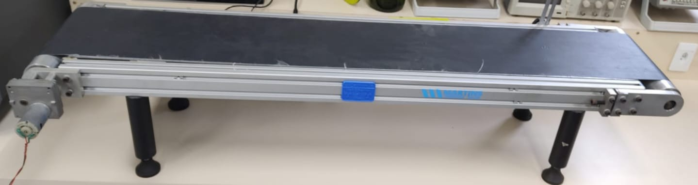

O projeto propõe a instalação de sensores em uma esteira pela qual os objetos passarão para que suas características sejam identificadas.

Os objetos serão posicionados no início da esteira e deslizarão diante dos sensores, que serão capazes de coletar informações sobre eles. Esses sensores terão a função de capturar dados como cor, temperatura, tamanho e identificação do objeto por meio de um código QR.

Minha contribuição para o projeto é a integração de um sensor de cor a essa esteira. Esse sistema simplificará a detecção das cores no espectro RGB (vermelho, verde, azul) dos objetos, permitindo interações específicas com base na cor identificada.

O propósito é classificar objetos em diferentes cores, identificando a cor através da intensidade da luz capturada por um sensor no momento em que o objeto passa por ele. As leituras coletadas são, em seguida, enviadas por um microcontrolador ESP para publicação em tópicos MQTT específicos. Esses dados, originados dos sensores, são então transmitidos para um display capaz de representar, por exemplo, as cores vermelha, verde e azul. Com base nessas cores, uma variedade de aplicações pode ser desenvolvida.

Figura 01- Esteira do projeto

### **Propósito comercial**

1ª- O sistema pode ser usado para detectar defeitos em produtos com base na cor. Por exemplo, se um produto tiver uma cor fora do padrão, o sistema pode identificar automaticamente o defeito e removê-lo da linha de produção para inspeção adicional;

2ª- À medida que os objetos deslizam pela esteira, o sensor pode detectar a cor de cada objeto. Com base na cor detectada, o sistema pode classificar automaticamente os objetos em diferentes categorias. Por exemplo, se a esteira estiver sendo utilizada em uma fábrica de brinquedos, os objetos poderiam ser classificados por cores como &quot;vermelho&quot;, &quot;verde&quot; e &quot;azul&quot;;

3ª- Em sistemas de monitoramento ambiental para medir a qualidade da luz ambiente em ambientes internos e externos, ajudando a otimizar a iluminação e conservar energia.

### **O que esperar?**

Alguns desafios podem surgir durante o desenvolvimento e implementação do projeto. Por exemplo, podem ocorrer dificuldades na calibração do sensor para garantir leituras precisas em diferentes condições de iluminação. Além disso, problemas de comunicação entre o microcontrolador e o sensor podem surgir, exigindo depuração cuidadosa do código.

Outro aspecto importante a considerar são as limitações físicas do sensor, como a distância ideal de operação em relação à superfície ou objeto que está sendo medido. Uma posição inadequada do sensor no suporte pode resultar em leituras imprecisas ou inconsistentes. Enquanto este projeto tem o potencial de fornecer uma solução eficaz para detecção e interpretação de cores em tempo real, é importante estar ciente dos possíveis desafios técnicos e físicos que podem surgir ao longo do processo de desenvolvimento e implementação. Com cuidado e atenção, é possível superar esses obstáculos e alcançar os objetivos desejados.

**REFERÊNCIAS**

ALMEIDA, Arthur. Como utilizar o módulo sensor de cor RGB TCS34725. **Blog Eletrogate**, 2023.  Disponível em: [https://blog.eletrogate.com/como-utilizar-o-modulo-sensor-de-cor-rgb-tcs34725/.](https://blog.eletrogate.com/como-utilizar-o-modulo-sensor-de-cor-rgb-tcs34725/)  Acesso em: 10 mar. 2024.

TCS34725 RGB Color Sensor, 5V, Adafruit. **Distrelec**, 2011. Disponível em: [https://www.distrelec.ch/en/tcs34725-rgb-color-sensor-5v-adafruit-1334/p/30091138.](https://www.distrelec.ch/en/tcs34725-rgb-color-sensor-5v-adafruit-1334/p/30091138.) Acesso em: 10 mar. 2024.