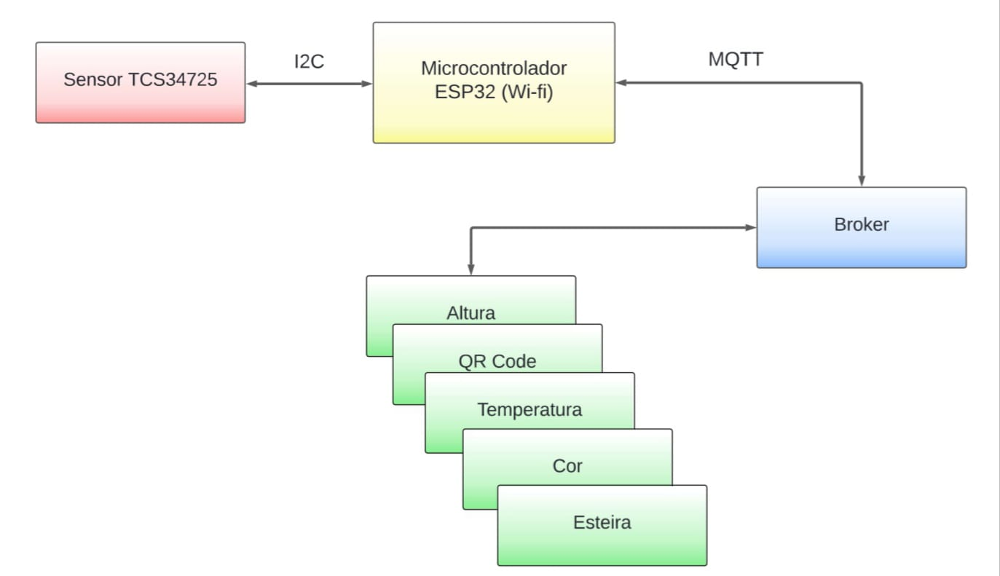
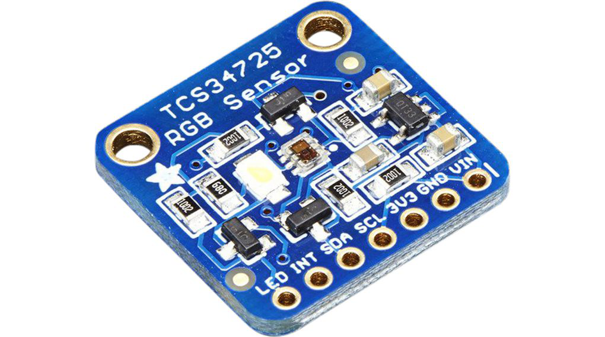
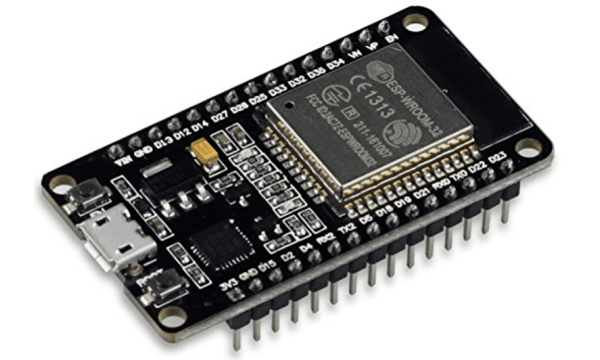
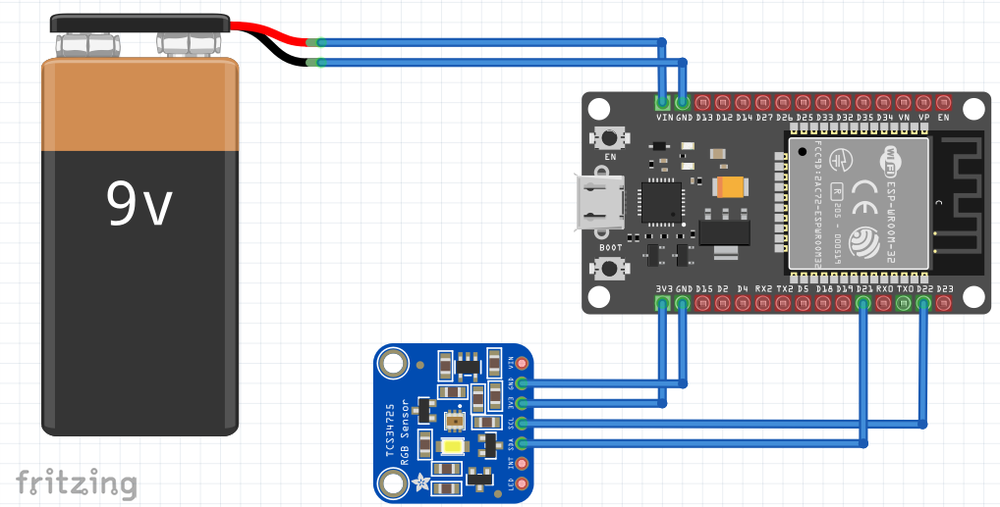
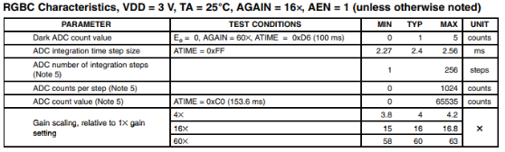

### **Funcionamento**

O diagrama de blocos referenciado pela Figura 01, proporciona uma representação visual do sistema, destacando as relações entre os componentes e como eles interagem entre si. O microcontrolador estabelecerá uma conexão com o sensor por meio do protocolo I2C e se ligará ao broker via protocolo MQTT. O broker receberá os dados e os tornará disponíveis para os dispositivos que solicitarem a informação lida pelo sensor.

**Figura 01- Diagrama de blocos do sistema**

###   

### Componentes que serão empregados no projeto

**Figura 02- Sensor de cor TCS34725**

O Sensor de cor TCS34725, representado na figura 02, utiliza uma matriz de fotodiodos sensíveis à luz vermelha, verde, azul e infravermelha para capturar a cor de uma superfície ou objeto. Esses fotodiodos convertem a luz incidente em corrente elétrica, que é então convertida em sinais digitais para determinar a intensidade de cada cor. Uma das vantagens do TCS34725 é sua capacidade de compensar a luz ambiente, permitindo medições precisas mesmo em diferentes condições de iluminação. Além disso, ele possui um filtro de luz infravermelha embutido, que ajuda a melhorar a precisão das medições de cor.

Ele opera dentro da faixa de tensão de 3,3 a 5 VDC e apresenta uma matriz de fotodiodos de dimensões 3x4. Equipado com um conversor de sinais analógico para digital (ADC), possibilitando a leitura e registro precisos de dados. Além disso, o sensor é integrado com uma interface I2C (Inter-Integrated Circuit), facilitando sua comunicação com outros dispositivos, como a ESP32, e permitindo uma fácil integração em sistemas mais amplos.

As cores detectadas pelo sensor de cor TCS34725 serão representadas por valores numéricos que correspondem à intensidade de cada componente de cor: vermelho (R), verde (G), azul (B) e clareza (C). Esses valores geralmente variam de 0 a 65535, onde 0 representa a ausência total da cor e 65535 representa a intensidade máxima da cor de acordo com a Figura 05.

###   

**Figura 03- Microcontrolador ESP32**

O ESP32 (Figura 03) será fundamental para estabelecer comunicação com o sensor e obter leituras de cor. Isso envolve o desenvolvimento de código na plataforma Arduino IDE, que permitirá a interação entre o microcontrolador e o sensor. Esse código facilita uma comunicação eficaz entre os dispositivos, será utilizada a interface I2C, para que o microcontrolador possa enviar comandos para o sensor e receber as leituras de cor correspondentes. As leituras obtidas serão então enviadas via MQTT para os dispositivos que receberão a informação onde será indicado a cor com base na intensidade da luz capturada pelo sensor.

### Esquema de Montagem

**Figura 04- Esquema de montagem**

O esquema de montagem (Figura 04)  vai será utilizado para fornecer uma representação visual e organizada de como os componentes do projeto devem ser montados e conectados. Ele ajuda a garantir que todos os elementos estejam corretamente posicionados e interligados, seguindo um plano pré-definido. Além disso, o esquema de montagem facilita a identificação de componentes, conexões e possíveis erros durante o processo de montagem, tornando o projeto mais eficiente e preciso.

As conexões serão realizadas da seguinte maneira: O terminal Vin do ESP32 será ligado ao polo positivo da bateria, enquanto o terminal GND será conectado ao polo negativo. Para as conexões com o sensor, o pino 3V3 do ESP32 será conectado ao mesmo pino de 3V3 do sensor, o terminal GND do ESP32 será conectado ao terminal GND do sensor, e o pino D21 será ligado ao SDA do sensor, enquanto o pino D22 será conectado ao SCL.

### Tópicos MQTT

*   /cor/ vermelho: publica Vermelho quando o objeto for vermelho;
*   /cor/ verde: publica Verde quando o objeto for verde;
*   /cor/ azul: publica Azul quando o objeto for azul.
*   /cor/ rosa: publica Rosa quando o objeto for rosa.
*   /cor/ laranja: publica Laranja quando o objeto for laranja.
*   /cor/ amarelo: publica Amarelo quando o objeto for amarelo.

### **Conectando o sensor a esteira**

Uma maneira de conectar o sensor à esteira é por meio de um suporte que pode ser fabricado em impressora 3D ou ajustando o suporte existente na esteira para garantir a proximidade adequada e uma boa leitura pelo sensor. Algumas caixas de cores diferentes serão posicionadas no início da esteira e se moverão em direção ao sensor. Quando uma caixa estiver em frente ao sensor de cor, ela será automaticamente parada, através de um comando enviado ao motor, para que a cor seja lida. Os dados da cor serão então encaminhados da ESP32 para o display, utilizando o Wi-fi. A ESP32 possui recursos de conectividade embutidos, como Wi-Fi e Bluetooth, o que permite que se comunique facilmente com outros dispositivos e serviços online.

**Figura 05- Datasheet TCS34725**

**REFERÊNCIAS**

Amaro, Aldyr. Review tcs3472 - sensor de cor baratinho. **Experimentos de garagem**, 2023. Disponível em: [https://www.youtube.com/watch?v=Gvb\_Q3-ypE0.](https://www.youtube.com/watch?v=Gvb_Q3-ypE0.) Acesso em: 10 mar. 2024.

ALMEIDA, Arthur. Como utilizar o módulo sensor de cor RGB TCS34725. **Blog Eletrogate**, 2023.  Disponível em: [https://blog.eletrogate.com/como-utilizar-o-modulo-sensor-de-cor-rgb-tcs34725/.](https://blog.eletrogate.com/como-utilizar-o-modulo-sensor-de-cor-rgb-tcs34725/)  Acesso em: 10 mar. 2024.

TCS34725 RGB Color Sensor, 5V, Adafruit. **Distrelec**, 2011. Disponível em: [https://www.distrelec.ch/en/tcs34725-rgb-color-sensor-5v-adafruit-1334/p/30091138.](https://www.distrelec.ch/en/tcs34725-rgb-color-sensor-5v-adafruit-1334/p/30091138.) Acesso em: 10 mar. 2024.

O que é fotodiodo. **AERO**, 2023. Disponível em: [https://aeroengenharia.com/glossario/o-que-e-fotodiodo/.](https://aeroengenharia.com/glossario/o-que-e-fotodiodo/)  Acesso em: 10 mar. 2024.

DATASHEET TCS34725. **Taos**, 2012. Disponível em:  [https://cdn-shop.adafruit.com/datasheets/TCS34725.pdf.](https://cdn-shop.adafruit.com/datasheets/TCS34725.pdf.) Acesso em: 10 mar. 2024.