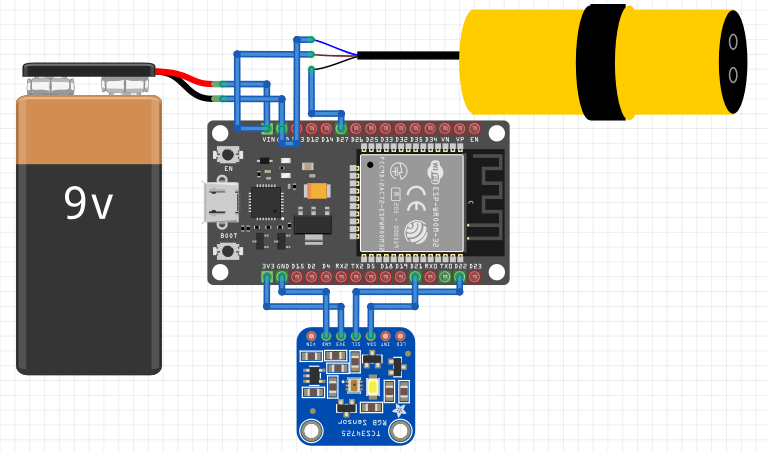
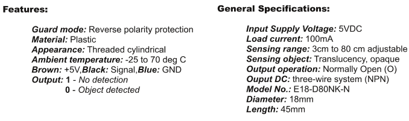

#### **INTRODUÇÃO**

Vários testes foram realizados para verificar o correto funcionamento do microcontrolador ESP-32. A seguir, alguns desses testes serão listados:

**PISCAR LED**

O Código 01 é um exemplo básico de como piscar um LED integrado ao ESP-32 e enviar uma mensagem via comunicação serial. Ele foi criado para verificar a conexão com o ESP. O código faz com que o LED integrado na placa pisque a cada segundo (500 ms ligado, 500 ms desligado) e envia a mensagem &quot;Oi&quot; para o monitor serial a cada segundo. Esse é um exemplo comum utilizado para testar a funcionalidade de uma placa de desenvolvimento e a comunicação serial.

Código 01

```C
#define LED_BUILTIN 2  // Define o pino do LED integrado como 2

// A função setup() é executada uma vez quando você pressiona reset ou liga a placa
void setup() {
  Serial.begin(9600);  // Inicializa a comunicação serial a 9600 bps
  pinMode(LED_BUILTIN, OUTPUT);  // Define o pino do LED integrado como saída
}

// A função loop() é executada continuamente
void loop() {
  digitalWrite(LED_BUILTIN, HIGH);  // Liga o LED (HIGH é o nível de tensão)
  delay(500);  // Aguarda por 500 milissegundos (meio segundo)
  digitalWrite(LED_BUILTIN, LOW);  // Desliga o LED (LOW é o nível de tensão)
  delay(500);  // Aguarda por 500 milissegundos (meio segundo)
  Serial.println("Oi");  // Envia a mensagem "oi" via comunicação serial
}
```

**CONECTAR AO WI-FI**

O Código 02 é utilizado para conectar um ESP-32 a uma rede Wi-Fi (nesse caso, foi utilizada a rede do laboratório LPAE) e configurar o dispositivo para ser acessível na rede local pelo nome &quot;ESP&quot; através do NetBIOS. É um exemplo comum para configurar a conectividade de rede em projetos IoT com o ESP-32.

Código 02

```C
#include <WiFi.h>    // Inclui a biblioteca WiFi para o ESP32
#include <NetBIOS.h> // Inclui a biblioteca NetBIOS para o ESP32

// Define as credenciais da rede WiFi
const char* ssid = "arduino";       // Nome da rede WiFi
const char* password = "esp-8266";  // Senha da rede WiFi

void setup() {
  Serial.begin(115200);  // Inicializa a comunicação serial com uma taxa de 115200 bps

  // Conecta-se à rede WiFi
  WiFi.mode(WIFI_STA);   // Define o modo WiFi como Station (cliente)
  WiFi.begin(ssid, password);  // Inicia a conexão com a rede WiFi usando as credenciais fornecidas
  Serial.println("");

  // Aguarda a conexão
  while (WiFi.status() != WL_CONNECTED) {
    delay(500);          // Aguarda 500ms
    Serial.print(".");   // Imprime um ponto na serial para indicar que está tentando se conectar
  }
  Serial.println("");
  Serial.print("Connected to ");    // Imprime a mensagem de conexão bem-sucedida
  Serial.println(ssid);             // Imprime o SSID da rede à qual está conectado
  Serial.print("IP address: ");     // Imprime a mensagem para o endereço IP
  Serial.println(WiFi.localIP());   // Imprime o endereço IP local atribuído à placa

  NBNS.begin("ESP");  // Inicia o serviço NetBIOS com o nome "ESP", permitindo que o dispositivo seja acessado na rede local pelo nome "ESP"
}

void loop() {
  // O loop está vazio, pois todas as configurações e conexões são feitas na função setup.
  // O código pode ser expandido aqui para realizar outras tarefas após a conexão WiFi ser estabelecida.
}
```

##   

**CONEXÃO COM O BROKER MQTT**

O Código 03 configura o ESP-32 para se conectar a uma rede Wi-Fi e a um broker MQTT. Uma vez conectado, o ESP-32 publica uma mensagem em um tópico específico e assina esse mesmo tópico para receber mensagens. A função &#39;&#39;callback()&#39;&#39; é chamada sempre que uma mensagem é recebida no tópico assinado, e o loop principal &#39;&#39;loop()&#39;&#39; mantém a conexão MQTT ativa. Esse broker atua como intermediário entre os dispositivos que enviam mensagens (publicadores) e aqueles que recebem mensagens (assinantes).

Código 03

```C
#include <WiFi.h>           // Inclui a biblioteca WiFi para o ESP32
#include <PubSubClient.h>   // Inclui a biblioteca PubSubClient para comunicação MQTT

// WiFi
const char *ssid = "arduino"; // Nome da rede WiFi
const char *password = "esp-8266";  // Senha da rede WiFi

// MQTT Broker
const char *mqtt_broker = "192.168.1.86"; // Endereço IP do broker MQTT
const char *topic = "RGB/COR";            // Tópico MQTT para publicação e assinatura
const char *mqtt_username = "";           // Nome de usuário do MQTT (se necessário)
const char *mqtt_password = "";           // Senha do MQTT (se necessário)
const int mqtt_port = 1883;               // Porta do broker MQTT

WiFiClient espClient;        // Cria um cliente WiFi
PubSubClient client(espClient); // Cria um cliente MQTT usando o cliente WiFi

void setup() {
    // Configura a taxa de transmissão serial para 115200 bps
    Serial.begin(115200);

    // Conectando-se a uma rede WiFi
    WiFi.begin(ssid, password); // Inicia a conexão WiFi
    while (WiFi.status() != WL_CONNECTED) {
        delay(500);             // Aguarda 500ms
        Serial.println("Connecting to WiFi.."); // Imprime na serial enquanto tenta conectar
    }
    Serial.println("Connected to the Wi-Fi network"); // Imprime na serial quando conectado

    // Conectando-se ao broker MQTT
    client.setServer(mqtt_broker, mqtt_port);  // Configura o servidor MQTT e a porta
    client.setCallback(callback);              // Define a função de callback para quando uma mensagem é recebida
    while (!client.connected()) {
        String client_id = "esp32-client-";
        client_id += String(WiFi.macAddress()); // Gera um ID único para o cliente MQTT baseado no endereço MAC do ESP32
        Serial.printf("The client %s connects to the public MQTT broker\n", client_id.c_str());
        if (client.connect(client_id.c_str(), mqtt_username, mqtt_password)) {
            Serial.println("Public EMQX MQTT broker connected"); // Conectado ao broker MQTT
        } else {
            Serial.print("failed with state ");
            Serial.print(client.state()); // Mostra o estado de falha da conexão
            delay(2000);                 // Aguarda 2 segundos antes de tentar novamente
        }
    }

    // Publicar e assinar tópicos
    client.publish(topic, "OI, sou a Renata"); // Publica uma mensagem no tópico especificado
    client.subscribe(topic);                   // Assina o tópico especificado
}

void callback(char *topic, byte *payload, unsigned int length) {
    Serial.print("Message arrived in topic: ");
    Serial.println(topic); // Imprime o tópico da mensagem recebida
    Serial.print("Message:");
    for (int i = 0; i < length; i++) {
        Serial.print((char) payload[i]); // Imprime o conteúdo da mensagem recebida
    }
    Serial.println();
    Serial.println("-----------------------");
}

void loop() {
    client.loop(); // Mantém a conexão MQTT ativa e verifica novas mensagens
}
```

**LEITURA DO ESPECTRO DE COR**

O Código 04 é um exemplo básico de como usar o sensor de cores TCS34725 com um ESP-32. Ele configura o sensor, lê os valores das cores RGB (red, green e blue) e do clear (claridade) e os imprime na tela serial a cada 2 segundos.Este exemplo básico serve como fundamento para a identificação de outros espectros de cor, como o rosa e o laranja. Ao posicionarmos um objeto rosa, por exemplo, diante do sensor, é realizada uma análise da intensidade de cada componente RGB que a cor rosa emite. Com esses dados, obtemos os parâmetros necessários para, posteriormente, incluir a cor rosa no código, permitindo que o sensor a reconheça e a exiba na tela.

Código 04

```C
#include <Wire.h>                  // Inclui a biblioteca Wire para comunicação I2C
#include "Adafruit_TCS34725.h"     // Inclui a biblioteca Adafruit TCS34725 para o sensor de cores

// Cria um objeto para o sensor TCS34725 com um tempo de integração de 50ms e ganho de 4X
Adafruit_TCS34725 tcs = Adafruit_TCS34725(TCS34725_INTEGRATIONTIME_50MS, TCS34725_GAIN_4X);

void setup() {
  Serial.begin(115200);            // Inicializa a comunicação serial a 115200 bps
  if (tcs.begin()) {               // Tenta inicializar o sensor TCS34725
    Serial.println("Sensor TCS34725 encontrado!"); // Mensagem de sucesso se o sensor for encontrado
  } else {
    Serial.println("Sensor TCS34725 não encontrado. Verifique as conexões."); // Mensagem de erro se o sensor não for encontrado
    while (1); // Fica preso aqui se o sensor não for encontrado, entrando em um loop infinito
  }
}

void loop() {
  uint16_t clear, red, green, blue; // Declara variáveis para armazenar os valores de cor
  tcs.getRawData(&red, &green, &blue, &clear); // Lê os valores de cor (vermelho, verde, azul) e o canal clear do sensor

  // Imprime os valores das cores e do canal clear na serial
  Serial.print("Vermelho: "); Serial.print(red); Serial.print(" ");
  Serial.print("Verde: "); Serial.print(green); Serial.print(" ");
  Serial.print("Azul: "); Serial.print(blue); Serial.print(" ");
  Serial.print("Clear: "); Serial.print(clear); Serial.println(" ");

  delay(2000); // Aguarda 2 segundos antes de ler novamente
}
```

**INCLUSÃO DE OUTRAS CORES AO CÓDIGO**

O Código 05 permite a leitura das cores vermelho, verde e azul, além do laranja e rosa, que foram adicionados posteriormente. Para assegurar uma leitura precisa, é essencial posicionar o sensor a uma distância inferior a 1,5 cm do objeto, um parâmetro estabelecido com base em testes realizados com o sensor. A identificação de cada cor é feita por meio da análise espectral dos componentes vermelho, verde, azul e claridade (clear) capturados pelo sensor após a inserção do objeto com a cor desejada diante dele. As condições específicas para cada cor foram ajustadas dentro desses espectros para garantir a precisão na detecção. Por exemplo, para o sensor identificar a cor rosa, o código verifica se o componente vermelho é maior que o verde e o azul, se o componente vermelho é menor que o valor de claridade (clear), e se o componente azul é maior que o verde. Se todas essas condições forem atendidas, a cor rosa será exibida na tela.

Essas conclusões foram alcançadas após uma leitura detalhada de cada espectro pelo código mencionado, que também analisou os parâmetros para a cor laranja.

Código 05

```C
#include <Wire.h>  // Biblioteca para comunicação I2C
#include "Adafruit_TCS34725.h"  // Biblioteca para o sensor TCS34725

// Criação do objeto para o sensor TCS34725 com tempo de integração e ganho definidos
Adafruit_TCS34725 tcs = Adafruit_TCS34725(TCS34725_INTEGRATIONTIME_50MS, TCS34725_GAIN_4X);

void setup() {
  Serial.begin(115200);  // Inicializa a comunicação serial a 115200 bps
  if (tcs.begin()) {
    Serial.println("Sensor TCS34725 encontrado!");  // Mensagem de sucesso na inicialização do sensor
  } else {
    Serial.println("Sensor TCS34725 não encontrado. Verifique as conexões.");  // Mensagem de erro na inicialização do sensor
    while (1); // Entra em um loop infinito se o sensor não for encontrado
  }
}

void loop() {
  uint16_t red, green, blue, clear;  // Variáveis para armazenar os valores de cor
  tcs.getRawData(&red, &green, &blue, &clear);  // Obtém os valores de cor do sensor

  const char* color = "indefinido";  // Inicializa a variável color com "indefinido"

  // Condições para as cores
  if (red > green && red > blue && red < clear && blue > green) { // Condição para rosa
    color = "rosa";
  } else if (red > green && red > blue && red < clear && (green - blue < 300)) { // Condição para vermelho
    color = "vermelho";
  } else if (green > red && green > blue && green < clear) { // Condição para verde
    color = "verde";
  } else if (blue > red && blue > green && blue < clear) { // Condição para azul
    color = "azul";
  } else if (red > green && red > blue && red < clear && (green - blue < 1300) && (green - blue > 400)) { // Condição para laranja
    color = "laranja";
  }

  Serial.print("Cor detectada: ");  // Exibe a mensagem "Cor detectada: "
  Serial.println(color);  // Exibe a cor detectada

  delay(2000); // Aguarda 2 segundos antes de ler novamente
}
```

##   

**CONEXÃO DO SENSOR DE COR COM O SENSOR DE PRESENÇA**

No Código 06, foi incorporado um sensor de presença ao sistema. Quando os sensores forem instalados na esteira, o sensor de presença detectará a existência de um objeto à sua frente e enviará um comando para que o sensor de cor realize a leitura da cor do objeto uma única vez. Se um novo objeto passar diante do sensor de presença, ele repetirá o mesmo processo. Exibindo no monitor serial a cor do objeto que está passando na esteira.

Código 06

```C
#include <Wire.h>
#include "Adafruit_TCS34725.h"

// Sensor de presença
const int presenceSensorPin = 27; // Pin conectado ao sensor de presença (D27 no ESP-32)

// Criação do objeto para o sensor TCS34725 com tempo de integração e ganho definidos
Adafruit_TCS34725 tcs = Adafruit_TCS34725(TCS34725_INTEGRATIONTIME_50MS, TCS34725_GAIN_4X);

bool objectPreviouslyDetected = false; // Variável para rastrear o estado anterior do objeto

void setup() {
  Serial.begin(115200);  // Inicializa a comunicação serial a 115200 bps
  pinMode(presenceSensorPin, INPUT); // Configura o pin do sensor de presença como entrada
  delay(1000); // Aguarda 1 segundo

  if (tcs.begin()) {
    Serial.println("Sensor TCS34725 encontrado!");  // Mensagem de sucesso na inicialização do sensor
  } else {
    Serial.println("Sensor TCS34725 não encontrado. Verifique as conexões.");  // Mensagem de erro na inicialização do sensor
    while (1); // Entra em um loop infinito se o sensor não for encontrado
  }
}

void loop() {
  bool currentPresence = digitalRead(presenceSensorPin) == HIGH;  // Lê o estado atual do sensor de presença

  if (currentPresence && !objectPreviouslyDetected) {  // Detecta a transição de "nenhum objeto" para "objeto presente"
    objectPreviouslyDetected = true; // Atualiza o estado para indicar que um objeto foi detectado

    uint16_t red, green, blue, clear;  // Variáveis para armazenar os valores de cor
    tcs.getRawData(&red, &green, &blue, &clear);  // Obtém os valores de cor do sensor

    const char* color = "indefinido";  // Inicializa a variável color com "indefinido"

    // Condições para as cores
    if (red > green && red > blue && red < clear && blue > green) { // Condição para rosa
      color = "rosa";
    } else if (red > green && red > blue && red < clear && (green - blue < 300)) { // Condição para vermelho
      color = "vermelho";
    } else if (green > red && green > blue && green < clear) { // Condição para verde
      color = "verde";
    } else if (blue > red && blue > green && blue < clear) { // Condição para azul
      color = "azul";
    } else if (red > green && red > blue && red < clear && (green - blue > 4000)) { // Condição para amarelo
      color = "amarelo";
    } else if (red > green && red > blue && red < clear && (green - blue < 1300) && (green - blue > 400)) { // Condição para laranja
      color = "laranja";
    }

    Serial.print("Cor detectada: ");  // Exibe a mensagem "Cor detectada: "
    Serial.println(color);  // Exibe a cor detectada
  } else if (!currentPresence) {
    objectPreviouslyDetected = false; // Atualiza o estado para indicar que o objeto não está mais presente
  }

  delay(200); // Aguarda 200 milissegundos antes de ler novamente
}
```

Na Imagem 01 estão mostradas as conexões necessárias para o funcionamento adequado do sensor de presença E18-D80NK, com base nas especificações do datasheet apresentado na Imagem 02. Onde o pino marrom está conectado ao Vin, o pino azul ao GND e o pino preto à porta D27.

Imagem 01


Imagem 02



**CONEXÃO ENTRE SENSOR DE COR, SENSOR DE PRESENÇA E BROKER MQTT**

Para as configurações finais do projeto, onde indicaremos a cor de cada objeto que passar na esteira, conectaremos todos os componentes previamente configurados. O sensor de presença detectará a presença de um objeto e enviará essa informação ao sensor de cor, que, por sua vez, realizará a leitura da cor do objeto e enviará esses dados para um broker. O broker repassará a informação aos assinantes, neste caso, um display, que exibirá a cor do objeto. No Código 07, todas essas configurações estão combinadas e podem ser observadas.

Código 07

```C
#include <Wire.h>
#include "Adafruit_TCS34725.h"
#include <WiFi.h>
#include <PubSubClient.h>

// Configurações do sensor de presença
const int presenceSensorPin = 27; // Pin conectado ao sensor de presença (D27 no ESP-32)

// Criação do objeto para o sensor TCS34725 com tempo de integração e ganho definidos
Adafruit_TCS34725 tcs = Adafruit_TCS34725(TCS34725_INTEGRATIONTIME_50MS, TCS34725_GAIN_4X);

bool objectPreviouslyDetected = false; // Variável para rastrear o estado anterior do objeto

// Configurações WiFi
const char *ssid = "lpae_wifi";
const char *password = "esp-8266";

// Configurações do MQTT Broker
const char *mqtt_broker = "192.168.1.2";
const char *topic = "RGB/COR";
const char *mqtt_username = "lpae";
const char *mqtt_password = "esp-32";
const int mqtt_port = 1883;

WiFiClient espClient;
PubSubClient client(espClient);

void setup() {
    // Inicializa a comunicação serial
    Serial.begin(115200);
    pinMode(presenceSensorPin, INPUT);

    delay(1000); // Aguarda 1 segundo

    // Inicializa o sensor TCS34725
    if (tcs.begin()) {
        Serial.println("Sensor TCS34725 encontrado!");
    } else {
        Serial.println("Sensor TCS34725 não encontrado. Verifique as conexões.");
        while (1);
    }

    // Conecta ao WiFi
    WiFi.begin(ssid, password);
    while (WiFi.status() != WL_CONNECTED) {
        delay(500);
        Serial.println("Connecting to WiFi..");
    }
    Serial.println("Connected to the Wi-Fi network");

    // Conecta ao broker MQTT
    client.setServer(mqtt_broker, mqtt_port);
    client.setCallback(callback);
    while (!client.connected()) {
        String client_id = "esp32-client-";
        client_id += String(WiFi.macAddress());
        Serial.printf("The client %s connects to the public MQTT broker\n", client_id.c_str());
        if (client.connect(client_id.c_str(), mqtt_username, mqtt_password)) {
            Serial.println("Public EMQX MQTT broker connected");
        } else {
            Serial.print("failed with state ");
            Serial.print(client.state());
            delay(2000);
        }
    }

    // Publica uma mensagem inicial e assina o tópico
    client.publish(topic, "Sensor de cores ativo");
    client.subscribe(topic);
}

void callback(char *topic, byte *payload, unsigned int length) {
    Serial.print("Message arrived in topic: ");
    Serial.println(topic);
    Serial.print("Message:");
    for (int i = 0; i < length; i++) {
        Serial.print((char) payload[i]);
    }
    Serial.println();
    Serial.println("-----------------------");
}

void loop() {
    client.loop(); // Mantém a conexão MQTT ativa e verifica novas mensagens

    bool currentPresence = digitalRead(presenceSensorPin) == HIGH;

    if (currentPresence && !objectPreviouslyDetected) {
        objectPreviouslyDetected = true;

        uint16_t red, green, blue, clear;
        tcs.getRawData(&red, &green, &blue, &clear);

        const char* color = "indefinido";

        // Condições para as cores
        if (red > green && red > blue && red < clear && blue > green) {
            color = "rosa";
        } else if (red > green && red > blue && red < clear && (green - blue < 300)) {
            color = "vermelho";
        } else if (green > red && green > blue && green < clear) {
            color = "verde";
        } else if (blue > red && blue > green && blue < clear) {
            color = "azul";
        } else if (red > green && red > blue && red < clear && (green - blue < 1300) && (green - blue > 400)) {
            color = "laranja";
        }

        Serial.print("Cor detectada: ");
        Serial.println(color);
       
        // Publica a cor detectada no tópico MQTT
        client.publish(topic, color);
        client.publish("motor/rampa", "0");
        client.publish("motor/velocidade", "0");
        
    } else if (!currentPresence) {
        objectPreviouslyDetected = false;
    }

    delay(200);
}
```

**PROBLEMAS ENFRENTADOS**

Um dos problemas encontrados foi a definição dos parâmetros para a leitura de cores além das do espectro RGB. Cores como o amarelo, por exemplo, são difíceis de analisar devido à sua proximidade com os espectros das cores vermelho e laranja.