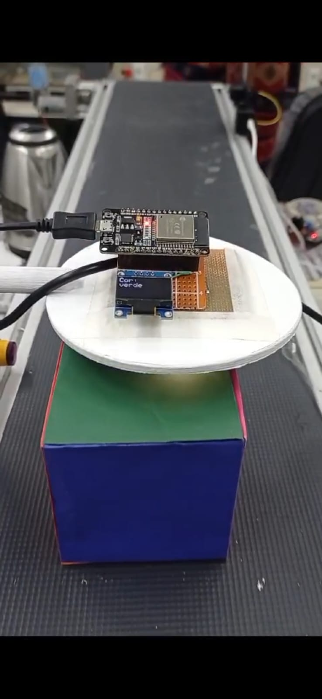

No vídeo em anexo, é possível ver que o sensor de cor operou com precisão. Foi instalado um sensor de presença na esteira para detectar objetos e, ao identificá-los, o sensor de cor realiza a leitura a uma distância inferior a 1,5 mm para garantir maior precisão. Em seguida, ele envia as informações via MQTT para um display na própria esteira, indicando a cor do objeto. Além disso, o display exibe dados de outros sensores adicionados, como o leitor de QR code, o sensor de temperatura e o sensor de altura. A esteira é acionada manualmente e, quando um objeto é colocado sobre ela, começa a se mover gradualmente, passando pelos sensores. O próximo passo é fazer a esteira parar assim que todas as leituras forem concluídas com o seguinte código: client.publish(&quot;motor/liga&quot;, &quot;0&quot;);.

## Conclusão

O funcionamento do sistema atendeu perfeitamente às expectativas, realizando todas as leituras de forma precisa e eficiente, detectando cores como vermelho, azul, rosa e verde. A instalação dos sensores na esteira também foi descomplicada, graças ao suporte já existente, que facilitou a montagem e a integração dos novos componentes, garantindo um processo rápido e sem complicações.

**Imagem da esteira em funcionamento**

