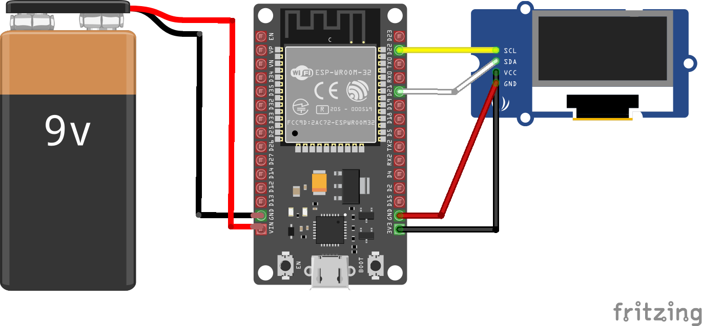

## Introdução

Nesta fase do projeto, concentra-se na arquitetura e na interconexão dos componentes que compõem a solução. Este documento explora os diferentes elementos e sua interconexão, oferecendo uma visão mais sólida de como cada parte contribui para o todo de forma a garantir a coesão e eficácia do projeto.

## Integração do sistema

O display estabelecerá uma conexão com o microcontrolador através da interface I2C, assim recebendo as informações que devem ser exibidas diretamente do ESP32. Este por sua vez estará conectado à rede através de uma rede wi-fi por onde usará protocolo MQTT para sinalizar as informações que deve receber, se inscrevendo para receber: se o motor está ligado, a velocidade atual, a cor, o tamanho e a temperatura. Assim que o ESP32 receber as informações necessárias, indicará para o display OLED as informações que devem ser exibidas.

Para exibir as informações corretamente, os tópicos do MQTT em que a ESP32 deve estar inscrita são:

qr\_code/altura/

qr\_code/cor/

qr\_code/temperatura/

altura/lenta/

/cor/

## Conexões entre componentes

## **Componentes e conexões**

### Display OLED

O display que será utilizado será o display OLED I2C.

<figure class="table op-uc-figure_align-center op-uc-figure"><table class="op-uc-table"><tbody><tr class="op-uc-table--row"><td class="op-uc-table--cell">iDimensões</td><td class="op-uc-table--cell">0,93 polegadas, 27.8 x27.3x 4.3 mm</td></tr><tr class="op-uc-table--row"><td class="op-uc-table--cell">Tensão de funcionamento</td><td class="op-uc-table--cell">3.3~ 5V DC</td></tr><tr class="op-uc-table--row"><td class="op-uc-table--cell">Potência</td><td class="op-uc-table--cell">Máximo de 0.06W</td></tr><tr class="op-uc-table--row"><td class="op-uc-table--cell">Interface</td><td class="op-uc-table--cell">I2C</td></tr><tr class="op-uc-table--row"><td class="op-uc-table--cell">Conexões</td><td class="op-uc-table--cell">VCC, GND, SLK (Serial Clock) e SDA (Serial Data)</td></tr><tr class="op-uc-table--row"><td class="op-uc-table--cell">Número de pixels</td><td class="op-uc-table--cell">128x64</td></tr></tbody></table></figure>

<figure class="image op-uc-figure" style="width:31.11%;">

</figure>

### Conexão I2C

A conexão entre o display e o microcontrolador será através da interface de conexão I2C. A conexão I2C (Inter-Integrated Circuit) é um método de comunicação serial utilizada para interconectar microcontroladores, microprocessadores, sensores e outros dispositivos em um barramento de dados de dois fios. Composta por um fio para dados (SDA) e outro para clock (SCL), a I2C permite a comunicação entre dispositivos mestre e escravos, com cada dispositivo possuindo um endereço único. Esta interface é amplamente adotada devido à sua simplicidade e eficiência, sendo ideal para sistemas com múltiplos dispositivos interconectados.

<figure class="image op-uc-figure" style="width:46.76%;">

</figure>

### Microcontrolador ESP32

O sistema será controlado pelo ESP32, que se conectará ao Display através da interface I2C e utilizará plataforma MQTT para receber os dados que deverá transmitir ao display. Texto curto sobre ESP 32. O ESP32 é um microcontrolador de baixo custo e baixo consumo de energia, fabricado pela Espressif Systems. Equipado com conectividade Wi-Fi e Bluetooth integrada, o ESP32 é amplamente utilizado em projetos de IoT (Internet das Coisas) e aplicações embarcadas. Além disso, oferece uma ampla gama de interfaces periféricas, como GPIOs, UARTs, SPIs e I2C, tornando-o altamente versátil para uma variedade de aplicações. Sua popularidade é atribuída à sua facilidade de programação, suportada pelo ambiente de desenvolvimento Arduino e pelo Espressif IoT Development Framework (ESP-IDF).

<figure class="image op-uc-figure" style="width:382px;">

</figure>

### MQTT:

O protocolo MQTT (Message Queuing Telemetry Transport) é uma tecnologia de comunicação ideal para dispositivos conectados à Internet das Coisas (IoT). Ele opera em um modelo de publicação/assinatura, em que os dispositivos se comunicam por meio de um intermediário chamado broker. Os dispositivos conectados, ou clientes MQTT, podem publicar mensagens em tópicos específicos no broker ou se inscrever em tópicos para receber mensagens pertinentes. Isso permite uma comunicação eficiente e assíncrona entre os dispositivos, tornando-o particularmente adequado para ambientes com largura de banda limitada e recursos restritos de hardware.

<figure class="image op-uc-figure" style="width:42.29%;">

</figure>

## Referências:

[informações do display](https://wiki.elecrow.com/index.php?title=I2C_0.96%22_OLED_128x64-_Blue)

[informações da ESP32](https://lobodarobotica.com/blog/esp32-pinout/)