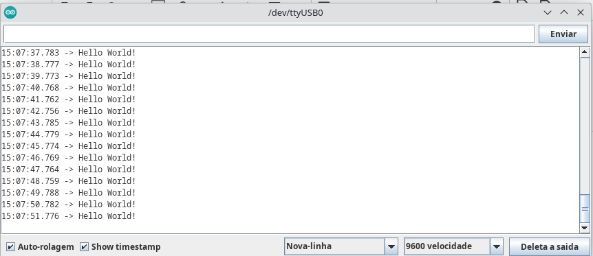
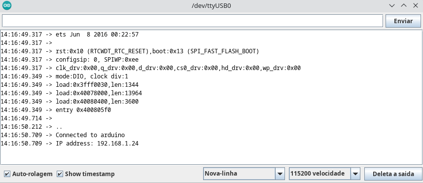
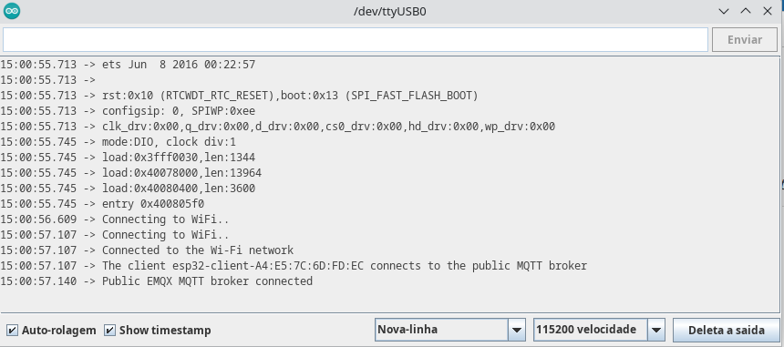
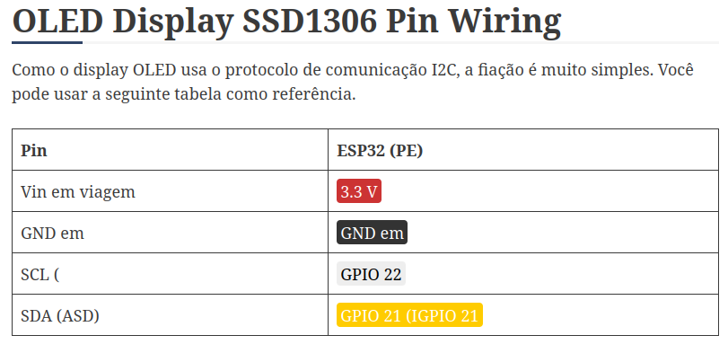
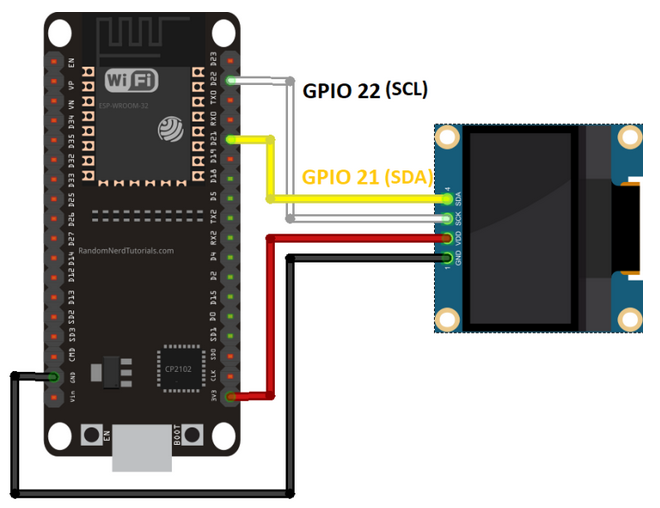

### Teste da placa e teste mqtt:

Para realizar a configuração correta da ESP32, o primeiro a ser feito foi baixar o software &quot;Arduino IDE&quot;, um IDE (Integrated Development Environment) para que o código possa ser escrito e gravado na ESP32. Após a instalação do software, há de ser selecionada a placa para qual os códigos serão orientados, no caso o utilizado foi &quot;ESP32 WROOM-DA Module&quot;. Após a instalação dos softwares que serão utilizados para esta parte do projeto, se fazem alguns testes, como o envio de um comando para que o led pisque. O teste é feito utilizando o código seguinte:

```cpp
void setup() {
 pinMode (2, OUTPUT);
}

void loop() {
 digitalWrite(2, HIGH);
 delay(1000);
 digitalWrite(2, LOW);
 delay(1000);}
```

O resultado observado é o LED da placa piscando de modo a ligar em um segundo e em seguida desligar um segundo depois.

Em seguida é realizado um teste da porta serial. Serial, é uma classe do Arduíno que serve pra mandar texto do Arduíno pro computador. O teste consiste em gravar um texto que deve ser recorrentemente enviado pela placa para o monitor serial através de serial data. O código utilizado para testar a comunicação serial é o seguinte:

```cpp
void setup() {
   Serial.begin(9600);
}

void loop() {
  Serial.println("Hello World!");
  delay(1000);
}
```

A observação do monitor serial exibe o resultado seguinte:



Tendo sido satisfatório o resultado obtido, considera-se funcional a comunicação através da porta serial, bem como a gravação do programa na placa.

Para a aplicação esperada, pretende-se o uso do MQTT e para tanto é necessário a conexão via wi-fi.

```cpp
#include <WiFi.h> // Biblioteca que permite ao dispositivo ESP32 se conectar a redes Wi-Fi
#include <PubSubClient.h> // Biblioteca para MQTT utilizada para conectar o dispositivo ao broker MQTT e trocar mensagens

// Definir rede WiFi a ser conectada

const char *ssid = "arduino";

const char *password = "esp-8266";

const char *mqtt_broker = "192.168.1.86"; // Definir MQTT Broker

const char *topic = "teste/"; // Definir  tópico a ser publicado

// Informações do usuário configuradas no broker

const char *mqtt_username = "lpae";

const char *mqtt_password = "esp-32";

const int mqtt_port = 1883; // Porta padrão do mqtt

WiFiClient espClient; // Cliente Wi-Fi para a conexão

PubSubClient client(espClient); // Cliente MQTT usando o cliente Wi-Fi para a conexão

void setup() {

    Serial.begin(115200); // Inicializa a comunicação serial para debug a uma taxa de 115200 bps.

    WiFi.begin(ssid, password); // Inicia a conexão com a rede Wi-Fi especificada.

    // Informar o status de conexão através da conexão serial

    while (WiFi.status() != WL_CONNECTED) {

        delay(500);

        Serial.println("Connecting to WiFi..");

    }

    Serial.println("Connected to the Wi-Fi network");

    

    // Conectando ao mqtt broker

    client.setServer(mqtt_broker, mqtt_port);

    client.setCallback(callback); // Função de callback chamada quando uma mensagem é recebida no tópico subscrito. Ela imprime o tópico e a mensagem recebida na porta serial.

    // Enquanto a conexão estiver estabelecida, as operações são realizadas

    while (!client.connected()) {

        String client_id = "esp32-client-"; // Cria uma string pro id do cliente MQTT

        client_id += String(WiFi.macAddress()); // Gera uma id específica com base no endereço MAC da esp32 específica

        Serial.printf("The client %s connects to the public MQTT broker\n", client_id.c_str()); // Imprime uma mensagem indicando que o cliente está tentando se conectar ao broker MQTT

        if (client.connect(client_id.c_str(), mqtt_username, mqtt_password)) { // Tenta conectar o cliente MQTT ao broker MQTT usando o ID do cliente, nome de usuário e senha especificados

            Serial.println("Public EMQX MQTT broker connected"); // Em caso de conexão bem sucedida, imprime uma mensagem indicando que o cliente está conectado ao broker

        } else {

            Serial.print("failed with state "); // Caso haja falha na conexão, envia uma mensagem de falha

            Serial.print(client.state()); // Imprime o estado atual do cliente MQTT

            delay(2000);

        }

    }

    // Publicar e subscrever

    client.publish(topic, "Victor :)");

    client.subscribe(topic);

}

    // Recebe informação dos tópicos subscritos e imprime o tópico e a mensagem recebida na porta serial.

void callback(char *topic, byte *payload, unsigned int length) {

    Serial.print("Message arrived in topic: ");

    Serial.println(topic);

    Serial.print("Message:");

    for (int i = 0; i < length; i++) {

        Serial.print((char) payload[i]);

    }

    Serial.println();

    Serial.println("-----------------------");

}

void loop() {

    client.loop();

}
```

O código tem a pretensão de se conectar a uma rede disponibiIizada para o projeto, cujo ssid é &quot;arduino&quot; e a senha é &quot;esp-8266&quot;.



Através do monitor serial é exibida a mensagem de que a conexão fora estabelecida e um endereço de ip fora atribuído. Assim a ESP é corretamente conectada com a rede.

Para que o mqtt funcione, se faz necessária um broker que integre todos os dispositivos que comporão o projeto, assim a ESP poderá receber e enviar informações. Como teste fora estabelecido um broker e usei um código de teste para enviar meu nome. Através do broker a informação fora recebida, assim assegurando a capacidade de conexão da placa em uma rede através de mqtt usando wi-fi.

```cpp
#include <WiFi.h> // Biblioteca que permite ao dispositivo ESP32 se conectar a redes Wi-Fi#include <PubSubClient.h> // Biblioteca para MQTT utilizada para conectar o dispositivo ao broker MQTT e trocar mensagens// Definir rede WiFi a ser conectada

const char *ssid = "arduino";

const char *password = "esp-8266";

const char *mqtt_broker = "192.168.1.86"; // Definir MQTT Broker

const char *topic = "teste/"; // Definir  tópico a ser publicado

// Informações do usuário configuradas no broker

const char *mqtt_username = "lpae";

const char *mqtt_password = "esp-32";

const int mqtt_port = 1883; // Porta padrão do mqtt

WiFiClient espClient; // Cliente Wi-Fi para a conexão

PubSubClient client(espClient); // Cliente MQTT usando o cliente Wi-Fi para a conexão

void setup() {

    Serial.begin(115200); // Inicializa a comunicação serial para debug a uma taxa de 115200 bps.

    WiFi.begin(ssid, password); // Inicia a conexão com a rede Wi-Fi especificada.

    // Informar o status de conexão através da conexão serial

    while (WiFi.status() != WL_CONNECTED) {

        delay(500);

        Serial.println("Connecting to WiFi..");

    }

    Serial.println("Connected to the Wi-Fi network");

    

    // Conectando ao mqtt broker

    client.setServer(mqtt_broker, mqtt_port);

    client.setCallback(callback); // Função de callback chamada quando uma mensagem é recebida no tópico subscrito. Ela imprime o tópico e a mensagem recebida na porta serial.

    // Enquanto a conexão estiver estabelecida, as operações são realizadas

    while (!client.connected()) {

        String client_id = "esp32-client-"; // Cria uma string pro id do cliente MQTT

        client_id += String(WiFi.macAddress()); // Gera uma id específica com base no endereço MAC da esp32 específica

        Serial.printf("The client %s connects to the public MQTT broker\n", client_id.c_str()); // Imprime uma mensagem indicando que o cliente está tentando se conectar ao broker MQTT

        if (client.connect(client_id.c_str(), mqtt_username, mqtt_password)) { // Tenta conectar o cliente MQTT ao broker MQTT usando o ID do cliente, nome de usuário e senha especificados

            Serial.println("Public EMQX MQTT broker connected"); // Em caso de conexão bem sucedida, imprime uma mensagem indicando que o cliente está conectado ao broker

        } else {

            Serial.print("failed with state "); // Caso haja falha na conexão, envia uma mensagem de falha

            Serial.print(client.state()); // Imprime o estado atual do cliente MQTT

            delay(2000);

        }

    }

    // Publicar e subscrever

    client.publish(topic, "Victor :)");

    client.subscribe(topic);

}

    // Recebe informação dos tópicos subscritos e imprime o tópico e a mensagem recebida na porta serial.

void callback(char *topic, byte *payload, unsigned int length) {

    Serial.print("Message arrived in topic: ");

    Serial.println(topic);

    Serial.print("Message:");

    for (int i = 0; i < length; i++) {

        Serial.print((char) payload[i]);

    }

    Serial.println();

    Serial.println("-----------------------");

}

void loop() {

    client.loop();

}
```

No código fora definido apenas os parâmetros da rede wi-fi a ser conectada e o broker. O seguinte resultado foi recebido pelo computador através da serial da placa:



Tendo os testes obtido sucesso, garante-se a possibilidade de utilizar a placa com mqtt, sendo assim a proxima etapa é testar o funcionamento do display.

### Teste do display:

\-atuador, descobrir como q faço pro meu display funcionar





##### Instalação da biblioteca OLED I2C – ESP32:

As bibliotecas a serem utilizadas serão duas bibliotecas de Adafruit: [biblioteca Adafruit\_SSD1306](https://github.com/adafruit/Adafruit_SSD1306) e [biblioteca Adafruit\_GFX](https://github.com/adafruit/Adafruit-GFX-Library). Sendo a segunda para finalidade de dar apoio à primeira.

A bilbioteca AdafruitSSD1306 disponibiliza um exemplo para que fosse feito o teste do display, que ao ser usado exibe um conjunto de imagens. O exemplo se chama &quot;ssd1306\_128x64\_i2c&quot; e o código é o seguinte:

```cpp
/**************************************************************************
 This is an example for our Monochrome OLEDs based on SSD1306 drivers

 Pick one up today in the adafruit shop!
 ------> http://www.adafruit.com/category/63_98

 This example is for a 128x64 pixel display using I2C to communicate
 3 pins are required to interface (two I2C and one reset).

 Adafruit invests time and resources providing this open
 source code, please support Adafruit and open-source
 hardware by purchasing products from Adafruit!

 Written by Limor Fried/Ladyada for Adafruit Industries,
 with contributions from the open source community.
 BSD license, check license.txt for more information
 All text above, and the splash screen below must be
 included in any redistribution.
 **************************************************************************/

#include <SPI.h>
#include <Wire.h>
#include <Adafruit_GFX.h>
#include <Adafruit_SSD1306.h>

#define SCREEN_WIDTH 128 // OLED display width, in pixels
#define SCREEN_HEIGHT 64 // OLED display height, in pixels

// Declaration for an SSD1306 display connected to I2C (SDA, SCL pins)
// The pins for I2C are defined by the Wire-library. 
// On an arduino UNO:       A4(SDA), A5(SCL)
// On an arduino MEGA 2560: 20(SDA), 21(SCL)
// On an arduino LEONARDO:   2(SDA),  3(SCL), ...
#define OLED_RESET     -1 // Reset pin # (or -1 if sharing Arduino reset pin)
#define SCREEN_ADDRESS 0x3C ///< See datasheet for Address; 0x3D for 128x64, 0x3C for 128x32
Adafruit_SSD1306 display(SCREEN_WIDTH, SCREEN_HEIGHT, &Wire, OLED_RESET);

#define NUMFLAKES     10 // Number of snowflakes in the animation example

#define LOGO_HEIGHT   16
#define LOGO_WIDTH    16
static const unsigned char PROGMEM logo_bmp[] =
{ 0b00000000, 0b11000000,
  0b00000001, 0b11000000,
  0b00000001, 0b11000000,
  0b00000011, 0b11100000,
  0b11110011, 0b11100000,
  0b11111110, 0b11111000,
  0b01111110, 0b11111111,
  0b00110011, 0b10011111,
  0b00011111, 0b11111100,
  0b00001101, 0b01110000,
  0b00011011, 0b10100000,
  0b00111111, 0b11100000,
  0b00111111, 0b11110000,
  0b01111100, 0b11110000,
  0b01110000, 0b01110000,
  0b00000000, 0b00110000 };

void setup() {
  Serial.begin(9600);

  // SSD1306_SWITCHCAPVCC = generate display voltage from 3.3V internally
  if(!display.begin(SSD1306_SWITCHCAPVCC, SCREEN_ADDRESS)) {
    Serial.println(F("SSD1306 allocation failed"));
    for(;;); // Don't proceed, loop forever
  }

  // Show initial display buffer contents on the screen --
  // the library initializes this with an Adafruit splash screen.
  display.display();
  delay(2000); // Pause for 2 seconds

  // Clear the buffer
  display.clearDisplay();

  // Draw a single pixel in white
  display.drawPixel(10, 10, SSD1306_WHITE);

  // Show the display buffer on the screen. You MUST call display() after
  // drawing commands to make them visible on screen!
  display.display();
  delay(2000);
  // display.display() is NOT necessary after every single drawing command,
  // unless that's what you want...rather, you can batch up a bunch of
  // drawing operations and then update the screen all at once by calling
  // display.display(). These examples demonstrate both approaches...

  testdrawline();      // Draw many lines

  testdrawrect();      // Draw rectangles (outlines)

  testfillrect();      // Draw rectangles (filled)

  testdrawcircle();    // Draw circles (outlines)

  testfillcircle();    // Draw circles (filled)

  testdrawroundrect(); // Draw rounded rectangles (outlines)

  testfillroundrect(); // Draw rounded rectangles (filled)

  testdrawtriangle();  // Draw triangles (outlines)

  testfilltriangle();  // Draw triangles (filled)

  testdrawchar();      // Draw characters of the default font

  testdrawstyles();    // Draw 'stylized' characters

  testscrolltext();    // Draw scrolling text

  testdrawbitmap();    // Draw a small bitmap image

  // Invert and restore display, pausing in-between
  display.invertDisplay(true);
  delay(1000);
  display.invertDisplay(false);
  delay(1000);

  testanimate(logo_bmp, LOGO_WIDTH, LOGO_HEIGHT); // Animate bitmaps
}

void loop() {
}

void testdrawline() {
  int16_t i;

  display.clearDisplay(); // Clear display buffer

  for(i=0; i<display.width(); i+=4) {
    display.drawLine(0, 0, i, display.height()-1, SSD1306_WHITE);
    display.display(); // Update screen with each newly-drawn line
    delay(1);
  }
  for(i=0; i<display.height(); i+=4) {
    display.drawLine(0, 0, display.width()-1, i, SSD1306_WHITE);
    display.display();
    delay(1);
  }
  delay(250);

  display.clearDisplay();

  for(i=0; i<display.width(); i+=4) {
    display.drawLine(0, display.height()-1, i, 0, SSD1306_WHITE);
    display.display();
    delay(1);
  }
  for(i=display.height()-1; i>=0; i-=4) {
    display.drawLine(0, display.height()-1, display.width()-1, i, SSD1306_WHITE);
    display.display();
    delay(1);
  }
  delay(250);

  display.clearDisplay();

  for(i=display.width()-1; i>=0; i-=4) {
    display.drawLine(display.width()-1, display.height()-1, i, 0, SSD1306_WHITE);
    display.display();
    delay(1);
  }
  for(i=display.height()-1; i>=0; i-=4) {
    display.drawLine(display.width()-1, display.height()-1, 0, i, SSD1306_WHITE);
    display.display();
    delay(1);
  }
  delay(250);

  display.clearDisplay();

  for(i=0; i<display.height(); i+=4) {
    display.drawLine(display.width()-1, 0, 0, i, SSD1306_WHITE);
    display.display();
    delay(1);
  }
  for(i=0; i<display.width(); i+=4) {
    display.drawLine(display.width()-1, 0, i, display.height()-1, SSD1306_WHITE);
    display.display();
    delay(1);
  }

  delay(2000); // Pause for 2 seconds
}

void testdrawrect(void) {
  display.clearDisplay();

  for(int16_t i=0; i<display.height()/2; i+=2) {
    display.drawRect(i, i, display.width()-2*i, display.height()-2*i, SSD1306_WHITE);
    display.display(); // Update screen with each newly-drawn rectangle
    delay(1);
  }

  delay(2000);
}

void testfillrect(void) {
  display.clearDisplay();

  for(int16_t i=0; i<display.height()/2; i+=3) {
    // The INVERSE color is used so rectangles alternate white/black
    display.fillRect(i, i, display.width()-i*2, display.height()-i*2, SSD1306_INVERSE);
    display.display(); // Update screen with each newly-drawn rectangle
    delay(1);
  }

  delay(2000);
}

void testdrawcircle(void) {
  display.clearDisplay();

  for(int16_t i=0; i<max(display.width(),display.height())/2; i+=2) {
    display.drawCircle(display.width()/2, display.height()/2, i, SSD1306_WHITE);
    display.display();
    delay(1);
  }

  delay(2000);
}

void testfillcircle(void) {
  display.clearDisplay();

  for(int16_t i=max(display.width(),display.height())/2; i>0; i-=3) {
    // The INVERSE color is used so circles alternate white/black
    display.fillCircle(display.width() / 2, display.height() / 2, i, SSD1306_INVERSE);
    display.display(); // Update screen with each newly-drawn circle
    delay(1);
  }

  delay(2000);
}

void testdrawroundrect(void) {
  display.clearDisplay();

  for(int16_t i=0; i<display.height()/2-2; i+=2) {
    display.drawRoundRect(i, i, display.width()-2*i, display.height()-2*i,
      display.height()/4, SSD1306_WHITE);
    display.display();
    delay(1);
  }

  delay(2000);
}

void testfillroundrect(void) {
  display.clearDisplay();

  for(int16_t i=0; i<display.height()/2-2; i+=2) {
    // The INVERSE color is used so round-rects alternate white/black
    display.fillRoundRect(i, i, display.width()-2*i, display.height()-2*i,
      display.height()/4, SSD1306_INVERSE);
    display.display();
    delay(1);
  }

  delay(2000);
}

void testdrawtriangle(void) {
  display.clearDisplay();

  for(int16_t i=0; i<max(display.width(),display.height())/2; i+=5) {
    display.drawTriangle(
      display.width()/2  , display.height()/2-i,
      display.width()/2-i, display.height()/2+i,
      display.width()/2+i, display.height()/2+i, SSD1306_WHITE);
    display.display();
    delay(1);
  }

  delay(2000);
}

void testfilltriangle(void) {
  display.clearDisplay();

  for(int16_t i=max(display.width(),display.height())/2; i>0; i-=5) {
    // The INVERSE color is used so triangles alternate white/black
    display.fillTriangle(
      display.width()/2  , display.height()/2-i,
      display.width()/2-i, display.height()/2+i,
      display.width()/2+i, display.height()/2+i, SSD1306_INVERSE);
    display.display();
    delay(1);
  }

  delay(2000);
}

void testdrawchar(void) {
  display.clearDisplay();

  display.setTextSize(1);      // Normal 1:1 pixel scale
  display.setTextColor(SSD1306_WHITE); // Draw white text
  display.setCursor(0, 0);     // Start at top-left corner
  display.cp437(true);         // Use full 256 char 'Code Page 437' font

  // Not all the characters will fit on the display. This is normal.
  // Library will draw what it can and the rest will be clipped.
  for(int16_t i=0; i<256; i++) {
    if(i == '\n') display.write(' ');
    else          display.write(i);
  }

  display.display();
  delay(2000);
}

void testdrawstyles(void) {
  display.clearDisplay();

  display.setTextSize(1);             // Normal 1:1 pixel scale
  display.setTextColor(SSD1306_WHITE);        // Draw white text
  display.setCursor(0,0);             // Start at top-left corner
  display.println(F("Hello, world!"));

  display.setTextColor(SSD1306_BLACK, SSD1306_WHITE); // Draw 'inverse' text
  display.println(3.141592);

  display.setTextSize(2);             // Draw 2X-scale text
  display.setTextColor(SSD1306_WHITE);
  display.print(F("0x")); display.println(0xDEADBEEF, HEX);

  display.display();
  delay(2000);
}

void testscrolltext(void) {
  display.clearDisplay();

  display.setTextSize(2); // Draw 2X-scale text
  display.setTextColor(SSD1306_WHITE);
  display.setCursor(10, 0);
  display.println(F("scroll"));
  display.display();      // Show initial text
  delay(100);

  // Scroll in various directions, pausing in-between:
  display.startscrollright(0x00, 0x0F);
  delay(2000);
  display.stopscroll();
  delay(1000);
  display.startscrollleft(0x00, 0x0F);
  delay(2000);
  display.stopscroll();
  delay(1000);
  display.startscrolldiagright(0x00, 0x07);
  delay(2000);
  display.startscrolldiagleft(0x00, 0x07);
  delay(2000);
  display.stopscroll();
  delay(1000);
}

void testdrawbitmap(void) {
  display.clearDisplay();

  display.drawBitmap(
    (display.width()  - LOGO_WIDTH ) / 2,
    (display.height() - LOGO_HEIGHT) / 2,
    logo_bmp, LOGO_WIDTH, LOGO_HEIGHT, 1);
  display.display();
  delay(1000);
}

#define XPOS   0 // Indexes into the 'icons' array in function below
#define YPOS   1
#define DELTAY 2

void testanimate(const uint8_t *bitmap, uint8_t w, uint8_t h) {
  int8_t f, icons[NUMFLAKES][3];

  // Initialize 'snowflake' positions
  for(f=0; f< NUMFLAKES; f++) {
    icons[f][XPOS]   = random(1 - LOGO_WIDTH, display.width());
    icons[f][YPOS]   = -LOGO_HEIGHT;
    icons[f][DELTAY] = random(1, 6);
    Serial.print(F("x: "));
    Serial.print(icons[f][XPOS], DEC);
    Serial.print(F(" y: "));
    Serial.print(icons[f][YPOS], DEC);
    Serial.print(F(" dy: "));
    Serial.println(icons[f][DELTAY], DEC);
  }

  for(;;) { // Loop forever...
    display.clearDisplay(); // Clear the display buffer

    // Draw each snowflake:
    for(f=0; f< NUMFLAKES; f++) {
      display.drawBitmap(icons[f][XPOS], icons[f][YPOS], bitmap, w, h, SSD1306_WHITE);
    }

    display.display(); // Show the display buffer on the screen
    delay(200);        // Pause for 1/10 second

    // Then update coordinates of each flake...
    for(f=0; f< NUMFLAKES; f++) {
      icons[f][YPOS] += icons[f][DELTAY];
      // If snowflake is off the bottom of the screen...
      if (icons[f][YPOS] >= display.height()) {
        // Reinitialize to a random position, just off the top
        icons[f][XPOS]   = random(1 - LOGO_WIDTH, display.width());
        icons[f][YPOS]   = -LOGO_HEIGHT;
        icons[f][DELTAY] = random(1, 6);
      }
    }
  }
}
```

Ao realizar uma pequena alteração no exemplo o display exibe as imagens de teste corretamente. Amodificação feita foi trocar o endereço para 0x3C (antes estava 0x3D).

Comprovado o funcionamento do display é necessário o teste para exibição de uma variável, que poderá ser alterada ao longo do tempo. Com o código seguinte foi simulada uma situação em que a cor a ser exibida pode ser alterada:

```cpp
#include <Wire.h>
#include <Adafruit_GFX.h>
#include <Adafruit_SSD1306.h>

#define SCREEN_WIDTH 128 // Largura do display OLED em pixels
#define SCREEN_HEIGHT 64 // Altura do display OLED em pixels

// Declaração para um display SSD1306 conectado via I2C
Adafruit_SSD1306 display(SCREEN_WIDTH, SCREEN_HEIGHT, &Wire, -1);

void setup() {
  Serial.begin(115200); // Inicia comunicação serial
  if (!display.begin(SSD1306_SWITCHCAPVCC, 0x3C)) { 
    Serial.println(F("SSD1306 allocation failed")); // Erro na inicialização
    for (;;); // Loop infinito
  }
  delay(2000); // Aguarda 2 segundos
}

void loop() {
  char a[] = "branco"; // Define a variável com o texto
  
  display.clearDisplay(); // Limpa o display
  display.setTextSize(1); // Define o tamanho do texto
  display.setTextColor(WHITE); // Define a cor do texto
  display.setCursor(0, 10); // Define a posição do cursor
  
  display.print("Cor: "); // Imprime o texto estático
  display.println(a);  // Imprime o valor da variável
  
  display.display(); // Atualiza o display com o conteúdo do buffer
  
  delay(1000); // Adiciona um atraso de 1 segundo para evitar atualizações muito rápidas
}
```

Por fim, o que falta é integrar a aquisição de informação através do mqtt e a exibição dessa informação através do display

### Integração do display com a placa:

Juntando os códigos usados para fazer a comunicação MQTT funcionar e para fazer o Display exibor textos, sintetiza-se um código que permita a ESP receber informações via MQTT e imprimí-las no display. Afim de que sejam exibidas todas as informações relevantes aferidas pelos sensores e a leitura do qr-code, o código final apresenta-se do seguinte modo:

```cpp
//Aqui eu vou colocar minhas bilbiotecas
#include <Wire.h>
#include <Adafruit_GFX.h>
#include <Adafruit_SSD1306.h>
//essas foram as as bibliotecas pra fazer o display funcionar. Agora pra fazer o wi-fi e mqtt funcionar:
#include <WiFi.h>
#include <PubSubClient.h>

//essa biblioteca é pra fazer operações com strings:
#include <cstdio>

//aqui eu vou definir qual é o tamanho da tela do meu display
#define SCREEN_WIDTH 128 // Largura do display OLED em pixels
#define SCREEN_HEIGHT 64 // Altura do display OLED em pixels

#define OLED_RESET     -1 // Reset pin # (or -1 if sharing Arduino reset pin)
#define SCREEN_ADDRESS 0x3C ///< See datasheet for Address; 0x3D for 128x64, 0x3C for 128x32
Adafruit_SSD1306 display(SCREEN_WIDTH, SCREEN_HEIGHT, &Wire, OLED_RESET); // Declaração para um display SSD1306 conectado via I2C


WiFiClient espClient; // Cliente Wi-Fi para a conexão

PubSubClient client(espClient); // Cliente MQTT usando o cliente Wi-Fi para a conexão

// Definir rede WiFi a ser conectada

const char *ssid = "lpae_wifi";
const char *password = "esp-8266";

const char *topic = "teste/"; // Definir  tópico a ser publicado

// Definir informações do usuário configuradas no broker
const char *mqtt_broker = "192.168.1.2"; // Definir MQTT Broker
const int mqtt_port = 1883; // Porta padrão do mqtt
const char *mqtt_username = "lpae";
const char *mqtt_password = "esp-32";


// Definir constantes que serão recebidas do broker para exibir no display
//using std::string;
String corsensor;
String corqr;
String alturasensor;
String alturaqr;
String temperaturasensor;
String temperaturaqr;
String lig = "desligado";
String velocidade;
String objeto;
//============================================================================================================================
//Aqui as funções

void WifiSetup(){
  delay(10);
  WiFi.begin(ssid, password); // Inicia a conexão com a rede Wi-Fi especificada.

  // Informar o status de conexão através da conexão serial

  while (WiFi.status() != WL_CONNECTED) {
    delay(500);
    Serial.println("Connecting to WiFi..");
  }

  Serial.println("Connected to the Wi-Fi network");
}

void callback(char* topic, byte* payload, unsigned int length) {

  char mensagem[64];

  Serial.print("Message arrived [");
  Serial.print(topic);
  Serial.print("] ");
  for (int i = 0; i < length; i++) {
    Serial.print((char)payload[i]);
  }
  Serial.println();

  /* Descobre qual o topico da mensagem */
  if (strcmp(topic, "motor/velocidade") == 0) {
    /* Buffer de no maximo 64 caracteres */
    if (length > 64)
      length = 64;
    /* copia a mensagem para buffer interno */
    memcpy(mensagem, (char *)payload, length);
    mensagem[length] = 0;
    /* Copia para a String global */
    velocidade = mensagem;

    Serial.print("Velocidade atual: ");
    Serial.println(velocidade);
  }

  else if (strcmp(topic, "motor/liga") == 0) {
    /* Buffer de no maximo 64 caracteres */
    if (length > 64)
      length = 64;
    /* copia a mensagem para buffer interno */
    memcpy(mensagem, (char *)payload, length);
    mensagem[length] = 0;
    /* Copia para a String global */
    if (strcmp(mensagem, "1") == 0) {
      lig = "ligado";
    }
    else {
      lig= "desligado";
    }
    Serial.print("O motor está: ");
    Serial.println(lig);
  }

  else if (strcmp(topic, "RGB/COR") == 0) {
    /* Buffer de no maximo 64 caracteres */
    if (length > 64)
      length = 64;
    /* copia a mensagem para buffer interno */
    memcpy(mensagem, (char *)payload, length);
    mensagem[length] = 0;
    /* Copia para a String global */
    corsensor = mensagem;

    Serial.print("Cor medida: ");
    Serial.println(corsensor);

  }
  else if (strcmp(topic, "sensor/temperatura") == 0) {
    /* Buffer de no maximo 64 caracteres */
    if (length > 64)
      length = 64;
    /* copia a mensagem para buffer interno */
    memcpy(mensagem, (char *)payload, length);
    mensagem[length] = 0;
    /* Copia para a String global */
    temperaturasensor = mensagem;

    Serial.print("Temperatura medida: ");
    Serial.println(temperaturasensor);

  }
  else if (strcmp(topic, "ultrassom/altura") == 0) {
    /* Buffer de no maximo 64 caracteres */
    if (length > 64)
      length = 64;
    /* copia a mensagem para buffer interno */
    memcpy(mensagem, (char *)payload, length);
    mensagem[length] = 0;
    /* Copia para a String global */
    alturasensor = mensagem;

    Serial.print("Altura medida: ");
    Serial.println(alturasensor);
  }
  else if (strcmp(topic, "qr_code/altura") == 0) {
    /* Buffer de no maximo 64 caracteres */
    if (length > 64)
      length = 64;
    /* copia a mensagem para buffer interno */
    memcpy(mensagem, (char *)payload, length);
    mensagem[length] = 0;
    /* Copia para a String global */
    alturaqr = mensagem;

    Serial.print("Altura no qr: ");
    Serial.println(alturaqr);
  }
  else if (strcmp(topic, "qr_code/temperatura") == 0) {
    /* Buffer de no maximo 64 caracteres */
    if (length > 64)
      length = 64;
    /* copia a mensagem para buffer interno */
    memcpy(mensagem, (char *)payload, length);
    mensagem[length] = 0;
    /* Copia para a String global */
    temperaturaqr = mensagem;

    Serial.print("Temperatura no qr: ");
    Serial.println(temperaturaqr);
  }
  else if (strcmp(topic, "qr_code/cor") == 0) {
    /* Buffer de no maximo 64 caracteres */
    if (length > 64)
      length = 64;
    /* copia a mensagem para buffer interno */
    memcpy(mensagem, (char *)payload, length);
    mensagem[length] = 0;
    /* Copia para a String global */
    corqr = mensagem;

    Serial.print("Cor no qr: ");
    Serial.println(corqr);
  }
  else if (strcmp(topic, "qr_code/objeto") == 0) {
    /* Buffer de no maximo 64 caracteres */
    if (length > 64)
      length = 64;
    /* copia a mensagem para buffer interno */
    memcpy(mensagem, (char *)payload, length);
    mensagem[length] = 0;
    /* Copia para a String global */
    objeto = mensagem;

    Serial.print("Objeto: ");
    Serial.println(objeto);
  }
  /* Demais topicos */

}


void MQTTsetup(){
  while (!client.connected()) {

    String client_id = "esp32-client-"; // Cria uma string pro id do cliente MQTT
    client_id += String(WiFi.macAddress()); // Gera uma id específica com base no endereço MAC da esp32 específica
    Serial.printf("The client %s connects to the public MQTT broker\n", client_id.c_str()); // Imprime uma mensagem indicando que o cliente está tentando se conectar ao broker MQTT

    if (client.connect(client_id.c_str(), mqtt_username, mqtt_password)) { // Tenta conectar o cliente MQTT ao broker MQTT usando o ID do cliente, nome de usuário e senha especificados
      Serial.println("Public EMQX MQTT broker connected"); // Em caso de conexão bem sucedida, imprime uma mensagem indicando que o cliente está conectado ao broker

      client.subscribe("motor/liga");
      client.subscribe("motor/velocidade");
      client.subscribe("RGB/COR");
      client.subscribe("ultrassom/altura");
      client.subscribe("sensor/temperatura");
      client.subscribe("qr_code/altura");
      client.subscribe("qr_code/temperatura");
      client.subscribe("qr_code/cor");
      client.subscribe("qr_code/objeto");

    } else {

      Serial.print("failed with state "); // Caso haja falha na conexão, envia uma mensagem de falha

      Serial.print(client.state()); // Imprime o estado atual do cliente MQTT

      delay(2000);

    }

  }
}
// String corsensor;
// String corqr;
// String alturasensor;
// String alturaqr;
// String temperaturasensor;
// String temperaturaqr;
// String lig = "desligado";
// String velocidade;
// String objeto;
void DesligaMotor(){
  if((corsensor!="")&&(corqr!="")&&(alturasensor!="")&&(alturaqr!="")&&(temperaturasensor!="")&&(temperaturaqr!="")&&(objeto!="")) {
    client.publish("motor/liga","0");
    client.publish("motor/velocidade","0");
  }
}

//============================================================================================================================
void setup() {

  Serial.begin(115200); // Inicializa a comunicação serial para debug a uma taxa de 115200 bps.

  WifiSetup(); //conecto no wi-fi

  Serial.print("Iniciando conexão como broker");
  client.setServer(mqtt_broker, mqtt_port); // Juntando o ip do broker com a porta é estabelecido o endereço
  MQTTsetup(); //conecto no MQTT


  if (!display.begin(SSD1306_SWITCHCAPVCC, SCREEN_ADDRESS)) {
    Serial.println(F("SSD1306 allocation failed")); // Erro na inicialização
    for (;;); // Loop infinito
  }

  display.clearDisplay();

  client.setCallback(callback); // Função de callback chamada quando uma mensagem é recebida no tópico subscrito. Ela imprime o tópico e a mensagem recebida na porta serial.
}
//============================================================================================================================
void loop() {

  if (!client.connected()) {
    //reconnect();
  }
  display.clearDisplay(); // Limpa o display
  display.setTextSize(1); // Define o tamanho do texto
  display.setTextColor(WHITE); // Define a cor do texto
  display.setCursor(0, 0); // Define a posição do cursor
  display.print("Motor "); // Imprime o texto estático
  display.println(lig);

  display.print("Velocidade: ");
  display.print(velocidade);
  display.println("%");

  display.print("Cor: ");
  display.println(corsensor);
  display.print("CorQr: ");
  display.println(corqr);

  display.print("h: ");
  display.print(alturasensor);
  display.print("cm hQr: ");
  display.print(alturaqr);
  display.println("cm");


  display.print("t: ");
  display.println(temperaturasensor);
  display.print("tQr: ");
  display.println(temperaturaqr);

  display.print("Objeto: ");
  display.print(objeto);

  display.display(); // Atualiza o display com o conteúdo do buffer
  DesligaMotor();
  client.loop();
}
```

referências:

https://randomnerdtutorials.com/esp32-ssd1306-oled-display-arduino-ide/