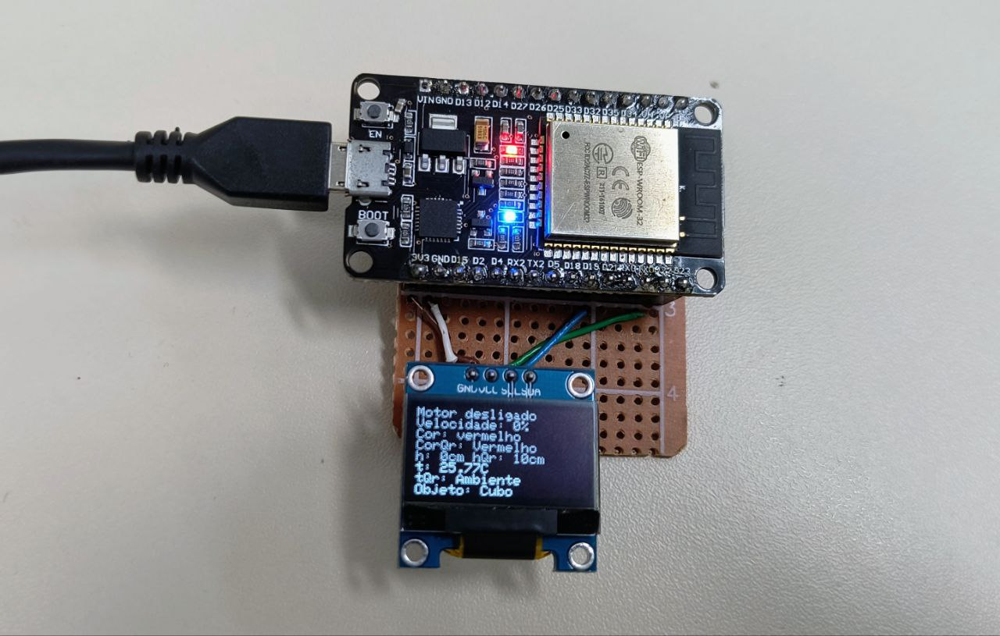

Tendo terminado as etapas necessárias para que o projeto chegue a um protótipo funcional, operar o protótipo é passo fundamental da prova de sua funcionalidade. Para uma utilização funcional do protótipo elaborado foi soldado em uma placa padrão conectores para que o esp32 e o display possam ser encaixados. Após o microcontrolador e o display serem encaixados na placa padrão, o microcontrolador deve ser alimentado com um cabo micro-USB e o botão de reset deve ser pressionado. Dessa forma, o esp tentará se concetar ao wi-fi usando o login e senha já em seu código, em seguida o esp se conectará ao broker via MQTT. Após uma conexão bem sucedida, o display será ligado e informará as condição da esteira (se está ligada ou não) bem como a velocidade em porcentagem e as informações aferidas pelos sensores. Entretanto as informações só podem ser exibidas se a informação for recebida via MQTT, enquanto não houver informação sendo postada nos tópicos a informação anterior será a exibida e enquanto não for recebida nada será exibido.

