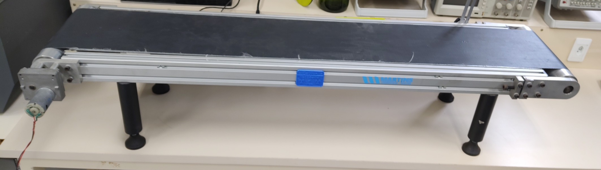

O projeto deverá integrar uma esteira inteligente de modo a atuar como IHM (Interface Homem-Máquina) que exiba informaçoes sobre o funcionamento da esteira e seus sensores. A esteira inteligente deverá fazer uma análise do objeto que foi colocado sobre a esteira e  estará integrada a quatro sensores inteligentes, tomando uma decisão sobre seu funcionamento.

Os sensores inteligentes consistem em um sensor de cor, um sensor que informará a temperatura do objeto, um sensor para informar seu tamanho e um leitor de QR code. 

Este projeto trata-se de um display inteligente que deverá exibir informações sobre o status de funcionamento da esteira e informações detectadas pelos sensores. Além de receber a informação se as informações lidas são coerentes.

**Portanto o display deverá informar:**

*   Se a esteira está ligada ou desligada;
*   A velocidade da esteira;
*   A cor aferida pelo senseor e pelo leitor QR;
*   A altura aferida pelo senseor e pelo leitor QR;
*   A temperatura aferida pelo senseor e pelo leitor QR;
*   Se as informações exibidas são coerentes entre si.

O display inteligente será composto por um display conectado a um microcontrolador e utilizará o protocolo MQTT para se receber as informações dos demais sensores. Ao ler os dados recebidos, o display inteligente irá traduzir esses dados em textos que serão exibidos para o usuário.